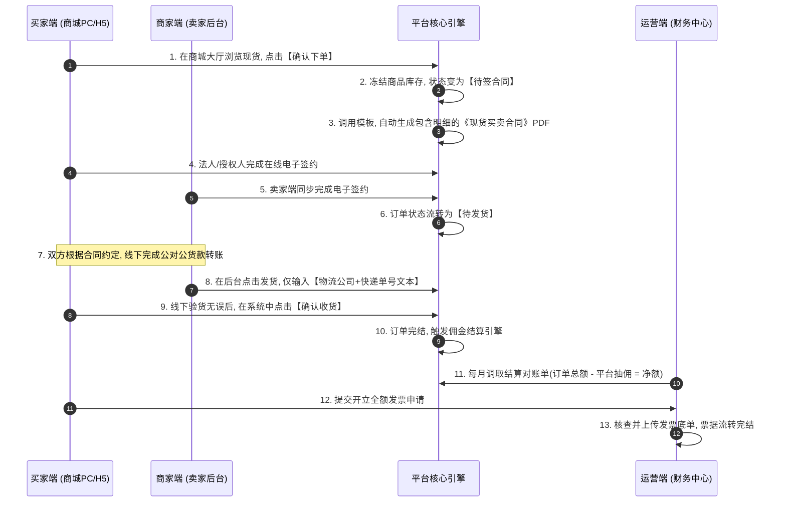
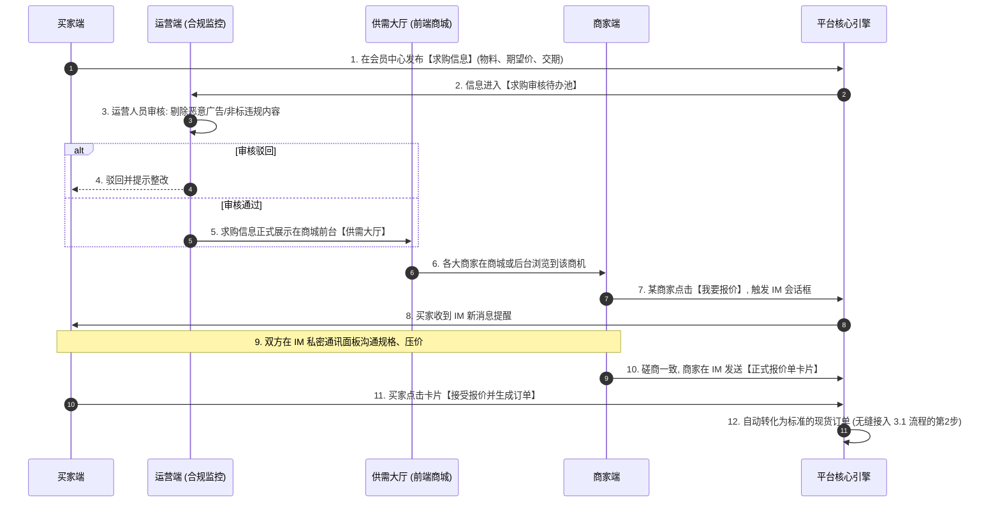
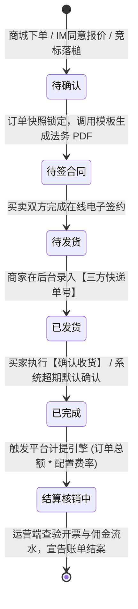

# 产业园区商流供应链系统 (S2B2C 轻量版) 产品需求文档 (PRD) V5.0

## 一、 系统架构与核心交易模型定位
本系统是一个轻量化、去资金池、去复杂物流的产业园区 S2B2C 商流撮合平台。平台不触碰在线支付网关，以“法务电子合同”作为约束纽带，以“对账单开票与抽取佣金”作为盈利核心。

### 1.1 三大核心交易模型 (Trading Models)
系统支持三种场景的交易流转，最终全部汇聚于标准化的履约与结算体系：
1. **【主流干道】商城现货标准采购**：类似传统电商，买家在商城浏览现货 SKU，直接加购下单。
2. **【定制寻源】供需大厅求购匹配**：买家发布定制化的采购需求，经平台审核合规后展示在供需大厅。卖家看到后通过系统内置 IM 工具发起沟通、推送报价单，促成转化。
3. **【大宗博弈】竞价拍卖**：商家发布拍卖公告，买家在规定时间内集中举牌出价，价高者得（无保证金模式）。

## 二、 用户角色与权限升维架构 (RBAC)
系统在底层仅有一套用户表（User DB），通过状态标识（User_Type）的切换，实现权限的动态升维。

### 2.1 角色权限矩阵定义
* **买家 (采购方)**：基础身份：在商城（PC/H5）通过手机号直接注册获得。【核心权限：只能买，不能卖】
  1. 逛商城，直接对现货商品下单购买。
  2. 逛竞价大厅，对感兴趣的标的出价。
  3. 在个人中心发布“求购需求”（需等运营审核）。
  4. 在线签署采购合同，线下打款，确认收货并申请开票。
* **商家 (供/销方)**：升维身份：买家在用户中心提交《营业执照》等企业资料，运营端审核通过后升维。【核心权限：买家权限 + 个人店铺卖家后台】
  1. 拥有独立的商家 PC 管理后台。
  2. 拥有卖货能力：上架现货商品、发布竞拍资源。
  3. 逛供需大厅，对买家的求购贴发起报价。
  4. 处理买家订单，签署售卖合同，录入发货物流号，核对平台扣除佣金后的结算单。
* **平台运营**：系统预设：由超级管理员在园区内部总控后台分配账号。【核心权限：全局审核、规则配置、财务结算】
  1. 审核：求购信息合规审核、商家入驻审核、竞价公告审核、商品违规下架。
  2. 配置：设置按品类/商家的抽佣比例。
  3. 财务：处理开票请求，核销票据单据。

## 三、 核心业务流转设计 (UML 泳道图)

### 3.1 【主流干道】商城现货标准采购履约闭环
这是系统最高频发生的交易流程，体现了“强合同、轻物流”的设计原则。

### 3.2 【定制寻源】供需大厅求购与 IM 议价转单流程
当商城现货无法满足时，买家通过发布求购信息引流，该流程重点增加了运营端的安全合规审核。

## 四、 全端详细功能菜单与操作矩阵 (PRD Menu Tables)

### 4.1 运营端 PC (平台管理总后台)
* **数据中心** -> 业务报表：统计大盘：订单总数、实收总金额（GMV）、活跃买/卖家数量看板。
* **用户中心** -> 会员管理 / 商家审核 / 商家列表 / 合同管理
* **供求中心** -> 求购信息审核：审核通过上架或驳回。
* **商品中心** -> 基础配置 / 商家商品
* **交易中心** -> 订单管理 / 咨询监控
* **竞价中心** -> 竞价大盘管理
* **结算中心** -> 佣金设置 / 结算对账单 / 发票管理

### 4.2 商家端 PC (卖家操作后台)
* **店铺中心** -> 店铺管理
* **商品中心** -> 发布商品 / 商品管理
* **交易履约** -> 订单管理 / 询报价管理
* **竞价管理** -> 资源与公告发布 / 中标与转单
* **财务中心** -> 结算对账单

### 4.3 商城 PC 与 H5 小程序 (买家浏览与采购门户)
* **门户大厅** -> 首页/优选商城 / 供需大厅 / 竞价中心大厅
* **买家中心** -> 账户与资料 / 我的供求 / 订单列表 / 我的竞价 / 发票中心

## 五、 系统状态机与核心防线约束 (State Machines & Rules)

### 5.1 统一交易状态流转机

### 5.2 研发核心防线约束规范
1. **求购信息拦截防线**：任何前台展示的求购数据必须经过运营审核。
2. **法务签约物理阻塞防线**：未完成签约（`Contract_Signed = False`）前发货按钮必须强制禁用。
3. **财务解耦计算规范**：计算公式：\(Order\_Amount \times Rate\)。

## 电子合同与发票税务合规化落地指南
1. **电子合同签署与盖章合规方案**：对接合规CA（e签宝/法大大）。
2. **平台抽佣与发票开立税务合规方案**：双发票流（货款发票由卖家开具给买家，佣金服务费发票由平台开具给卖家），可接入诺诺发票。
