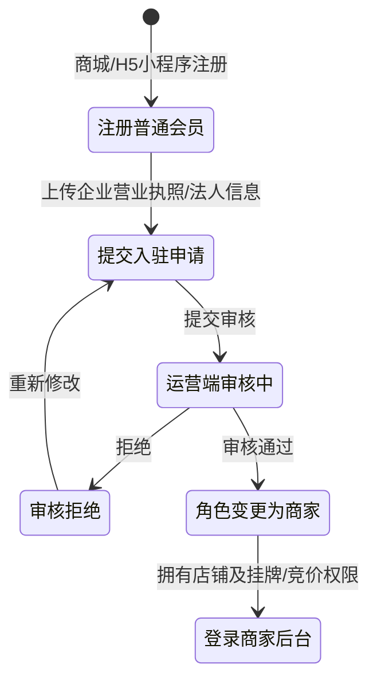
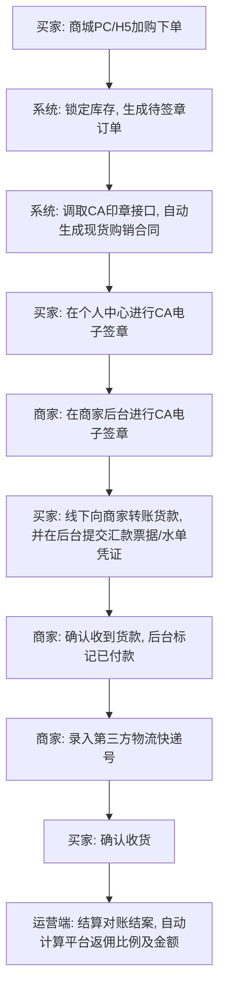
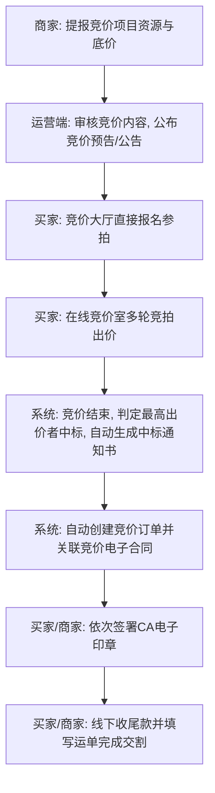
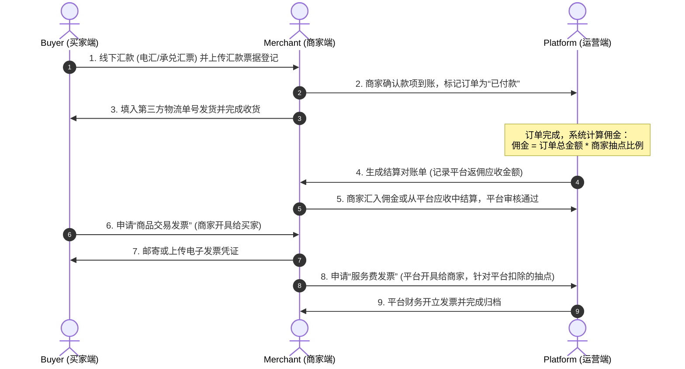

# 采销云简易版 S2B2C 供应链交易系统 产品需求文档 (PRD)

---

## 一、 文档控制

| 项目名称 | 简易版 S2B2C 供应链交易平台 |
| :--- | :--- |
| 文档版本 | V1.0 |
| 编写人员 | 高级产品经理 |
| 编写日期 | 2026-07-07 |
| 审批人员 | 平台产品委员会 |
| 状态 | 待评审 |

---

## 二、 项目概述与系统定位

### 1. 建设背景与目标
针对大宗物资与农产品供应链交易特点，以极简为原则，重构一套全流程闭环的 S2B2C 供应链系统。系统移除了供应商端、保证金机制、复杂的授信与预存款体系，核心聚焦于**挂牌现货直销、竞价交易、CA合同电子签章、线下清算返佣以及票据与发票结算**。

### 2. 核心设计原则
- **统一用户池**：商城买家与后台商家使用同一个用户账号体系，通过“入驻申请审核”完成角色晋升，避免身份割裂。
- **闭环全流程**：保留“下单/中标 $\rightarrow$ 生成CA合同 $\rightarrow$ 电子签章签署 $\rightarrow$ 三方物流填单 $\rightarrow$ 线下结算核销 $\rightarrow$ 开票与返佣”的全链路流程。
- **去中间件化**：不接入第三方支付，货款全部走线下结算，系统只作为“结算中心”进行账款登记、返佣核销及发票管理。

---

## 三、 用户角色与账号权限设计

### 1. 统一用户模型
平台采用单一的用户表结构，通过 `UserType` 进行权限判定：

### 2. 四端入口定义
1. **商城 PC 端**：买家采购入口。包含现货商城、竞价大厅、企业会员中心。
2. **H5小程序端**：移动端买家入口。支持浏览现货、参与竞价、查看订单、签署合同、申请发票。
3. **商家端 PC 后台**：供审核通过的商家使用。负责商品挂牌、竞价项目发布、订单发货（录入运单号）、结算对账与开票登记。
4. **运营端 PC 后台**：平台超级管理员使用。负责商家入驻审核、商品审核、竞价公告发布、电子合同模板定义、结算抽成与开票审核、系统日志审计。

---

## 四、 核心业务流程与状态机

### 流程一：现货交易及合同签署流程（线下结算版）

### 流程二：竞价拍卖交易流程（无保证金版）

### 流程三：结算中心、返佣与票据开立流程（全面细化）

---

## 五、 各端口功能模块明细规划

### 1. 运营端 PC 后台 (Platform Operations Admin)

#### 1.1 用户中心 (会员管理)
- **会员列表**：展示平台全部注册用户，支持检索（用户名、联系电话、注册时间、用户类型 `[买家/商家]`）。
- **商家入驻审核**：
  - 展示所有提交了入驻申请的买家用户。
  - **审核表单明细**：企业名称、统一社会信用代码、营业执照附件、法人姓名、身份证号、联系电话。
  - **操作按钮**：`审核通过`（用户类型晋升为商家）、`拒绝并填写原因`。
- **非必要移除**：移除原采购商管理、商家管理的多级标签及分层定义，仅保留“统一会员管理”。

#### 1.2 商品中心 (商品准入审核)
- **货品审核列表**：展示商家端新发布及修改的商品。
- **列表字段**：商品图片、名称、所属商家、类目、规格参数（大宗商品质量指标）、建议零售价、抽点比例（%）。
- **操作按钮**：`审核上架`、`拒绝`。

#### 1.3 订单与合同监管
- **订单列表**：监控全平台“现货订单”及“竞价订单”，字段中包含**对应关联的电子合同签约状态**、**第三方物流单号**、**订单返佣金额**。
- **CA 协议配置**：支持配置电子合同模板（现货交易合同模板、竞拍交易合同模板），定义盖章位置坐标。

#### 1.4 结算中心 (最核心的财务监管)
- **返佣结算单**：
  - 系统根据已完成的订单生成对账结算单。
  - **计算公式**：$\text{平台佣金} = \text{订单实付金额} \times \text{商家商品抽点比例}$。
  - **表头字段**：对账单号、关联订单号、商家名称、订单总金额、平台佣金、结算状态（待返佣/已清盘）。
  - **操作**：`确认收款`（标记商家已将平台返佣服务费汇入平台账户，结算完成）。
- **票据结算监管**：
  - 针对大宗交易线下常用的电汇水单、承兑汇票（银行承兑/商业承兑）进行系统登记备案。
  - 审核商家上传的票据信息，确保账实相符。
- **发票开立审核**：
  - **服务费开票申请表**：商家向平台申请的服务费发票审核（平台佣金部分的增值税专票/普票）。
  - **操作**：`标记已开票`并上传发票电子档或填写快递运单。

---

### 2. 商家端 PC 后台 (Merchant Admin)

#### 2.1 商品发布与策略
- **商品发布**：编辑商品基本信息、规格参数（支持自定义农产品/大宗商品指标，如水份、杂质、粒度等）。
- **销售价格策略**：配置特定商品的特定折扣比例，设定简易版“一客一价”名单。
- **非必要移除**：移除营销中心、批量图片空间同步、供应商供货库挑选等复杂分销功能。

#### 2.2 竞价中心 (竞价发布)
- **发布竞价公告**：商家可以直接发起公开竞价。
- **表单字段**：竞拍标题、拍品规格、底价、最小加价幅度、看货截止时间、竞拍开始/结束时间。
- **流拍/中标管理**：查看竞拍历史，中标后系统自动触发生成“中标通知书”并自动生成竞价订单。

#### 2.3 订单管理 (履约填单)
- **订单签约与发货**：
  - **电子签章**：调取第三方 CA 电子证书，对关联的购销合同进行电子印章签署。
  - **物流寄送**：移除了原系统的车辆排班和到货磅单机制，简化为：商家发货时，只需手工输入**“第三方物流快递号”**和“承运物流公司”即完成发货。
- **线下支付确认**：查看到买家上传的线下转账凭证，确认货款安全到账后，点击`确认收款`将订单状态变更为已支付。

#### 2.4 结算与发票管理
- **我的账单**：查看待向平台交纳的返佣对账单，获取平台收款账号。
- **服务费发票申请**：针对已支付给平台的佣金，向平台申请开具服务费发票。
- **买家开票处理**：查看买家针对商品交易货款申请的开票，录入已开票凭证。

---

### 3. 商城 PC 端 & H5 小程序 (Buyer Front-end)

#### 3.1 前台商城门户 (现货与竞拍)
- **现货商城**：商品分类检索、详情浏览、商品规格参数展示。支持直接加入采购车并进行结算。
- **竞价中心**：展示所有预告中、进行中、已结束的商家竞拍场次。
  - **在线竞拍室**：进行中场次支持直接报名并进入举牌页面，进行实时加价（无保证金门槛）。
- **产销对接沟通**：
  - 移除了原供应商的询报价逻辑，简化为**“产销对接在线沟通功能”**。
  - 买家针对特定意向商品，可以直接在商城PC/H5中向商家发起在线留言咨询，进行规格与线下批量价格的沟通。

#### 3.2 买家企业会员中心
- **注册与入驻申请**：
  - 允许普通买家在线提交企业入驻资料申请变更为“商家账户”。
- **订单与合同签署**：
  - 订单列表：点击订单可以直接进入 CA 电子签名页面，签署电子章。
  - 合同下载：提供加盖了双方电子公章 of PDF 合同下载。
- **线下付款提报**：
  - 针对订单在线下银行转账后，买家可以在订单详情中上传“汇款凭证图片/转账截图”并填写付款说明。
- **发票中心**：
  - 维护企业开票资质（纳税人识别号、开户行、账号、电话、地址）。
  - 针对已成交订单一键申请开具“交易发票”（由商家开具）。

---

## 六、 结算中心与票据管理深度细化

由于平台无在线支付，所有资金链闭环依赖线下核销和票据清盘。结算中心采用如下三维结算模式：

### 1. 票据流与单据关联 (Ticket Flow)
买家上传的线下转账凭证由系统建立票据档案，分为以下类型：
- **电汇水单凭证**：记录付款银行、付款人名称、转账金额、转账日期、银行流水号、凭证截图。
- **承兑汇票登记**：支持银行承兑汇票与商业承兑汇票。记录汇票号码、出票人、收票人、票面金额、出票日期、汇票到期日、承兑银行、承兑汇票扫描件。
- **结算核销逻辑**：商家核对票据真实性后，在系统内勾选关联订单核销，释放订单锁定状态。

### 2. 平台佣金计算与抽点 (Commission & Cut Rate)
- 每一笔成交订单（现货或竞价），在买家付款并由商家标记“已确认收款”后，系统自动冻结对应比例的平台佣金。
- 平台可在运营端为每个商家设定专属佣金比例（默认5%），也可针对单个商品设置单独的抽佣扣点。
- 商家必须在结算账期内向平台转账该服务费，运营方确认后结案，否则限制该商家提报新的竞价项目或下架部分现货。

### 3. 开票逻辑与分单体系 (Invoicing System)
大宗交易发票流如下：
1. **交易发票 (Goods Invoice)**：买家向商家申请。由商家直接线下开具给买家，发票金额为订单实付金额。系统支持买家申请、商家录入发票号与PDF归档。
2. **平台服务费发票 (Platform Commission Invoice)**：商家向平台申请。平台运营方针对收取的“平台佣金”部分，向商家开具相应金额的“信息技术服务费”增值税发票，用于商家在财务上做成本抵扣。

---

## 七、 数据库与核心数据模型规划 (Key Schema)

### 1. 用户表 (Users)
- `user_id` (PK)
- `username`
- `password_hash`
- `mobile`
- `user_type` (Enum: `BUYER`, `MERCHANT`)
- `status` (Enum: `NORMAL`, `PENDING_AUDIT`, `REJECTED`)
- `company_name` (企业名称)
- `social_credit_code` (统一社会信用代码)
- `license_img_url` (营业执照扫描件)

### 2. 商品表 (Goods)
- `goods_id` (PK)
- `merchant_id` (FK)
- `goods_name`
- `category_id`
- `price`
- `stock`
- `spec_json` (规格与大宗质量指标参数)
- `commission_rate` (专属抽成比例)
- `status` (Enum: `PENDING`, `ON_SALE`, `OFF_SALE`)

### 3. 订单表 (Orders)
- `order_id` (PK)
- `buyer_id` (FK)
- `merchant_id` (FK)
- `order_type` (Enum: `SPOT`现货, `BIDDING`竞价)
- `total_amount` (订单总额)
- `commission_amount` (平台应收返佣金额)
- `status` (Enum: `WAIT_CONTRACT`待签署合同, `WAIT_PAY`待付尾款, `WAIT_SHIP`待发货, `WAIT_RECEIVE`待收货, `COMPLETED`已结案)
- `logistics_no` (第三方快递物流单号)
- `contract_url` (CA电子合同PDF路径)
- `payment_slip_url` (线下汇款凭证路径)

### 4. 竞价项目表 (Bidding_Projects)
- `project_id` (PK)
- `merchant_id` (FK)
- `title`
- `base_price` (底价)
- `step_price` (加价幅度)
- `start_time`
- `end_time`
- `status` (Enum: `PREVIEW`, `ACTIVE`, `FINISHED`, `流拍`)
- `winner_id` (FK, 中标买家)
- `win_price` (成交中标价)
