# 🎯 产业园区商流供应链系统 - 可视化流程文档

## 📋 文档概述

本文档基于实际代码分析，使用Mermaid图表可视化展示**店铺入驻审核流程**、**货品上架审核流程**、**竞价资源流程**、**竞价公告流程**、**供需流程**和**订单履约流程**中管理端、商家、买家三个角色的真实操作按钮和状态转换。

### 🎨 图表颜色说明

| 类型 | 颜色 | 说明 |
|------|------|------|
| 🟦 **流程状态** | 蓝色底 | 表示业务流转中的各个阶段状态 |
| 🟩 **操作按钮** | 绿色底 | 表示用户可点击的操作动作 |
| 🟨 **审核/判断节点** | 黄色底 | 表示需要判断的分支节点 |
| ⬜ **结束状态** | 灰色底 | 表示流程终止状态 |

---

## 🏪 一、店铺入驻审核流程

### 店铺入驻整体状态流转图

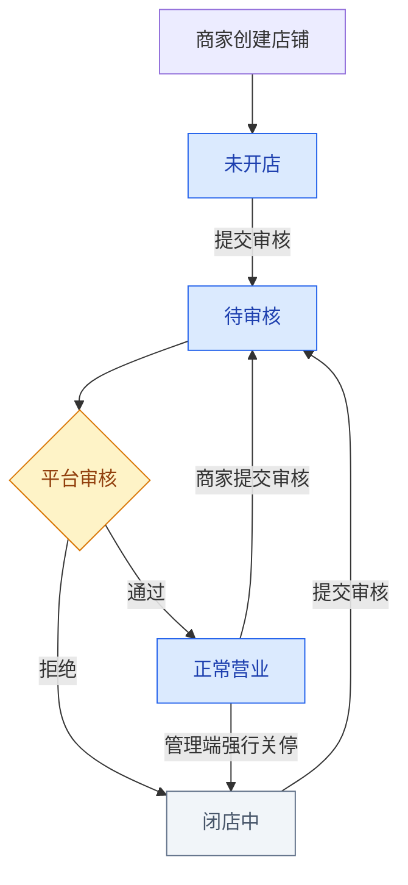
```mermaid
graph TB
    A[商家创建店铺] --> B[未开店]
    B -->|提交审核| C[待审核]
    C --> D{平台审核}
    
    D -->|通过| E[正常营业]
    D -->|拒绝| F[闭店中]
    
    E -->|管理端强行关停| F
    E -->|商家提交审核| C
    F -->|提交审核| C
    
    classDef state fill:#dbeafe,stroke:#2563eb,color:#1e40af
    classDef judge fill:#fef3c7,stroke:#d97706,color:#92400e
    classDef endState fill:#f1f5f9,stroke:#64748b,color:#475569

    class B,C,E state
    class D judge
    class F endState
```

---

### 商家端操作流程

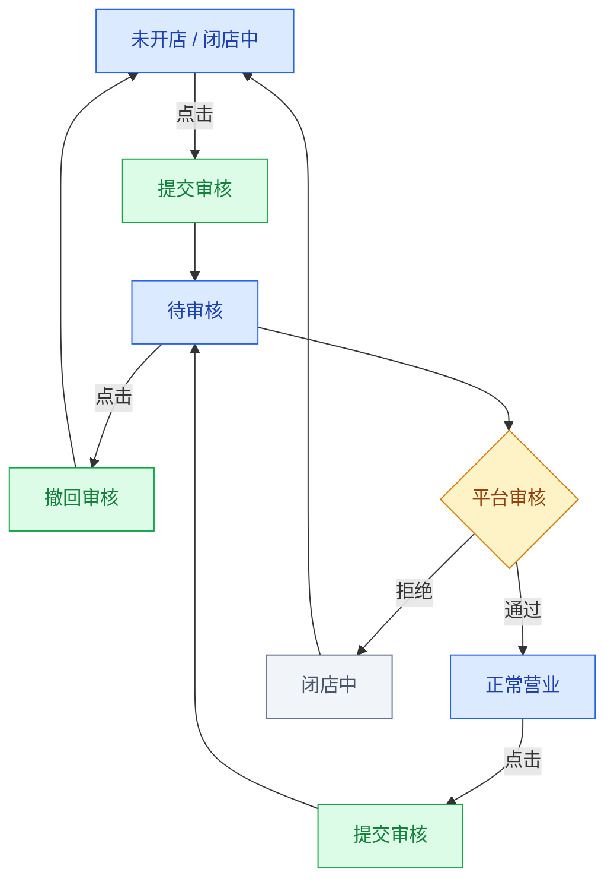
```mermaid
graph TB
    A[未开店 / 闭店中] -->|点击| B[提交审核]
    B --> C[待审核]
    C -->|点击| D[撤回审核]
    D --> A
    
    C --> E{平台审核}
    E -->|通过| F[正常营业]
    E -->|拒绝| G[闭店中]
    G --> A

    F -->|点击| H[提交审核]
    H --> C

    classDef state fill:#dbeafe,stroke:#2563eb,color:#1e40af
    classDef btn fill:#dcfce7,stroke:#16a34a,color:#15803d
    classDef judge fill:#fef3c7,stroke:#d97706,color:#92400e
    classDef endState fill:#f1f5f9,stroke:#64748b,color:#475569

    class A,C,F state
    class G endState
    class B,D,H btn
    class E judge
```

> **商家端按钮一览**
> - 未开店 / 闭店中：`提交审核`
> - 待审核：`撤回审核`
> - 正常营业：`提交审核`（重新进入审核流程）

---

### 管理端操作流程

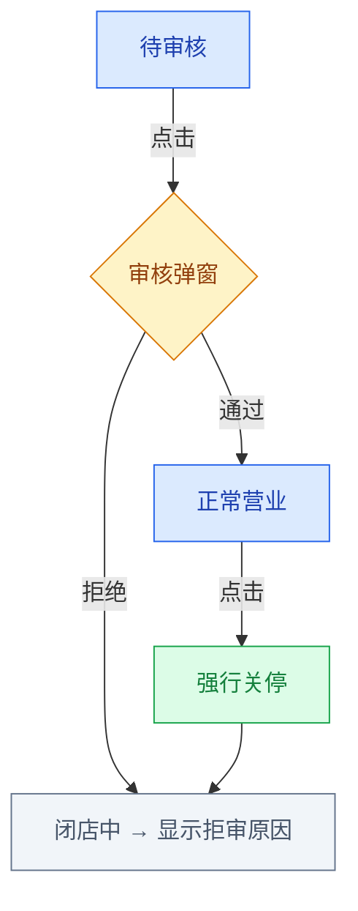
```mermaid
graph TB
    A[待审核] -->|点击| B{审核弹窗}
    B -->|通过| C[正常营业]
    B -->|拒绝| D[闭店中 → 显示拒审原因]
    
    C -->|点击| E[强行关停]
    E --> D

    classDef state fill:#dbeafe,stroke:#2563eb,color:#1e40af
    classDef btn fill:#dcfce7,stroke:#16a34a,color:#15803d
    classDef judge fill:#fef3c7,stroke:#d97706,color:#92400e
    classDef endState fill:#f1f5f9,stroke:#64748b,color:#475569

    class A,C state
    class D endState
    class E btn
    class B judge
```

> **管理端按钮一览**
> - 待审核：`审核`（弹窗内：通过 / 拒绝+填写原因）
> - 正常营业：`强行关停`（弹窗内：确认关停+填写原因）
> - 闭店中：无按钮

---

### 店铺入驻按钮权限表

#### 状态说明
- **店铺状态**：`未开店`（初始）、`待审核`、`正常营业`、`闭店中`（含审核拒绝、强行关停两个子态）

#### 商家端

| 店铺状态 | 显示按钮 | 功能说明 |
|---------|---------|---------|
| **未开店 / 闭店中** | `提交审核` | 编辑店铺资料后提交平台审核 |
| **待审核** | `撤回审核` | 撤回审核，状态退回未开店并解锁编辑 |
| **正常营业** | `提交审核` | 修改资料后重新提交审核，状态变为待审核 |

#### 管理端（运营后台）

| 店铺状态 | 显示按钮 | 功能说明 |
|---------|---------|---------|
| **待审核** | `审核` | 弹窗内选择通过（→正常营业）或拒绝（→闭店中+填写原因，限50字） |
| **正常营业** | `强行关停` | 弹窗内填写关停原因，状态变为闭店中 |
| **闭店中** | - | 显示拒审/关停原因，无操作按钮 |

---

## 📦 二、货品上架审核流程

### 货品上架整体状态流转图

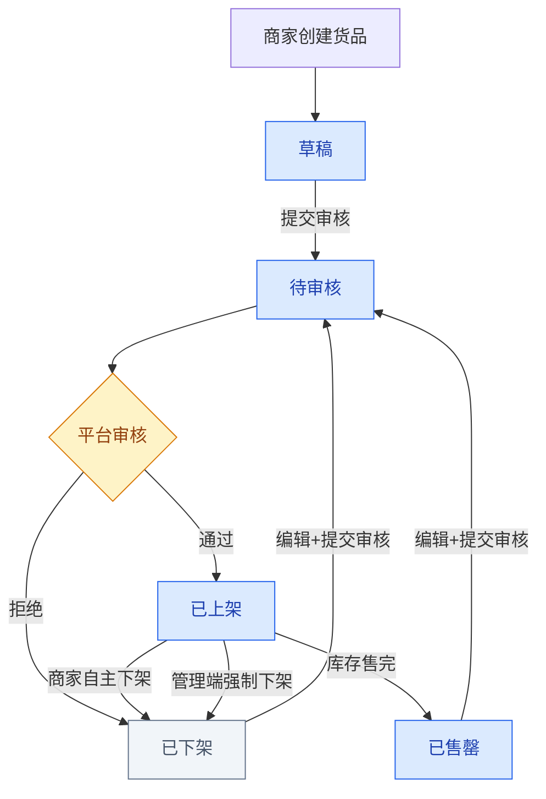
```mermaid
graph TB
    A[商家创建货品] --> B[草稿]
    B -->|提交审核| C[待审核]
    C --> D{平台审核}
    
    D -->|通过| E[已上架]
    D -->|拒绝| F[已下架]
    
    E -->|商家自主下架| F
    E -->|库存售完| G[已售罄]
    E -->|管理端强制下架| F
    
    F -->|编辑+提交审核| C
    G -->|编辑+提交审核| C
    
    classDef state fill:#dbeafe,stroke:#2563eb,color:#1e40af
    classDef judge fill:#fef3c7,stroke:#d97706,color:#92400e
    classDef endState fill:#f1f5f9,stroke:#64748b,color:#475569

    class B,C,E,G state
    class D judge
    class F endState
```

---

### 商家端操作流程

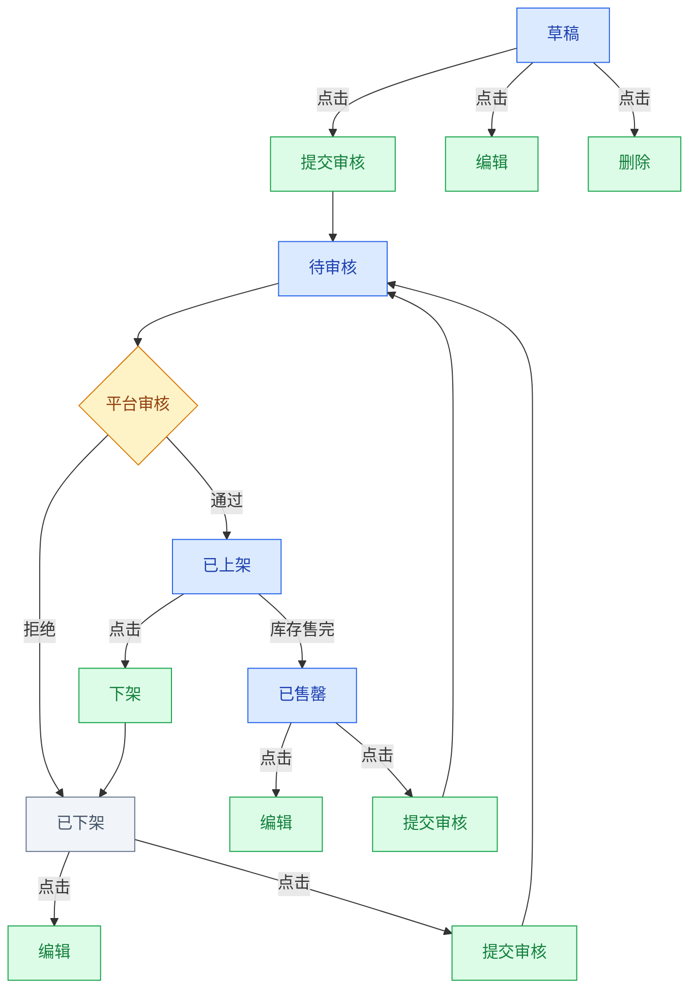
```mermaid
graph TB
    A[草稿] -->|点击| B[提交审核]
    A -->|点击| C[编辑]
    A -->|点击| D[删除]
    B --> E[待审核]
    
    E --> F{平台审核}
    F -->|通过| G[已上架]
    F -->|拒绝| H[已下架]
    
    G -->|点击| I[下架]
    I --> H
    
    H -->|点击| J[编辑]
    H -->|点击| K[提交审核]
    K --> E
    
    G -->|库存售完| L[已售罄]
    L -->|点击| M[编辑]
    L -->|点击| N[提交审核]
    N --> E

    classDef state fill:#dbeafe,stroke:#2563eb,color:#1e40af
    classDef btn fill:#dcfce7,stroke:#16a34a,color:#15803d
    classDef judge fill:#fef3c7,stroke:#d97706,color:#92400e
    classDef endState fill:#f1f5f9,stroke:#64748b,color:#475569

    class A,E,G,L state
    class H endState
    class B,C,D,I,J,K,M,N btn
    class F judge
```

> **商家端按钮一览**
> - 草稿：`提交审核` `编辑` `删除`
> - 待审核：无按钮
> - 已上架：`下架`
> - 已下架：`编辑` `提交审核`
> - 已售罄：`编辑` `提交审核`

---

### 管理端操作流程

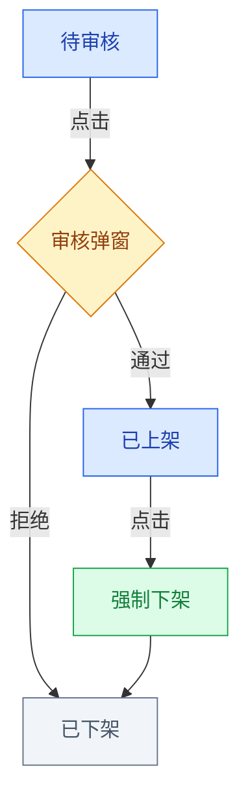
```mermaid
graph TB
    A[待审核] -->|点击| B{审核弹窗}
    B -->|通过| C[已上架]
    B -->|拒绝| D[已下架]
    
    C -->|点击| E[强制下架]
    E --> D

    classDef state fill:#dbeafe,stroke:#2563eb,color:#1e40af
    classDef btn fill:#dcfce7,stroke:#16a34a,color:#15803d
    classDef judge fill:#fef3c7,stroke:#d97706,color:#92400e
    classDef endState fill:#f1f5f9,stroke:#64748b,color:#475569

    class A,C state
    class D endState
    class E btn
    class B judge
```

> **管理端按钮一览**
> - 待审核：`编辑` `审核`（弹窗内：通过 / 拒绝+填写原因）
> - 已上架：`强制下架`
> - 已下架 / 已售罄：无按钮

---

### 货品上架按钮权限表

#### 状态说明
- **货品状态**：草稿 / 待审核 / 已上架 / 已下架（含审核拒绝、自主下架、强制下架） / 已售罄

#### 商家端

| 货品状态 | 显示按钮 | 功能说明 |
|---------|---------|---------|
| **草稿** | `提交审核` `编辑` `删除` | 提交审核、编辑货品信息、删除草稿 |
| **待审核** | - | 无操作按钮，显示"审核中..." |
| **已上架** | `下架` | 商家自主下架 |
| **已下架** | `编辑` `提交审核` | 编辑后重新提交审核（显示下架原因） |
| **已售罄** | `编辑` `提交审核` | 编辑后重新提交审核 |

#### 管理端（运营后台）

| 货品状态 | 显示按钮 | 功能说明 |
|---------|---------|---------|
| **待审核** | `编辑` `审核` | 编辑货品信息 + 审核弹窗（通过/拒绝+填写原因） |
| **已上架** | `强制下架` | 强制下架（显示强制下架原因） |
| **已下架** | - | 显示下架原因（拒审/强制下架/自主下架），无操作按钮 |
| **已售罄** | - | 无操作按钮 |

---

## 🎯 三、竞价资源流程

### 竞价资源整体状态流转图

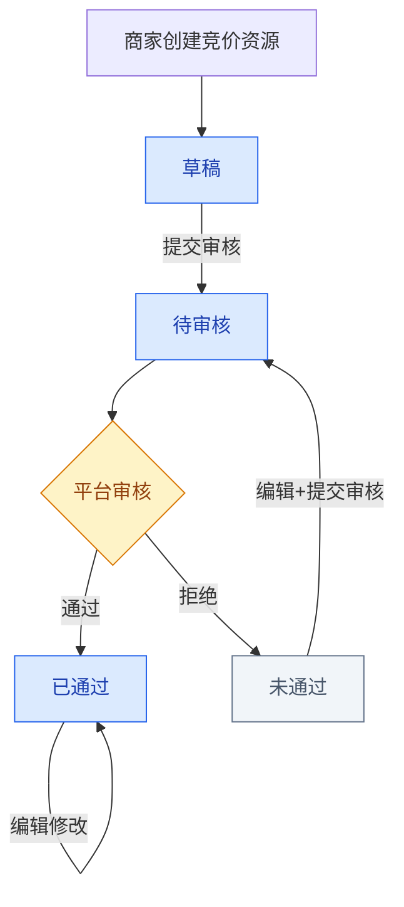
```mermaid
graph TB
    A[商家创建竞价资源] --> B[草稿]
    B -->|提交审核| C[待审核]
    C --> D{平台审核}
    
    D -->|通过| E[已通过]
    D -->|拒绝| F[未通过]
    
    E -->|编辑修改| E
    F -->|编辑+提交审核| C
    
    classDef state fill:#dbeafe,stroke:#2563eb,color:#1e40af
    classDef judge fill:#fef3c7,stroke:#d97706,color:#92400e
    classDef endState fill:#f1f5f9,stroke:#64748b,color:#475569

    class B,C,E state
    class D judge
    class F endState
```

---

### 商家端操作流程

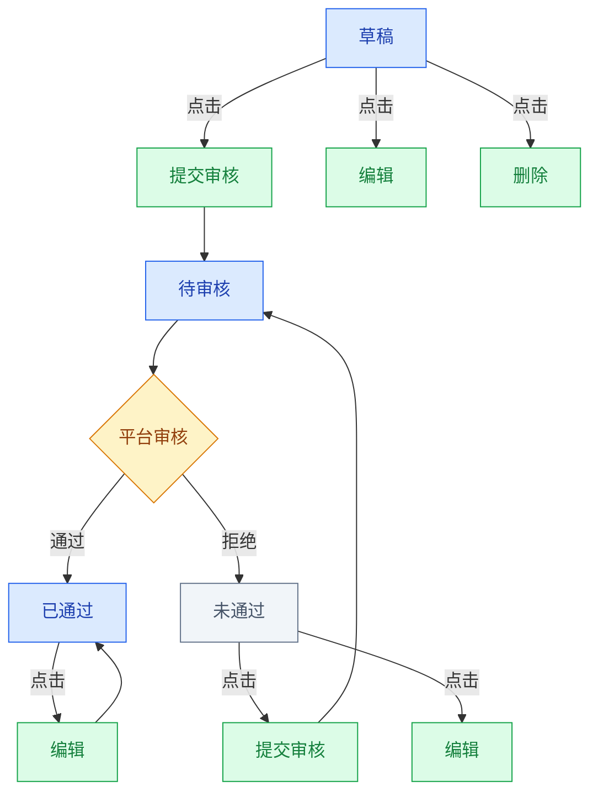
```mermaid
graph TB
    A[草稿] -->|点击| B[提交审核]
    A -->|点击| C[编辑]
    A -->|点击| D[删除]
    B --> E[待审核]
    
    E --> F{平台审核}
    F -->|通过| G[已通过]
    F -->|拒绝| H[未通过]
    
    G -->|点击| I[编辑]
    I --> G
    
    H -->|点击| J[提交审核]
    H -->|点击| K[编辑]
    J --> E

    classDef state fill:#dbeafe,stroke:#2563eb,color:#1e40af
    classDef btn fill:#dcfce7,stroke:#16a34a,color:#15803d
    classDef judge fill:#fef3c7,stroke:#d97706,color:#92400e
    classDef endState fill:#f1f5f9,stroke:#64748b,color:#475569

    class A,E,G state
    class H endState
    class B,C,D,I,J,K btn
    class F judge
```

> **商家端按钮一览**
> - 草稿：`提交审核` `编辑` `删除`
> - 待审核：无按钮
> - 已通过：`编辑`
> - 未通过：`提交审核` `编辑`（显示拒审原因）

---

### 管理端操作流程

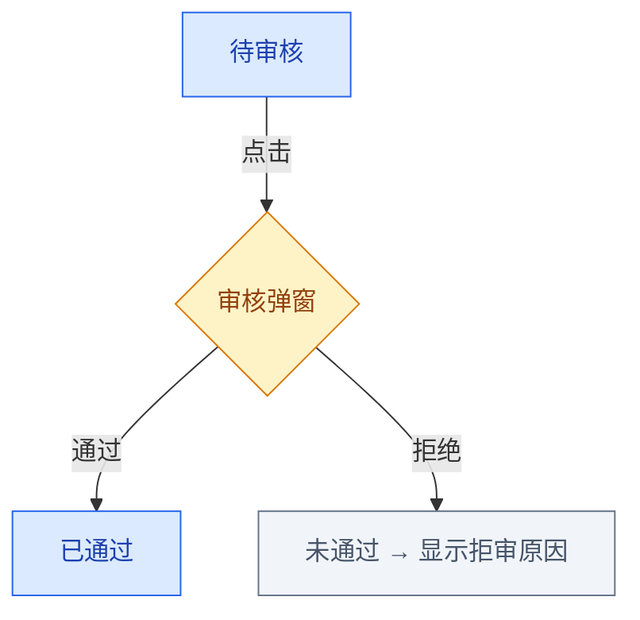
```mermaid
graph TB
    A[待审核] -->|点击| B{审核弹窗}
    B -->|通过| C[已通过]
    B -->|拒绝| D[未通过 → 显示拒审原因]

    classDef state fill:#dbeafe,stroke:#2563eb,color:#1e40af
    classDef judge fill:#fef3c7,stroke:#d97706,color:#92400e
    classDef endState fill:#f1f5f9,stroke:#64748b,color:#475569

    class A,C state
    class D endState
    class B judge
```

> **管理端按钮一览**
> - 待审核：`审核`（弹窗内：通过 / 拒绝+填写原因）
> - 已通过 / 未通过：无按钮

---

### 竞价资源按钮权限表

#### 状态说明
- **资源状态**：草稿 / 待审核 / 已通过 / 未通过

#### 商家端

| 资源状态 | 显示按钮 | 功能说明 |
|---------|---------|---------|
| **草稿** | `提交审核` `编辑` `删除` | 提交审核、编辑资源信息、删除草稿 |
| **待审核** | - | 无操作按钮，显示"--" |
| **已通过** | `编辑` | 编辑已通过的资源信息 |
| **未通过** | `提交审核` `编辑` | 编辑后重新提交审核（显示拒审原因） |

#### 管理端（运营后台）

| 资源状态 | 显示按钮 | 功能说明 |
|---------|---------|---------|
| **待审核** | `审核` | 进入审核弹窗，选择通过/拒绝 |
| **已通过** | - | 无操作按钮 |
| **未通过** | - | 显示拒审原因，无操作按钮 |

---

## 📢 四、竞价公告流程

### 竞价公告整体状态流转图

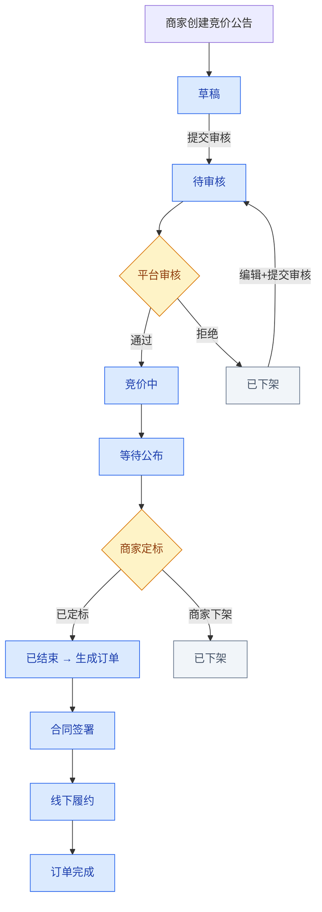
```mermaid
graph TB
    A[商家创建竞价公告] --> B[草稿]
    B -->|提交审核| C[待审核]
    C --> D{平台审核}
    
    D -->|通过| E[竞价中]
    D -->|拒绝| F[已下架]
    F -->|编辑+提交审核| C
    
    E --> G[等待公布]
    G --> H{商家定标}
    
    H -->|已定标| I[已结束 → 生成订单]
    H -->|商家下架| J[已下架]
    
    I --> K[合同签署]
    K --> L[线下履约]
    L --> M[订单完成]
    
    classDef state fill:#dbeafe,stroke:#2563eb,color:#1e40af
    classDef judge fill:#fef3c7,stroke:#d97706,color:#92400e
    classDef endState fill:#f1f5f9,stroke:#64748b,color:#475569

    class B,C,E,G,I,K,L,M state
    class D,H judge
    class F,J endState
```

---

### 管理端操作流程

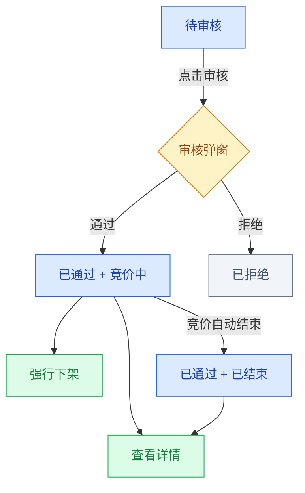
```mermaid
graph TB
    A[待审核] -->|点击审核| B{审核弹窗}
    B -->|通过| C[已通过 + 竞价中]
    B -->|拒绝| D[已拒绝]
    
    C --> E[强行下架]
    C --> F[查看详情]
    
    C -->|竞价自动结束| G[已通过 + 已结束]
    G --> F

    classDef state fill:#dbeafe,stroke:#2563eb,color:#1e40af
    classDef btn fill:#dcfce7,stroke:#16a34a,color:#15803d
    classDef judge fill:#fef3c7,stroke:#d97706,color:#92400e
    classDef endState fill:#f1f5f9,stroke:#64748b,color:#475569

    class A,C,G state
    class D endState
    class E,F btn
    class B judge
```

> **管理端按钮一览**
> - 待审核：`审核`
> - 已通过 + 竞价中：`强行下架` `查看详情`
> - 已通过 + 已结束：`查看详情`
> - 已拒绝/已撤回/已下架：无按钮

---

### 商家端操作流程

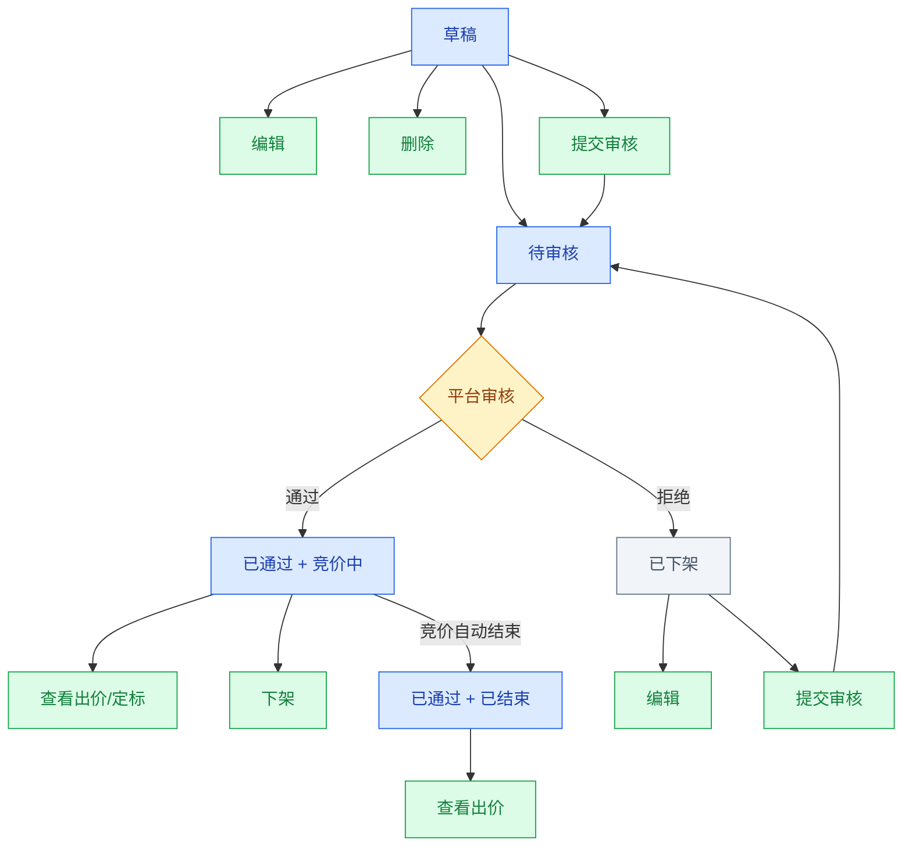
```mermaid
graph TB
    A[草稿] --> B[待审核]
    B --> C{平台审核}
    C -->|通过| D[已通过 + 竞价中]
    C -->|拒绝| E[已下架]
    
    D --> F[查看出价/定标]
    D --> G[下架]
    
    D -->|竞价自动结束| H[已通过 + 已结束]
    H --> I[查看出价]
    
    E --> J[编辑]
    E --> K[提交审核]
    K --> B
    
    A --> L[编辑]
    A --> M[删除]
    A --> N[提交审核]
    N --> B

    classDef state fill:#dbeafe,stroke:#2563eb,color:#1e40af
    classDef btn fill:#dcfce7,stroke:#16a34a,color:#15803d
    classDef judge fill:#fef3c7,stroke:#d97706,color:#92400e
    classDef endState fill:#f1f5f9,stroke:#64748b,color:#475569

    class A,B,D,H state
    class E endState
    class F,G,I,J,K,L,M,N btn
    class C judge
```

> **商家端按钮一览**
> - 草稿：`提交审核` `编辑` `删除`
> - 待审核：无按钮
> - 已拒绝/已撤回/已下架：`编辑` `提交审核`
> - 已通过 + 竞价中：`查看出价/定标` `下架`
> - 已通过 + 已结束：`查看出价`

---

### 买家端操作流程

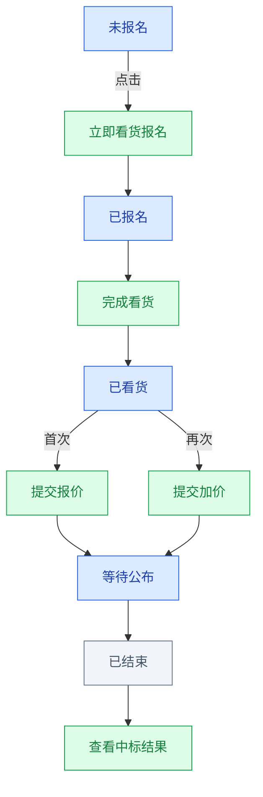
```mermaid
graph TB
    A[未报名] -->|点击| B[立即看货报名]
    B --> C[已报名]
    C --> D[完成看货]
    D --> E[已看货]
    E -->|首次| F[提交报价]
    E -->|再次| G[提交加价]
    
    F --> H[等待公布]
    G --> H
    
    H --> I[已结束]
    I --> J[查看中标结果]

    classDef state fill:#dbeafe,stroke:#2563eb,color:#1e40af
    classDef btn fill:#dcfce7,stroke:#16a34a,color:#15803d
    classDef endState fill:#f1f5f9,stroke:#64748b,color:#475569

    class A,C,E,H state
    class I endState
    class B,D,F,G,J btn
```

> **买家端按钮一览**
> - 未报名：`立即看货报名`
> - 已报名未看货：`完成看货`
> - 已看货未报价：`提交报价` / `提交加价`
> - 等待公布：无按钮（只读）
> - 已结束：无按钮（只读查看）

---

### 竞价公告按钮权限表

#### 状态说明
- **竞价状态**：竞价中 / 等待公布 / 已结束
- **审核状态**：草稿 / 待审核 / 已通过 / 已拒绝 / 已撤回 / 已下架

#### 管理端（运营后台）

| 审核状态 | 竞价状态 | 显示按钮 | 功能说明 |
|---------|---------|---------|---------|
| **待审核** | 任意 | `审核` | 进入审核弹窗，选择通过/拒绝 |
| **已拒绝** | 任意 | - | 显示拒审原因，无操作按钮 |
| **已撤回/已下架** | 任意 | - | 显示下架原因，无操作按钮 |
| **已通过** | 竞价中 | `强行下架` `查看详情` | 强制下架 + 只读详情查看 |
| **已通过** | 已结束 | `查看详情` | 竞价结束后的只读查看 |

#### 商家端

| 审核/竞价状态 | 显示按钮 | 功能说明 |
|-------------|---------|---------|
| **草稿** | `提交审核` `编辑` `删除` | 提交审核、编辑内容、删除草稿 |
| **待审核** | - | 无操作按钮 |
| **已拒绝/已撤回/已下架** | `编辑` `提交审核` | 编辑后重新提交审核 |
| **已通过+竞价中** | `查看出价/定标` `下架` | 查看出价列表、选择中标者、下架公告 |
| **已通过+已结束** | `查看出价` | 只读查看中标结果 |

#### 买家端

| 竞价状态 | 用户参与状态 | 显示按钮 | 功能说明 |
|---------|-------------|---------|---------|
| **任意** | 未报名 | `立即看货报名` | 报名参与竞价 |
| **竞价中** | 已报名未看货 | `完成看货` | 完成看货解锁报价功能 |
| **竞价中** | 已看货未报价 | `提交报价` / `提交加价` | 参与竞价 |
| **等待公布** | 任意 | - | 只读等待公布结果 |
| **已结束** | 任意 | - | 查看中标结果 |

---

## 🔄 五、供需流程

### 供需流程整体状态流转图

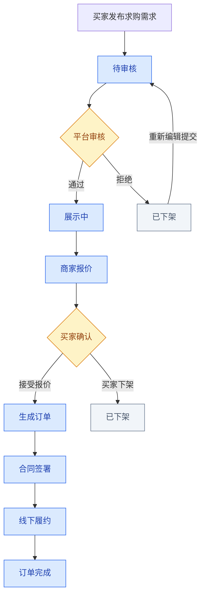
```mermaid
graph TB
    A[买家发布求购需求] --> B[待审核]
    B --> C{平台审核}
    
    C -->|通过| D[展示中]
    C -->|拒绝| E[已下架]
    
    D --> F[商家报价]
    F --> G{买家确认}
    
    G -->|接受报价| H[生成订单]
    G -->|买家下架| I[已下架]
    
    E -->|重新编辑提交| B
    
    H --> J[合同签署]
    J --> K[线下履约]
    K --> L[订单完成]
    
    classDef state fill:#dbeafe,stroke:#2563eb,color:#1e40af
    classDef judge fill:#fef3c7,stroke:#d97706,color:#92400e
    classDef endState fill:#f1f5f9,stroke:#64748b,color:#475569

    class B,D,F,H,J,K,L state
    class C,G judge
    class E,I endState
```

---

### 管理端操作流程

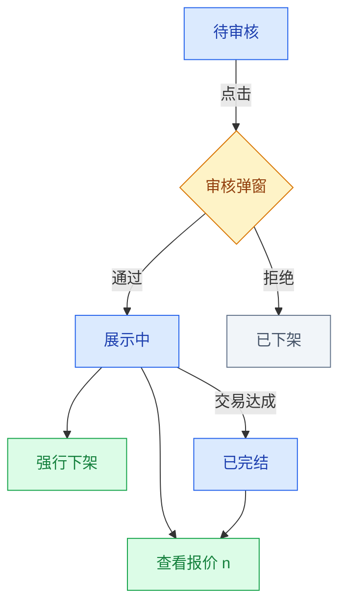
```mermaid
graph TB
    A[待审核] -->|点击| B{审核弹窗}
    B -->|通过| C[展示中]
    B -->|拒绝| D[已下架]
    
    C --> E[强行下架]
    C --> F[查看报价 n]
    
    C -->|交易达成| G[已完结]
    G --> F

    classDef state fill:#dbeafe,stroke:#2563eb,color:#1e40af
    classDef btn fill:#dcfce7,stroke:#16a34a,color:#15803d
    classDef judge fill:#fef3c7,stroke:#d97706,color:#92400e
    classDef endState fill:#f1f5f9,stroke:#64748b,color:#475569

    class A,C,G state
    class D endState
    class E,F btn
    class B judge
```

> **管理端按钮一览**
> - 待审核：`审核`
> - 展示中：`强行下架` `查看报价 (n)`
> - 已完结：`查看报价 (n)`
> - 已下架：无按钮

---

### 买家端操作流程（需求发布方）

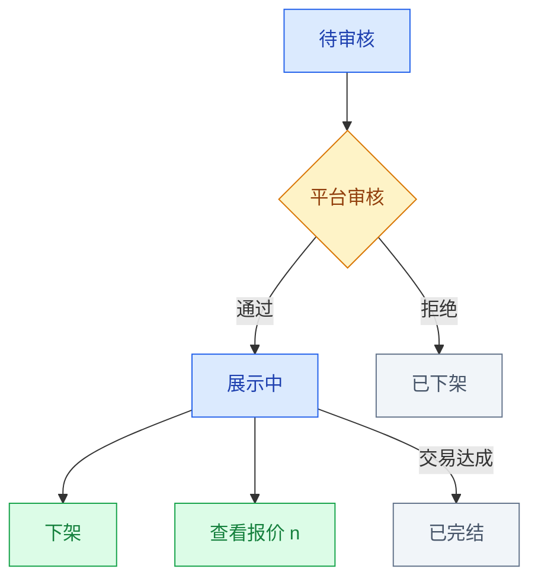
```mermaid
graph TB
    A[待审核] --> B{平台审核}
    B -->|通过| C[展示中]
    B -->|拒绝| D[已下架]
    
    C --> E[下架]
    C --> F[查看报价 n]
    
    C -->|交易达成| G[已完结]

    classDef state fill:#dbeafe,stroke:#2563eb,color:#1e40af
    classDef btn fill:#dcfce7,stroke:#16a34a,color:#15803d
    classDef judge fill:#fef3c7,stroke:#d97706,color:#92400e
    classDef endState fill:#f1f5f9,stroke:#64748b,color:#475569

    class A,C state
    class D,G endState
    class E,F btn
    class B judge
```

> **买家端按钮一览**
> - 待审核：无按钮
> - 展示中：`下架` `查看报价 (n)`
> - 已下架：无按钮
> - 已完结：无按钮（只读）

---

### 商家端操作流程（报价方）

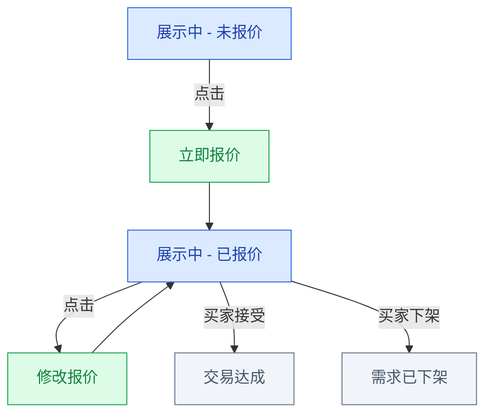
```mermaid
graph TB
    A[展示中 - 未报价] -->|点击| B[立即报价]
    B --> C[展示中 - 已报价]
    C -->|点击| D[修改报价]
    D --> C
    
    C -->|买家接受| E[交易达成]
    C -->|买家下架| F[需求已下架]

    classDef state fill:#dbeafe,stroke:#2563eb,color:#1e40af
    classDef btn fill:#dcfce7,stroke:#16a34a,color:#15803d
    classDef endState fill:#f1f5f9,stroke:#64748b,color:#475569

    class A,C state
    class E,F endState
    class B,D btn
```

> **商家端按钮一览**
> - 展示中 + 未报价：`立即报价`
> - 展示中 + 已报价：`修改报价`
> - 已下架/已完结：无按钮

---

### 供需流程按钮权限表

#### 状态说明
- **需求状态**：待审核 / 展示中 / 已下架(自主) / 已完结

#### 管理端（运营后台）

| 需求状态 | 显示按钮 | 功能说明 |
|---------|---------|---------|
| **待审核** | `审核` | 进入审核弹窗，选择通过/拒绝 |
| **已下架** | - | 显示下架原因，无操作按钮 |
| **展示中** | `强行下架` `查看报价 (n)` | 强制下架 + 查看商家报价列表 |
| **已完结** | `查看报价 (n)` | 查看历史报价记录 |

#### 买家端（需求发布方）

| 需求状态 | 显示按钮 | 功能说明 |
|---------|---------|---------|
| **待审核** | - | 无操作按钮（等待平台审核） |
| **展示中** | `下架` `查看报价 (n)` | 自主下架需求 + 查看商家报价 |
| **已下架** | - | 显示下架原因，无操作按钮 |
| **已完结** | - | 只读完结状态 |

#### 商家端（报价方）

| 需求状态 | 参与状态 | 显示按钮 | 功能说明 |
|---------|---------|---------|---------|
| **展示中** | 未报价 | `立即报价` | 对需求进行报价 |
| **展示中** | 已报价 | `修改报价` | 修改未成交的报价金额 |

---

## 📋 六、订单履约流程

### 订单履约整体状态流转图

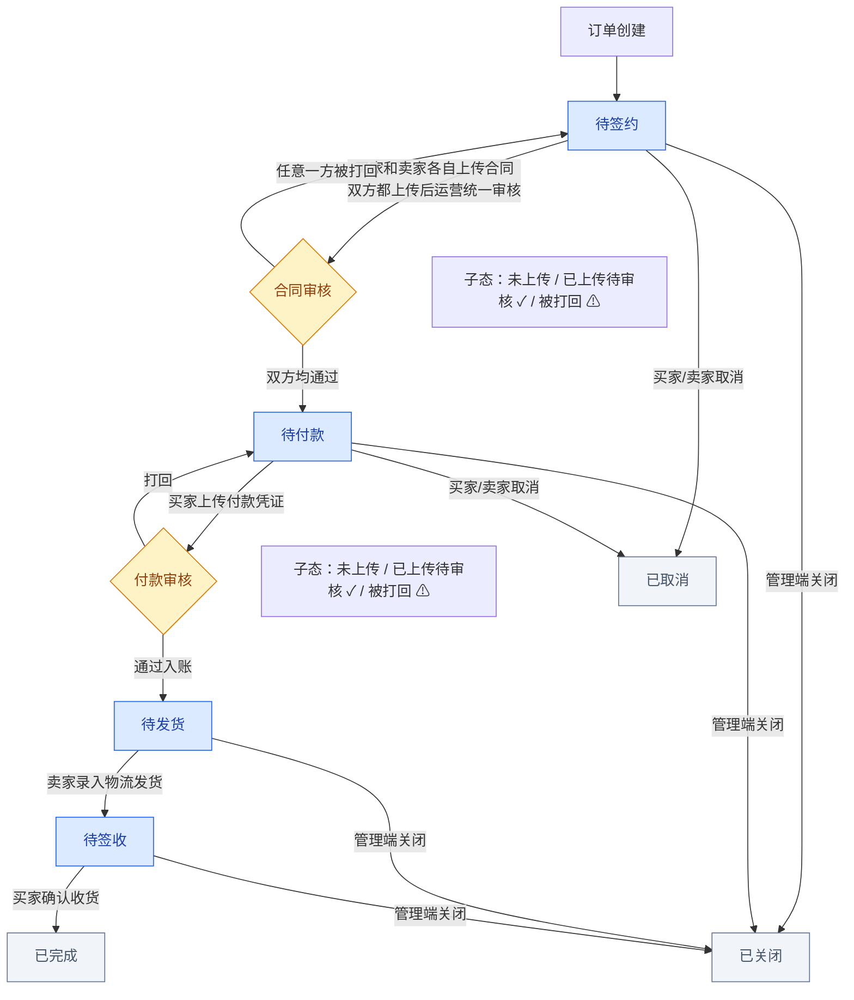
```mermaid
graph TB
    A[订单创建] --> B[待签约]
    B -->|买家和卖家各自上传合同<br>双方都上传后运营统一审核| C{合同审核}
    C -->|双方均通过| D[待付款]
    C -->|任意一方被打回| B
    B ~~~ B_sub1[子态：未上传 / 已上传待审核 ✓ / 被打回 ⚠]
    
    D -->|买家上传付款凭证| E{付款审核}
    E -->|通过入账| F[待发货]
    E -->|打回| D
    D ~~~ D_sub1[子态：未上传 / 已上传待审核 ✓ / 被打回 ⚠]
    
    F -->|卖家录入物流发货| G[待签收]
    G -->|买家确认收货| H[已完成]
    
    B -->|买家/卖家取消| I[已取消]
    D -->|买家/卖家取消| I
    B -->|管理端关闭| J[已关闭]
    D -->|管理端关闭| J
    F -->|管理端关闭| J
    G -->|管理端关闭| J
    
    classDef state fill:#dbeafe,stroke:#2563eb,color:#1e40af
    classDef judge fill:#fef3c7,stroke:#d97706,color:#92400e
    classDef endState fill:#f1f5f9,stroke:#64748b,color:#475569

    class B,D,F,G state
    class H endState
    class I,J endState
    class C,E judge
```

---

### 买家端操作流程

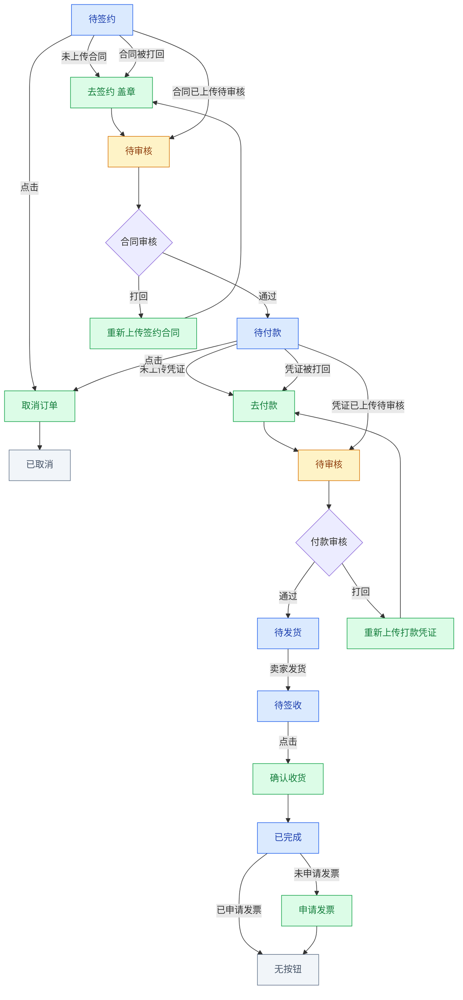
```mermaid
graph TB
    A[待签约] -->|未上传合同| B[去签约 盖章]
    B --> C[待审核]
    A -->|合同已上传待审核| C
    A -->|合同被打回| B
    A -->|点击| E[取消订单]
    E --> Z1[已取消]
    C --> D{合同审核}
    D -->|通过| F[待付款]
    D -->|打回| G[重新上传签约合同]
    G --> B
    
    F -->|未上传凭证| H[去付款]
    H --> I[待审核]
    F -->|凭证已上传待审核| I
    F -->|凭证被打回| H
    F -->|点击| E
    I --> J{付款审核}
    J -->|通过| K[待发货]
    J -->|打回| L[重新上传打款凭证]
    L --> H

    K -->|卖家发货| M[待签收]
    M -->|点击| N[确认收货]
    N --> O[已完成]
    O -->|未申请发票| P[申请发票]
    O -->|已申请发票| Q[无按钮]
    P --> Q

    classDef state fill:#dbeafe,stroke:#2563eb,color:#1e40af
    classDef btn fill:#dcfce7,stroke:#16a34a,color:#15803d
    classDef endState fill:#f1f5f9,stroke:#64748b,color:#475569
    classDef info fill:#fef3c7,stroke:#d97706,color:#92400e

    class A,F,K,M,O state
    class Z1,Q endState
    class B,E,G,H,L,N,P btn
    class C,I info
    class D,J judge
```

> **买家端按钮一览**
> - 待签约（未上传）：`去签约(盖章)` `取消订单` → 进入待审核，等待运营审核
> - 待签约（已上传，平台审核中）：无按钮，显示"合同已提交，平台审核中..."
> - 待签约（合同被打回）：`重新上传签约合同` → 回到待审核，等待运营重新审核
> - 待付款（未上传凭证）：`去付款` `取消订单` → 进入待审核，等待运营审核
> - 待付款（凭证已提交审核中）：无按钮，显示"付款凭证已提交，平台审核中..."
> - 待付款（凭证被打回）：`重新上传打款凭证` → 回到待审核，等待运营重新审核
> - 待发货：无按钮
> - 待签收：`确认收货`
> - 已完成：未申请发票→`申请发票`；已申请→无按钮
> - 已取消/已关闭：无按钮

---

### 商家端操作流程

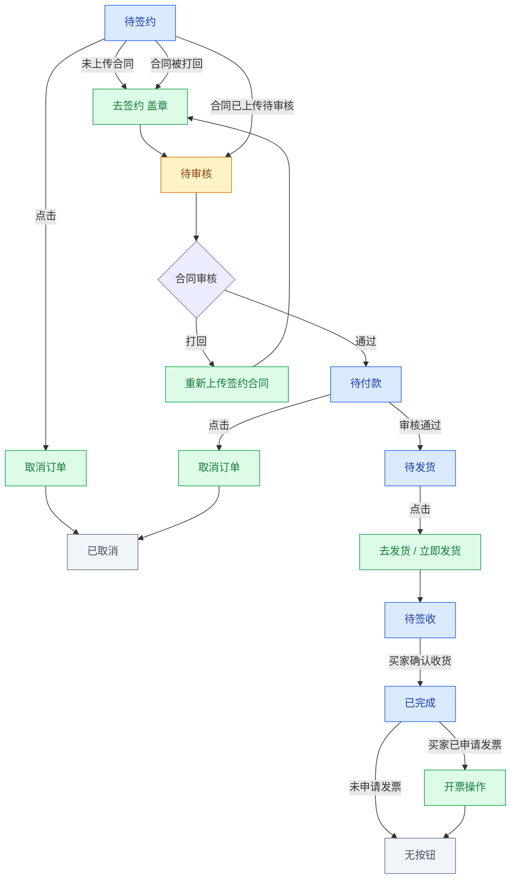
```mermaid
graph TB
    A[待签约] -->|未上传合同| B[去签约 盖章]
    B --> C[待审核]
    A -->|合同已上传待审核| C
    A -->|合同被打回| B
    A -->|点击| E[取消订单]
    E --> Z1[已取消]
    C --> D{合同审核}
    D -->|通过| F[待付款]
    D -->|打回| G[重新上传签约合同]
    G --> B
    
    F -->|点击| H[取消订单]
    H --> Z1
    F -->|审核通过| I[待发货]
    I -->|点击| J[去发货 / 立即发货]
    J --> K[待签收]
    K -->|买家确认收货| L[已完成]
    L -->|买家已申请发票| M[开票操作]
    L -->|未申请发票| N[无按钮]
    M --> N

    classDef state fill:#dbeafe,stroke:#2563eb,color:#1e40af
    classDef btn fill:#dcfce7,stroke:#16a34a,color:#15803d
    classDef endState fill:#f1f5f9,stroke:#64748b,color:#475569
    classDef info fill:#fef3c7,stroke:#d97706,color:#92400e

    class A,F,I,K,L state
    class Z1,N endState
    class B,E,G,H,J,M btn
    class C info
    class D judge
```

> **商家端按钮一览**
> - 待签约（未上传）：`去签约(盖章)` `取消订单` → 进入待审核，等待运营审核
> - 待签约（已上传，平台审核中）：无按钮，显示"合同已提交，平台审核中..."
> - 待签约（合同被打回）：`重新上传签约合同` → 回到待审核，等待运营重新审核
> - 待付款：`取消订单`
> - 待发货：`去发货` / `立即发货`（录入物流信息）
> - 待签收：无按钮（等待买家确认收货）
> - 已完成：买家已申请发票→`待开票` / `已开发票(查看)`；未申请→无按钮
> - 已取消/已关闭：无按钮

---

### 管理端操作流程

```mermaid
graph TB
    A[待签约 - 双方已上传合同] -->|点击| B{审核合同弹窗}
    B -->|买家通过 + 卖家通过| C[流转至待付款]
    B -->|任意一方打回 → 双方均退回| D[双方均退回重新签约]
    
    E[待付款 - 凭证已上传] -->|点击| F{审核付款弹窗}
    F -->|通过入账| G[流转至待发货]
    F -->|打回| H[退回买家付款]
    
    I[待签收] -->|点击| J[代确认收货]
    J --> K[已完成]
    
    A2[任意非完结状态] -->|点击| L[关闭 退款]
    L --> M[已关闭]

    classDef state fill:#dbeafe,stroke:#2563eb,color:#1e40af
    classDef btn fill:#dcfce7,stroke:#16a34a,color:#15803d
    classDef judge fill:#fef3c7,stroke:#d97706,color:#92400e
    classDef endState fill:#f1f5f9,stroke:#64748b,color:#475569

    class A,E,I state
    class C,G,K state
    class D,H endState
    class J,L btn
    class M endState
    class B,F judge
```

> **管理端按钮一览**
> - 待签约（双方已上传合同）：`审核合同`（弹窗内：买家通过/打回 + 卖家通过/打回，任意一方打回则双方均需重新上传，另一方同步打回）
> - 待付款（凭证已上传）：`审核付款`（弹窗内：审核通过入账 / 审核不通过打回）
> - 待签收：`代确认收货`
> - 任意非完结状态：`关闭(退款)`
> - 已完成/已取消/已关闭：无按钮

---

### 订单履约按钮权限表

#### 状态说明
- **订单状态**：待签约 / 待付款 / 待发货 / 待签收 / 已完成 / 已取消 / 已关闭
- **合同子态**：未上传 / 已上传待审核 / 被打回 / 已审核通过
- **付款子态**：未上传 / 已上传待审核 / 被打回

#### 买家端（PC + H5）

| 订单状态 | 合同子态 | 显示按钮 | 功能说明 |
|---------|---------|---------|---------|
| **待签约** | 未上传 | `去签约(盖章)` `取消订单` | 上传合同并盖章 → 进入待审核 / 买家取消订单 |
| **待签约** | 已上传待审核 | - | 显示"合同已提交，平台审核中..."，等待运营审核 |
| **待签约** | 合同被打回（双方均打回） | `重新上传签约合同` | 重新上传被打回的合同 → 回到待审核 → 等待运营重新审核 |
| **待付款** | 已审核通过 | 见下方付款子态行 | - |
| **待付款** | 付款未上传 | `去付款` `取消订单` | 上传付款凭证 → 进入待审核 / 买家取消订单 |
| **待付款** | 付款已上传待审核 | - | 显示"付款凭证已提交，平台审核中..."，等待运营审核 |
| **待付款** | 付款被打回 | `重新上传打款凭证` | 重新上传被打回的凭证 → 回到待审核 → 等待运营重新审核 |
| **待发货** | 已审核通过 | - | 无按钮，等待卖家发货 |
| **待签收** | 已审核通过 | `确认收货` | 买家确认收货，订单完成 |
| **已完成** | - | 未申请发票→`申请发票`；已申请→无按钮 | 申请开具增值税发票 |
| **已取消/已关闭** | - | - | 无按钮 |

#### 商家端（PC + H5）

| 订单状态 | 合同子态 | 显示按钮 | 功能说明 |
|---------|---------|---------|---------|
| **待签约** | 未上传 | `去签约(盖章)` `取消订单` | 上传合同并盖章 → 进入待审核 / 卖家取消订单 |
| **待签约** | 已上传待审核 | - | 显示"合同已提交，平台审核中..."，等待运营审核 |
| **待签约** | 合同被打回（双方均打回） | `重新上传签约合同` | 重新上传被打回的合同 → 回到待审核 → 等待运营重新审核 |
| **待付款** | 已审核通过 | `取消订单` | 卖家取消订单 |
| **待发货** | 已审核通过 | `去发货` / `立即发货` | 录入物流发货信息 |
| **待签收** | 已审核通过 | - | 无按钮，等待买家确认收货 |
| **已完成** | - | 买家已申请发票→`待开票` / `已开发票(查看)` | 上传发票文件或查看已开发票 |
| **已完成** | - | 未申请→无按钮 | - |
| **已取消/已关闭** | - | - | 无按钮 |

#### 管理端（运营后台）

| 订单状态 | 审核对象 | 显示按钮 | 功能说明 |
|---------|---------|---------|---------|
| **待签约（双方已上传合同）** | 合同 | `审核合同` | 弹窗内：买家通过/打回 + 卖家通过/打回；任意一方打回则双方均需重新上传，另一方同步打回 |
| **待签约（一方或双方未上传）** | 合同 | - | 无按钮，等待双方上传合同 |
| **待付款（凭证已上传）** | 付款凭证 | `审核付款` | 弹窗内：审核通过入账 / 审核不通过打回 |
| **待付款（凭证未上传）** | 付款凭证 | - | 无按钮，等待买家上传凭证 |
| **待签收** | - | `代确认收货` | 监管放款执行权，代买家确认收货 |
| **非完结状态** | - | `关闭(退款)` | 强制关闭订单并退款 |
| **已完成/已取消/已关闭** | - | - | 无按钮 |

---

## 📝 更新记录

| 版本 | 日期 | 更新内容 |
|------|------|---------|
| V1.0 | 2026-08-04 | 基于实际代码分析创建，修正所有虚构按钮和错误状态 |
| V1.1 | 2026-08-04 | 将每个角色的操作流程图完全分离，提升可读性 |
| V1.2 | 2026-08-04 | 统一颜色方案：蓝色=状态、绿色=按钮、黄色=判断、灰色=结束 |
| V1.3 | 2026-08-05 | 新增店铺入驻审核流程（开头）和订单履约流程（末尾），使用 endState 避免保留字冲突 |
| V1.4 | 2026-08-05 | 清除所有流程图和权限表中的代码数字（status 值、枚举值、pending/rejected 等），纯业务语言展示 |
| V1.7 | 2026-08-06 | 修复订单履约流程：合同和付款凭证的重新上传改为经过审核节点（黄色方框），打回→重新上传→待审核→审核节点；同步更新按钮权限表说明 |
