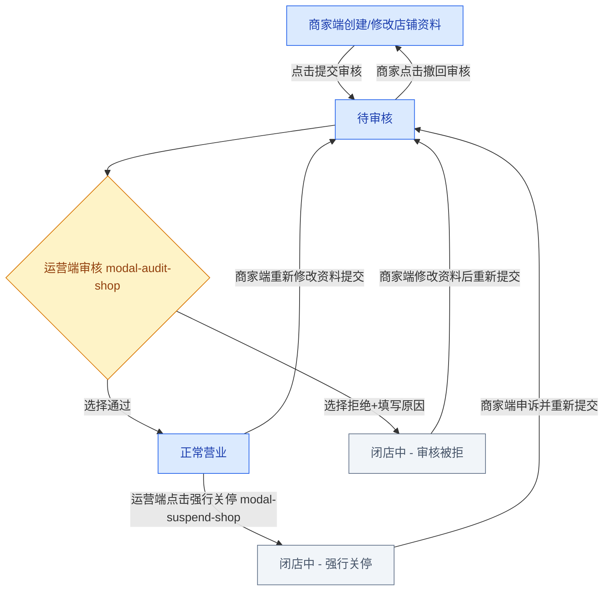
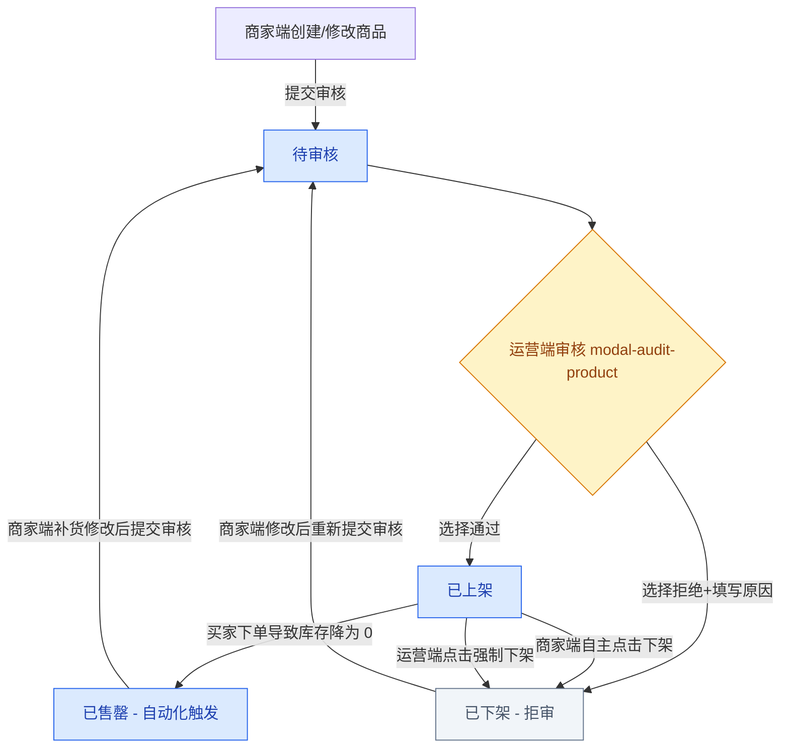
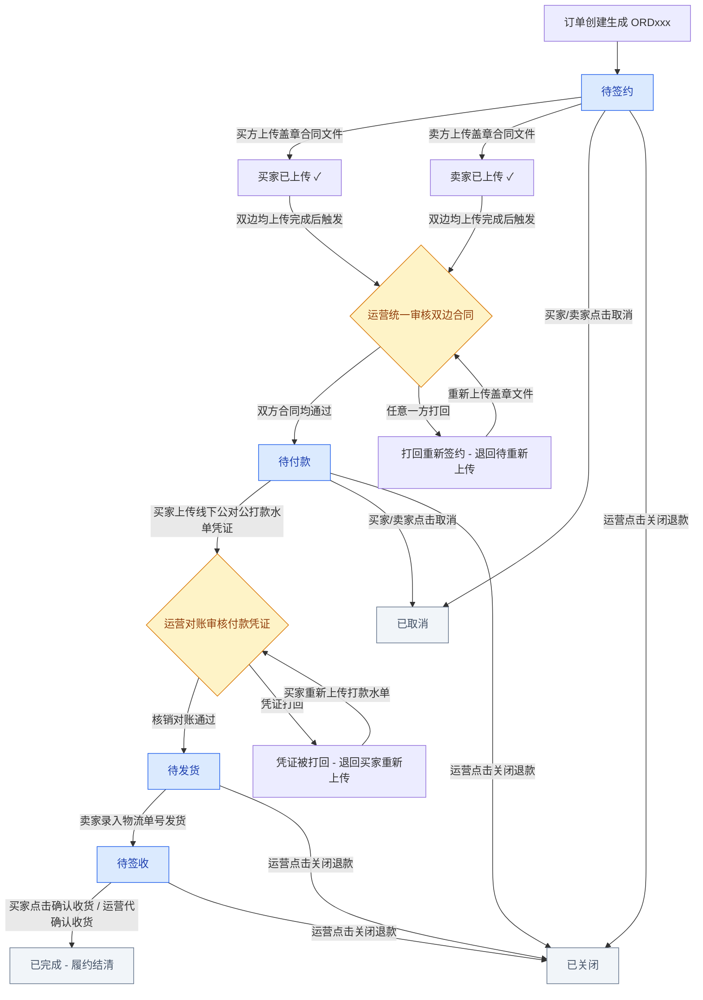
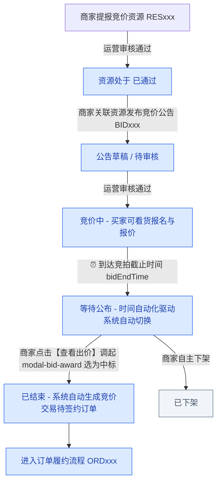
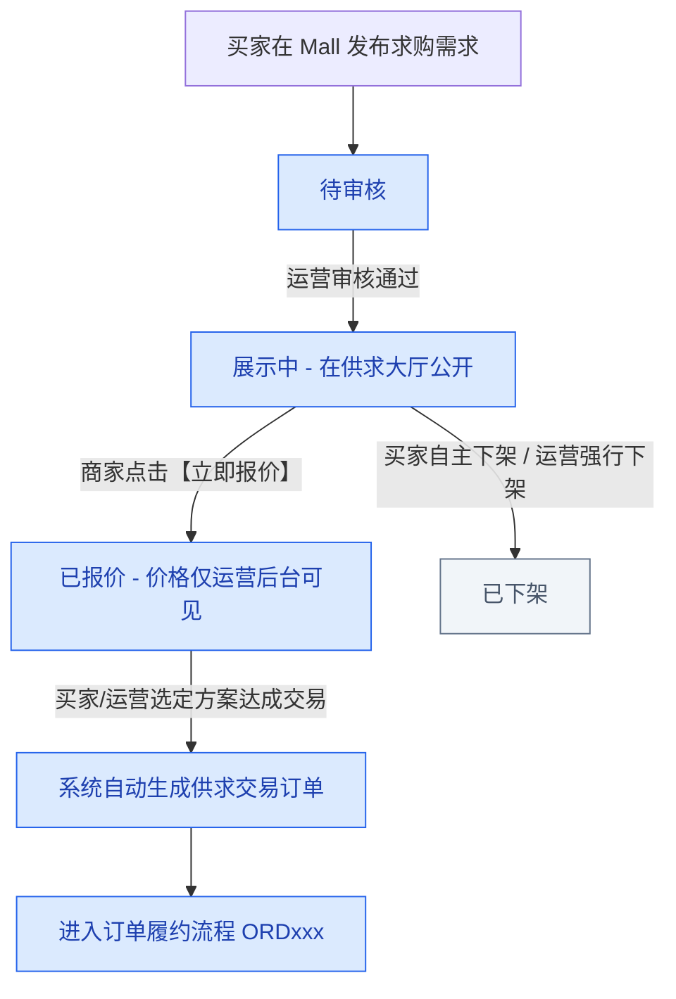

# 📊 产业园区商流供应链系统 - 全平台字段表、状态流转与操作权限全景文档 (完整版)

## 📋 文档概述

本文档针对产业园区商流供应链系统（S2B2C 轻量版、去资金网关、线下履约对账）中 **运营端 (Admin)**、**PC 商家端 (Merchant)**、**H5 移动商家端 (Merchant H5)**、**PC 买家商城端 (Mall)**、**H5 移动买家端 (H5)** 5 大端口，全面梳理了各界面的**字段属性字典 (含来源生成规则与展示格式)**、**状态机与时间/条件驱动自动化切换机理**、**Mermaid 业务流程图** 以及 **多角色（买家/商家/运营）在不同状态节点下的操作按钮权限矩阵**。

---

## 🏢 一、 运营管理端 (Admin)

### 1️⃣ 商家店铺管理 (`admin.html`)

#### 📊 字段字典表 (7列统一架构)

| 字段名称 | 字段类型 | 来源 / 生成规则 | 展示与格式要求 | 筛选 / 搜索方式 | 对应操作 / 触发动作 | 关联状态流转节点 |
|---------|---------|----------------|---------------|---------------|-------------------|------------------|
| **序号** | 流水号 | 前端表格动态渲染自增 | `1, 2, 3...` 居中展示 | - | - | 列表标识 |
| **商户号** | 字符串 | 企业提交审核后系统自动生成，格式：`S0001`（四位流水号） | 文本，等宽字体 | 输入框 全匹配 | - | 身份标识 |
| **头像** | 图片预览 | 商家上传，缺省时读取默认 Logo | 36x36px 圆形缩略图，点击调起原图预览弹窗 | - | 点击调起大图预览 | - |
| **横幅 Banner** | 图片预览 | 商家上传，缺省时读取默认海报 | 80x30px 圆角矩形，点击调起原图预览弹窗 | - | 点击调起大图预览 | - |
| **店铺名称** | 字符串 | 商家店铺登记注册全称 | 粗体文本，超出 15 字 `...` 截断 | 输入框 模糊匹配 | - | - |
| **公司名称** | 字符串 | 商家营业执照认证公司全称 | 灰色辅助文本 | 输入框 模糊匹配 | - | - |
| **店铺状态** | 枚举 | 状态机流转控制 | `未开店`(灰色) / `待审核`(橙色) / `正常营业`(绿色) / `闭店中`(红/黑) | 下拉单选 | 点击状态标签可演示循环切换 | `未开店` -> `待审核` -> `正常营业` / `闭店中` |
| **货品数量** | 千分位整数 | 统计名下在售及备货商品总量 | 数字，如 `1,250` | - | - | - |
| **统一社会信用代码** | 字符串 | 18 位统一社会信用代码 | 18 位大写字母数字组合 | - | - | 资质核验 |
| **更新时间** | 日期时间 | 记录每次审核、关停或提交的时间 | `yyyy-MM-dd HH:mm:ss` | 日期范围选择 | - | 排序基准 |
| **操作列** | 动作按钮 | 依赖当前 `店铺状态` 动态渲染 | 按钮组：`审核` (待审核时) / `强行关停` (正常营业时) / `--` (闭店时) | - | 调起 `#modal-audit-shop` 审核弹窗 / `#modal-suspend-shop` 关停弹窗 | `待审核` -> `正常营业` / `闭店中` |

> **📌 默认排序**：按 `更新时间` 降序 (新 -> 旧)  
> **💡 展示限制**：仅展示首次提交过开店审核的商户。尚未提交首次建立申请的商户不在此列表出现。

#### 🔄 店铺入驻与生命周期状态流转图 (Mermaid)

#### 🛡️ 店铺入驻角色与按钮权限矩阵表

| 当前店铺状态 | 商家端 (PC / H5) 可见按钮与行为 | 运营端 (Admin) 可见按钮与行为 | 自动化 / 系统行为 |
|-------------|------------------------------|------------------------------|------------------|
| **未开店 / 闭店中** | `提交审核`：解锁表单，填写资料后提交审核 | - (无操作按钮，只读显示关停/拒审原因) | 商家提交后状态自动变为 `待审核` |
| **待审核** | `撤回审核`：点击后撤回，状态退回未开店并解锁编辑 | `审核`：调起审核弹窗，选择通过/拒绝(限50字原因) | 处于 `待审核` 时锁死商家端输入框 |
| **正常营业** | `提交审核`：修改资料后重新提交审核 | `强行关停`：调起弹窗填写关停原因后强制闭店 | 状态变为 `闭店中` |

---

### 2️⃣ 分类数据字典 (`admin.html`)

#### 📊 字段字典表

| 字段名称 | 字段类型 | 来源 / 生成规则 | 展示与格式要求 | 筛选 / 搜索方式 | 对应操作 / 触发动作 | 关联状态流转节点 |
|---------|---------|----------------|---------------|---------------|-------------------|------------------|
| **序号** | 流水号 | 前端表格动态自增 | `1, 2, 3...` | - | - | - |
| **类别名称** | 字符串 | 运营手动录入 | 文本，同层级不允许重名 | 输入框 模糊匹配 | - | - |
| **类别编码** | 字符串 | 系统依层级自增，如 `C001`、`C001-001` | 编码格式字符串 | - | - | 层级标识 |
| **分类级别** | 枚举 | 依赖父节点层级自动判定 | `1级` / `2级` / `3级` 标签 | 下拉单选 (必选) | - | 树节点深度 |
| **状态** | 标签 | 运营切换控制 | `启用`(绿色) / `禁用`(灰色) | 下拉单选 | 点击可就地切换启用/禁用 | 启用/停用状态 |
| **创建时间** | 日期时间 | 节点首次新增时间 | `yyyy-MM-dd HH:mm:ss` | - | - | 默认排序 |
| **更新时间** | 日期时间 | 最后修改时间 | `yyyy-MM-dd HH:mm:ss` | - | - | - |
| **操作列** | 动作按钮 | 常驻 | `编辑` / `新增下级` / `禁用` | - | 调起 `#modal-add-category` 分类弹窗 | - |

> **📌 默认排序**：按 `创建时间` 升序 (旧 -> 新，按树形多级展开)

---

### 3️⃣ 上架商品管理 (`admin.html`)

#### 📊 字段字典表

| 字段名称 | 字段类型 | 来源 / 生成规则 | 展示与格式要求 | 筛选 / 搜索方式 | 对应操作 / 触发动作 | 关联状态流转节点 |
|---------|---------|----------------|---------------|---------------|-------------------|------------------|
| **序号** | 流水号 | 前端自增 | `1, 2, 3...` | - | - | - |
| **上架单号** | 字符串 | 系统自动生成，格式：`LST2607010001` | 字符串，支持一键复制 | 输入框 全匹配 | - | 追溯标识 |
| **主图** | 图片预览 | 商家上传商品主图 | 40x40px 缩略图，点击调起原图预览 | - | 点击调起放大预览 | - |
| **店铺名称** | 字符串 | 提报上架单的商家店铺名称 | 文本 | - | - | - |
| **公司名称** | 字符串 | 商家公司名称 | 灰色辅助文本 | - | - | - |
| **商品名称** | 字符串 | 商品标题 | 粗体文本，超出 20 字省略 | 输入框 模糊匹配 | - | - |
| **上架单类别**| 标签 | 商家提报时选择 | `现货` (蓝) / `预售货` (紫) | 枚举下拉选择 (前置必选)| - | 交易模式 |
| **货品类别** | 三级分类 | 属于的三级分类路径 | 三级级联文本，如 `粮油-谷物-大米` | 三级级联下拉选择 | - | 品类归属 |
| **单价** | 千分位 | 挂牌单价 | `¥4,150.00 / 吨` (保留两位小数) | - | - | 价格控制 |
| **销量** | 千分位整数 | 履约完成后累加 | 数字，如 `1,500` | - | - | 销售统计 |
| **上架时间** | 日期时间 | 最新一次审核通过时间 | `yyyy-MM-dd HH:mm:ss` | 日期范围选择 | - | 状态时间戳 |
| **创建时间** | 日期时间 | 上架申请首次提报时间 | `yyyy-MM-dd HH:mm:ss` | - | - | - |
| **更新时间** | 日期时间 | 审核、下架、重新提报时间 | `yyyy-MM-dd HH:mm:ss` | - | - | 默认排序 |
| **当前状态** | 枚举 | 货品状态机 | `待审核` / `已上架` / `已下架` / `已售罄` | 下拉单选 | 点击可循环演练切换 | 货品生命周期 |
| **操作列** | 动作按钮 | 依赖 `当前状态` 渲染 | `编辑` / `审核` (待审核) / `强制下架` (已上架) | - | 调起 `#modal-audit-product` 审核弹窗 | `待审核` -> `已上架` / `已下架` |

> **📌 默认排序**：按 `更新时间` 降序 (新 -> 旧)  
> **💡 下架原因展示**：`已下架(拒审原因: xxx)` / `已下架(强制下架原因: xxx)` / `已下架(自主下架)` / `已下架(店铺闭店)`

#### 🔄 货品上架审核与下架流程图 (Mermaid)

---

### 4️⃣ 供求中心 (`admin.html`)

#### 📊 字段字典表

| 字段名称 | 字段类型 | 来源 / 生成规则 | 展示与格式要求 | 筛选 / 搜索方式 | 对应操作 / 触发动作 | 关联状态流转节点 |
|---------|---------|----------------|---------------|---------------|-------------------|------------------|
| **序号** | 流水号 | 前端自增 | `1, 2, 3...` | - | - | - |
| **求购单号** | 字符串 | 格式：`REQ2607010001` | 字符串 | 输入框 全匹配 | - | 需求标识 |
| **买家** | 字符串 | 发布需求的买家用户名 | 文本 | 输入框 模糊匹配 | - | 买家主体 |
| **买家手机号** | 脱敏手机号 | 买家注册手机号 | `138****8818` 脱敏展示 | 输入框 全匹配 (前置必选)| - | 隐私保护 |
| **意向货品** | 标签 | 买家输入的采购商品名称 | 蓝色 Tag 标签 | 输入框 模糊匹配 (前置必选)| - | 品类意向 |
| **数量** | 数量+单位 | 买家输入的采购量 | 数字+单位，如 `50 吨` | - | - | 采购规模 |
| **交期时间** | 日期范围 | 期望到货交期区间 | `yyyy-MM-dd ~ yyyy-MM-dd` | 日期范围选择 | - | 履约时效 |
| **创建时间** | 日期时间 | 需求提交发布时间 | `yyyy-MM-dd HH:mm:ss` | - | - | 默认排序 |
| **更新时间** | 日期时间 | 审核、下架、成单时间 | `yyyy-MM-dd HH:mm:ss` | - | - | - |
| **状态** | 枚举 | 需求状态机 | `待审核` / `展示中` / `已下架` / `已完结` | - | - | 需求生命周期 |
| **操作列** | 动作按钮 | 依赖 `状态` 渲染 | `审核` (待审核) / `强行下架` / `查看报价 (n)` | - | 调起 `#modal-audit-demand` 审核弹窗 / `#modal-demand-quotes` 报价列表 | `待审核` -> `展示中` -> `已完结` |

> **📌 默认排序**：按 `创建时间` 降序 (新 -> 旧)  
> **💡 权限约束**：买家前台不显示“查看报价”按钮，所有商家报价记录强制仅在运营后台提供查看，防止绕过平台交易。

---

### 5️⃣ 订单透视与履约管理 (`admin.html`)

#### 📊 字段字典表

| 字段名称 | 字段类型 | 来源 / 生成规则 | 展示与格式要求 | 筛选 / 搜索方式 | 对应操作 / 触发动作 | 关联状态流转节点 |
|---------|---------|----------------|---------------|---------------|-------------------|------------------|
| **序号** | 流水号 | 前端自增 | `1, 2, 3...` | - | - | - |
| **订单编号** | 字符串 | 格式：`ORD202607010001` | 粗体文本，一键复制 | 输入框 全匹配 | 点击调起订单履约轨迹详情弹窗 | 主键 |
| **订单类型** | 标签 | 系统根据交易源划分 | `现货交易` / `竞价交易` 标签 | 下拉单选 | - | 交易源区分 |
| **买家** | 字符串 | 买家账号/企业全称 | 文本 | 输入框 模糊匹配 | - | 买方主体 |
| **买家手机号** | 脱敏手机号 | 脱敏处理 | `138****8818` | 输入框 模糊匹配 | - | 联系方式 |
| **关联卖家店铺**| 字符串 | 卖家店铺名称 | 文本 | 输入框 模糊匹配 | - | 卖方主体 |
| **卖家公司** | 字符串 | 卖家认证公司全称 | 灰色辅助文本 | - | - | - |
| **订单金额** | 千分位 | 商品单价 * 数量 | `¥100,000.00` (保留两位) | - | - | 交易体量 |
| **平台佣金** | 组合字段 | 按抽佣规则计算 | `0.60% (¥600.00)` | - | - | 抽佣账单 |
| **履约状态** | 枚举 | 订单状态机驱动 | `待签约` / `待付款` / `待发货` / `待签收` / `已完成` / `已取消` / `已关闭` | 下拉单选 | 点击可进行演示状态轮转 | 订单履约主链 |
| **创建时间** | 日期时间 | 订单生成时间 | `yyyy-MM-dd HH:mm:ss` | 日期范围选择 | - | 默认排序 |
| **操作列** | 动作按钮 | 依赖当前 `履约状态` | `审核合同` (待签约时) / `审核付款` (待付款时) / `代确认收货` (待签收时) / `关闭退款` | - | 调起合同双校验弹窗 / 付款对账凭证核验弹窗 | `待签约` -> `待付款` -> `待发货` -> `待签收` -> `已完成` |

> **📌 默认排序**：按 `创建时间` 降序 (新 -> 旧)

#### 🔄 全流程订单履约与线下水单/双边合同校验流转图 (Mermaid)

#### 🛡️ 订单履约多角色操作权限矩阵表

| 订单履约状态  | 买家端 (Mall PC / H5) 可见按钮与行为   | 商家端 (Merchant PC / H5) 可见按钮与行为 | 运营端 (Admin) 可见按钮与监管权                  |
| ------- | ---------------------------- | ------------------------------ | ------------------------------------- |
| **待签约** | `去签约(盖章)` (上传盖章合同件) / `取消订单` | `去签约(盖章)` (上传盖章合同件) / `取消订单`   | `审核合同` (当且仅当双边均已上传合同后激活审核弹窗) / `关闭订单` |
| **待付款** | `去付款` (上传线下打款水单凭证) / `取消订单`  | `取消订单`                         | `审核付款` (买家上传水单后激活核销弹窗) / `关闭订单`       |
| **待发货** | - (只读，显示"卖家备货发货中...")        | `去发货` / `立即发货` (录入物流公司与单号)     | `关闭订单`                                |
| **待签收** | `确认收货` (点击后直接结清变为已完成)        | - (只读，等待买家确认收货)                | `代确认收货` (拥有监管放款强制执行权) / `关闭订单`        |
| **已完成** | `申请发票` (填写发票抬头与接收邮箱)         | `开票处理` (查看开票申请并上传发票文件)         | - (只读完成记录)                            |

---

### 6️⃣ IM 沟通监控 (`admin.html`)

#### 📊 字段字典表

| 字段名称 | 字段类型 | 来源 / 生成规则 | 展示与格式要求 | 筛选 / 搜索方式 | 对应操作 / 触发动作 | 关联状态流转节点 |
|---------|---------|----------------|---------------|---------------|-------------------|------------------|
| **序号** | 流水号 | 前端自增 | `1, 2, 3...` | - | - | - |
| **关联单号** | 字符串 | 关联商品单号 `LST...` 或求购单号 `REQ...` | 文本 | 输入框 全匹配 | - | 关联上下文 |
| **买家** | 字符串 | 参与聊天的买家用户名 | 文本 | 输入框 模糊匹配 | - | 咨询买方 |
| **买家手机号** | 脱敏手机号 | 脱敏展示 | `138****8818` | 输入框 模糊匹配 | - | - |
| **商家店铺名** | 字符串 | 被咨询的商家店铺名称 | 文本 | 输入框 模糊匹配 | - | 咨询卖方 |
| **商家公司名** | 字符串 | 商家认证公司名 | 灰色文本 | 输入框 模糊匹配 | - | - |
| **最近互动时间**| 日期时间 | 最新一条 IM 消息发送时间 | `yyyy-MM-dd HH:mm:ss` | - | - | 默认排序 |
| **操作列** | 动作按钮 | 常驻 | `查看沟通快照` | - | 调起 `#modal-chat` IM 快照监控弹窗 | 只读监控 |

---

### 7️⃣ 竞价资源监控 (`admin.html`)

#### 📊 字段字典表

| 字段名称 | 字段类型 | 来源 / 生成规则 | 展示与格式要求 | 筛选 / 搜索方式 | 对应操作 / 触发动作 | 关联状态流转节点 |
|---------|---------|----------------|---------------|---------------|-------------------|------------------|
| **序号** | 流水号 | 前端自增 | `1, 2, 3...` | - | - | - |
| **资源编号** | 字符串 | 格式：`RES2607010001` | 字符串 | 输入框 全匹配 | - | 资源 ID |
| **资源图片** | 图片预览 | 商家拍照上传物资实物图 | 40x40px 缩略图，点击调起原图预览 | - | 点击调起原图预览 | - |
| **提报商家店铺**| 字符串 | 提报资源的商家店铺 | 文本 | 输入框 模糊匹配 | - | - |
| **公司名** | 字符串 | 商家公司全称 | 灰色文本 | 输入框 模糊匹配 | - | - |
| **资源货品名** | 字符串 | 竞价物资资源名称 | 粗体文本 | 输入框 模糊匹配 | - | - |
| **规格描述** | 字符串 | 材质、重量、看货要求 | 文本 | - | - | - |
| **状态** | 枚举 | 资源审核状态机 | `待审核` / `已通过` / `未通过` | 下拉单选 | - | 资源审核节点 |
| **创建时间** | 日期时间 | 提报提交时间 | `yyyy-MM-dd HH:mm:ss` | - | - | - |
| **更新时间** | 日期时间 | 审核通过/驳回时间 | `yyyy-MM-dd HH:mm:ss` | - | - | 默认排序 |
| **操作列** | 动作按钮 | 依赖 `状态` 渲染 | `审核` (待审核) / `--` | - | 调起 `#modal-audit-bidres` 审核弹窗 | `待审核` -> `已通过` / `未通过` |

---

### 8️⃣ 竞价公告监控 (`admin.html`)

#### 📊 字段字典表

| 字段名称 | 字段类型 | 来源 / 生成规则 | 展示与格式要求 | 筛选 / 搜索方式 | 对应操作 / 触发动作 | 关联状态流转节点 |
|---------|---------|----------------|---------------|---------------|-------------------|------------------|
| **序号** | 流水号 | 前端自增 | `1, 2, 3...` | - | - | - |
| **公告编号** | 字符串 | 格式：`BID2607010001` | 字符串 | 输入框 全匹配 | - | 公告 ID |
| **公告标题** | 字符串 | 竞拍公告标题 | 粗体文本，超出 20 字 `...` 截断 | 输入框 模糊匹配 | - | - |
| **发布商家店铺**| 字符串 | 商家店铺名称 | 文本 | 输入框 模糊匹配 | - | - |
| **关联资源编号**| 字符串 | 绑定的已过审资源 ID | 字符串 | 输入框 全匹配 | - | 资源关联 |
| **起拍底价** | 千分位 | 起拍最低底价（元） | `¥50,000.00` | - | - | 底价基准 |
| **当前最高出价**| 千分位 | 买家实时竞争最高出价 | `¥68,500.00` (红色粗体) | - | - | 实时行情 |
| **公告状态** | 枚举 | 竞拍生命周期状态机 | `待审核` / `竞价中` / `等待公布` / `已结束` / `已下架` | 下拉单选 | - | 竞拍生命周期 |
| **创建时间** | 日期时间 | 提交发布时间 | `yyyy-MM-dd HH:mm:ss` | - | - | 默认排序 |
| **操作列** | 动作按钮 | 依赖 `公告状态` 渲染 | `审核` (待审核) / `强行下架` / `查看详情` (只读) | - | 调起 `#modal-admin-bid-detail` 报价排行榜 (无定标权) | 运营监督流程 |

> **📌 默认排序**：按 `创建时间` 降序 (新 -> 旧)  
> **💡 自动化状态转换机理**：
> 1. **审核过审驱动**：运营审核通过后，公告状态变为 `竞价中`。
> 2. **时间自动化驱动 (Time-Driven Automatic Transition)**：当当前系统时间达到 `竞拍截止时间 (bidEndTime)` 时，后台系统**无需人工操作，自动将公告状态从 `竞价中` 转换为 `等待公布`**，并封闭买家端继续提交加价的入口。

---

### 9️⃣ 平台抽佣配置 (`admin.html`)

#### 📊 字段字典表

| 字段名称 | 字段类型 | 来源 / 生成规则 | 展示与格式要求 | 筛选 / 搜索方式 | 对应操作 / 触发动作 | 关联状态流转节点 |
|---------|---------|----------------|---------------|---------------|-------------------|------------------|
| **序号** | 流水号 | 前端自增 | `1, 2, 3...` | - | - | - |
| **规则名称** | 字符串 | 运营手动创建 | 粗体文本，不可重复 | 输入框 模糊匹配 | - | 规则唯一标识 |
| **抽佣模式** | 枚举 | 模式选择 | `全局模式` / `特定商家` / `特定品类` | 下拉单选 (前置必选)| - | 规则计算作用域 |
| **针对目标** | 字符串 | 绑定的商家店铺或品类路径 | 文本，如 `全平台` 或 `远大钢铁` | 输入框 模糊匹配 | - | 作用对象 |
| **抽佣比例%** | 百分比 | 手续费率 | `0.60%` | - | - | 结算计算因子 |
| **创建时间** | 日期时间 | 配置生成时间 | `yyyy-MM-dd HH:mm:ss` | - | - | 默认排序 |
| **操作列** | 动作按钮 | 常驻 | `编辑` / `删除` | - | 调起 `#modal-add-commission` 配置弹窗 | 计费规则库 |

---

## 🏪 二、 PC 商家端后台 (Merchant)

### 1️⃣ 店铺看板与装潢 (`merchant.html`)

#### 📊 字段字典表

| 字段名称 | 字段类型 | 来源 / 生成规则 | 展示与格式要求 | 筛选 / 搜索方式 | 对应操作 / 触发动作 | 关联状态流转节点 |
|---------|---------|----------------|---------------|---------------|-------------------|------------------|
| **店铺名称** | 字符串 | 商家编辑填写 | 文本输入框 (待审核时 disabled) | - | 提交审核 | 店铺资料 |
| **店铺头像** | 图片上传 | 商家上传 | 缩略图预览 + 上传按钮 (待审核时 disabled) | - | 点击上传文件 | 视觉形象 |
| **店铺 Banner** | 图片上传 | 商家上传宽幅横幅 | 矩形预览 + 上传按钮 (待审核时 disabled) | - | 点击上传文件 | 店铺招牌 |
| **公司名称** | 字符串 | 企业认证数据 | 只读锁定展示 | - | - | 资质关联 |
| **统一信用代码**| 字符串 | 企业认证数据 | 18 位大写只读 | - | - | 资质关联 |
| **店铺状态** | 状态机 | 店铺审核与关停状态 | `未开店` / `待审核` / `正常营业` / `闭店中` | - | 点击【提交审核】/【撤回审核】 | 店铺生命周期 |

---

### 2️⃣ 基础商品库 (`merchant.html`)

#### 📊 字段字典表

| 字段名称 | 字段类型 | 来源 / 生成规则 | 展示与格式要求 | 筛选 / 搜索方式 | 对应操作 / 触发动作 | 关联状态流转节点 |
|---------|---------|----------------|---------------|---------------|-------------------|------------------|
| **序号** | 流水号 | 前端自增 | `1, 2, 3...` | - | - | - |
| **商品代码** | 字符串 | 格式：`GD00001` (GD+5位流水) | 等宽文本 | 输入框 全匹配 | - | 商品 SKU |
| **商品名称** | 字符串 | 商家录入 | 粗体文本 | 输入框 模糊匹配 | - | - |
| **商品分类** | 三级分类 | 绑定分类数据字典 | 三级级联路径 | 三级级联下拉选择器 | - | 品类归属 |
| **创建时间** | 日期时间 | 新增录入时间 | `yyyy-MM-dd HH:mm:ss` | - | - | 默认排序 |
| **更新时间** | 日期时间 | 修改时间 | `yyyy-MM-dd HH:mm:ss` | - | - | - |
| **操作列** | 动作按钮 | 常驻 | `编辑` / `删除` | - | 点击弹出编辑窗口 | 商品元数据 |

---

### 3️⃣ 上架管理列表 (`merchant.html`)

#### 📊 字段字典表

| 字段名称 | 字段类型 | 来源 / 生成规则 | 展示与格式要求 | 筛选 / 搜索方式 | 对应操作 / 触发动作 | 关联状态流转节点 |
|---------|---------|----------------|---------------|---------------|-------------------|------------------|
| **序号** | 流水号 | 前端自增 | `1, 2, 3...` | - | - | - |
| **上架单号** | 字符串 | 格式：`LST2607010001` | 字符串 | 输入框 全匹配 | - | 上架单 ID |
| **主图** | 图片预览 | 商品主图 | 40x40px 缩略图 | - | 点击调起大图预览 | - |
| **商品名称** | 字符串 | 基础库关联名称 | 粗体文本 | 输入框 模糊匹配 | - | - |
| **类别** | 标签 | 现货/预售选择 | `现货` / `预售货` | 枚举单选 | - | 销售模式 |
| **货品类别** | 三级分类 | 分类全路径 | 文本 | 三级分类下拉多选 | - | - |
| **单价** | 千分位 | 商家挂牌售价 | `¥4,150.00` | - | - | - |
| **销量** | 千分位整数 | 履约成交累加 | 整数 | - | - | - |
| **上架时间** | 日期时间 | 审核过审时间 | `yyyy-MM-dd HH:mm:ss` | 日期范围选择 | - | - |
| **创建时间** | 日期时间 | 提报提交时间 | `yyyy-MM-dd HH:mm:ss` | - | - | - |
| **更新时间** | 日期时间 | 状态变动时间 | `yyyy-MM-dd HH:mm:ss` | - | - | 默认排序 |
| **当前状态** | 枚举 | 货品状态机 | `待审核` / `已上架` / `已下架` / `已售罄` | 下拉单选 | - | 上架生命周期 |
| **操作列** | 动作按钮 | 依赖 `当前状态` | `编辑` / `提交审核` / `下架` | - | 调起 `#modal-add-product` 上架弹窗 | `草稿/已下架` -> `待审核` -> `已上架` |

---

### 4️⃣ 商家订单中心 (`merchant.html`)

#### 📊 字段字典表

| 字段名称 | 字段类型 | 来源 / 生成规则 | 展示与格式要求 | 筛选 / 搜索方式 | 对应操作 / 触发动作 | 关联状态流转节点 |
|---------|---------|----------------|---------------|---------------|-------------------|------------------|
| **序号** | 流水号 | 前端自增 | `1, 2, 3...` | - | - | - |
| **订单编号** | 字符串 | 格式：`ORD202607010001` | 粗体文本 | 输入框 全匹配 | 点击调起订单轨迹弹窗 | 订单主键 |
| **订单类型** | 标签 | 现货/竞价 | `现货交易` / `竞价交易` | 下拉单选 | - | - |
| **买家** | 字符串 | 买家用户名 | 文本 | 输入框 模糊匹配 | - | 买方 |
| **买家手机号** | 脱敏手机号 | 买家联系电话 | 脱敏展示 | - | - | - |
| **订单金额** | 千分位 | 订单总结算额 | `¥100,000.00` | - | - | - |
| **履约状态** | 枚举 | 履约主链状态 | `待签约` / `待付款` / `待发货` / `待签收` / `已完成` / `已取消` / `已关闭` | 下拉单选 | - | 履约阶段 |
| **申请开票** | 枚举 | 买家端触发申请 | `是` (红) / `否` (灰) | 单选筛选 | - | 发票开具触发 |
| **创建时间** | 日期时间 | 下单时间 | `yyyy-MM-dd HH:mm:ss` | 日期范围选择 | - | 默认排序 |
| **操作列** | 动作按钮 | 依赖 `履约状态` | `去签约(盖章)` / `取消订单` / `去发货` / `开票处理` | - | 调起卖家盖章弹窗 / `#modal-ship` 发货弹窗 | `待发货` -> `待签收` |

> **🛠️ 商家端履约弹窗表单**：
> 1. **卖家去签约弹窗**：预览合同文本、上传卖家 CA 盖章合同文件 (`.pdf`/`.png`)，提交后等待运营双校验审核
> 2. **卖家发货弹窗** (`#modal-ship`)：
>    - `第三方物流公司`：下拉选择（`顺丰速运` / `德邦物流` / `安能物流` / `专线自建`）
>    - `纯文本物流单号`：文本框（必填）
> 3. **开票处理弹窗**：查看买家发票抬头/税号/邮箱、上传电子发票文件 (`.pdf`)

---

### 5️⃣ 竞价资源提报 (`merchant.html`)

#### 📊 字段字典表

| 字段名称 | 字段类型 | 来源 / 生成规则 | 展示与格式要求 | 筛选 / 搜索方式 | 对应操作 / 触发动作 | 关联状态流转节点 |
|---------|---------|----------------|---------------|---------------|-------------------|------------------|
| **序号** | 流水号 | 前端自增 | `1, 2, 3...` | - | - | - |
| **资源编号** | 字符串 | 格式：`RES2607010001` | 字符串 | 输入框 全匹配 | - | 资源 ID |
| **资源货品名称**| 字符串 | 物资标题 | 粗体文本 | 输入框 模糊匹配 | - | - |
| **图片** | 图片预览 | 商家拍照上传 | 40x40px 缩略图 | - | 点击调起大图预览 | - |
| **规格描述** | 字符串 | 规格材质与重量 | 文本 | - | - | - |
| **状态** | 枚举 | 资源提报状态机 | `草稿` / `待审核` / `已通过` / `未通过` | 下拉单选 | - | 资源过审状态 |
| **创建时间** | 日期时间 | 创建时间 | `yyyy-MM-dd HH:mm:ss` | - | - | 默认排序 |
| **操作列** | 动作按钮 | 依赖 `状态` | `编辑` / `提交审核` / `删除` (仅草稿拥有删除) | - | 调起 `#modal-add-res` 资源弹窗 | `草稿` -> `待审核` -> `已通过` |

---

### 6️⃣ 竞价公告管理 (`merchant.html`)

#### 📊 字段字典表

| 字段名称 | 字段类型 | 来源 / 生成规则 | 展示与格式要求 | 筛选 / 搜索方式 | 对应操作 / 触发动作 | 关联状态流转节点 |
|---------|---------|----------------|---------------|---------------|-------------------|------------------|
| **序号** | 流水号 | 前端自增 | `1, 2, 3...` | - | - | - |
| **公告编号** | 字符串 | 格式：`BID2607010001` | 字符串 | 输入框 全匹配 | - | 公告 ID |
| **公告标题** | 字符串 | 公告公开标题 | 粗体文本 | 输入框 模糊匹配 | - | - |
| **关联资源编号**| 字符串 | 已通过审核的资源 ID | 字符串 | 输入框 全匹配 | - | 依赖绑定 |
| **起拍底价** | 千分位 | 商家设置底价 | `¥50,000.00` | - | - | - |
| **当前最高出价**| 千分位 | 买家出价最高者 | `¥68,500.00` (红色) | - | - | 实时行情 |
| **状态** | 枚举 | 竞拍生命周期状态机 | `草稿` / `待审核` / `竞价中` / `等待公布` / `已结束` / `已下架` | 下拉单选 | - | 竞拍生命周期 |
| **创建时间** | 日期时间 | 发布申请时间 | `yyyy-MM-dd HH:mm:ss` | - | - | 默认排序 |
| **操作列** | 动作按钮 | 依赖 `状态` 渲染 | `编辑` / `提交审核` / `查看出价` (含选为中标定标功能) / `下架` | - | 调起 `#modal-bid-award` 定标弹窗 | `等待公布` -> `已结束(生成订单)` |

> **🔄 定标与自动化订单生成机理 (Awarding Mechanism)**：
> 商家在 `等待公布` 节点点击【查看出价】调起定标弹窗，在买家报价排行榜中点击【选为中标】，系统自动执行：  
> 1. 公告状态切换为 `已结束`。  
> 2. 后台在数据库/内存中自动为该中标买家生成一条对应的 **`竞价交易` 待签约订单 (`ORDxxx`)**，拉通履约闭环。

#### 🔄 竞价流程与时间驱动自动化状态转换图 (Mermaid)

#### 🛡️ 竞价资源与公告多角色操作权限矩阵表

| 竞价节点/状态 | 商家端 (Merchant PC / H5) 操作权限 | 买家端 (Mall PC / H5) 操作权限 | 运营端 (Admin) 操作权限与监督 |
|--------------|-----------------------------------|------------------------------|----------------------------|
| **草稿 / 待审核**| `编辑` / `提交审核` / `删除草稿` | 不可见 (未上架公开) | `审核` (选择通过/拒绝+填写50字原因) |
| **竞价中** | `查看出价` (只读) / `下架` | `看货报名` -> `完成看货` -> `提交报价/加价` | `强行下架` / `查看详情` (只读排行) |
| **等待公布 (截止时间到达后自动进入)** | `查看出价` (含选为中标定标功能) / `下架` | 无操作 (显示"报价已截止，商家正在评审定标中") | `查看详情` (只读监督，无定标权) |
| **已结束 (定标完成后)** | `查看出价` (只读中标结果) | 查看中标结果 (中标人收到待签约订单) | `查看详情` (只读归档) |

---

## 📱 三、 H5 移动商家端后台 (Merchant H5)

### 1️⃣ 移动店铺看板与发货管理 (`merchant-h5.html`)

#### 📊 界面与表单字段汇总

| 界面模块 | 字段/控件名称 | 控件类型 | 来源与交互说明 | 关联状态节点 |
|---------|-------------|---------|---------------|-------------|
| **店铺移动看板**| 店铺名称 / 头像 / 经营状态 Tag | 视图组件 | 实时展现营业/审核状态 | `正常营业` / `待审核` / `闭店中` |
| **移动订单列表**| 订单编号 / 买家名 / 金额 / 履约状态 | 卡片列表 | 上滑加载，点击调起移动履约详情 | 订单履约主链 |
| **移动发货 Bottom Sheet** (`#modal-mh5-ship`)| `选择物流公司` | 下拉单选 | `顺丰速运` / `德邦物流` / `安能物流` | `待发货` -> `待签收` |
| | `纯文本运单号` | 文本框 | 输入运单号，点击【确认提交并标记发货】 | 触发物流轨迹 |

---

### 2️⃣ 移动资源提报与公告定标 (`merchant-h5.html`)

#### 📊 界面与表单字段汇总

| 界面模块 | 字段/控件名称 | 控件类型 | 来源与交互说明 | 关联状态节点 |
|---------|-------------|---------|---------------|-------------|
| **移动新增资源 Sheet** (`#modal-mh5-add-res`)| `资源名称` / `规格描述` / `照片拍照` | 文本框 / 相机上传 | 点击提交进入待审核 | `草稿` -> `待审核` |
| **移动新增公告 Sheet** (`#modal-mh5-add-ann`)| `选择已过审资源` / `公告标题` / `起拍底价` / `截止时间` | 下拉/文本/数字/时间 | 发布竞价公告 | `待审核` -> `竞价中` |
| **移动定标 Sheet** (`#sheet-mh5-bid-detail`)| 报价排行榜 / 【选为中标】按钮 | 移动 Bottom Sheet | 选中高价买家点击定标 | `等待公布` -> `已结束 (生成订单)` |

---

## 🛒 四、 PC 买家端商城 (Mall)

### 1️⃣ 现货与预售大厅 (`mall.html`)

#### 📊 字段字典表

| 字段名称 | 字段类型 | 来源 / 生成规则 | 展示与格式要求 | 筛选 / 搜索方式 | 对应操作 / 触发动作 | 关联状态流转节点 |
|---------|---------|----------------|---------------|---------------|-------------------|------------------|
| **商品主图** | 图片 | 商家挂牌上传 | 高清商品图 | - | 点击调起商品详情弹窗 | - |
| **商品名称** | 字符串 | 商品挂牌标题 | 粗体文本 | 顶部/全宽搜索框 模糊匹配 | - | - |
| **店铺名称** | 字符串 | 关联商家店铺 | 蓝色链接文本 | - | 点击跳转/筛选该店铺 | - |
| **单价** | 千分位 | 挂牌单价 | `¥4,150.00 / 吨` | 价格区间筛选 | - | - |
| **可售库存/销量**| 整数 | 实时动态库存 | 文本，如 `库存: 500吨 \| 销量: 1,200` | - | - | - |
| **卡片操作** | 按钮 | 动态 | `加入购物车` / `立即购买` | - | 点击弹出规格 Card 或加入购物车 | 生成购物车/订单 |

---

### 2️⃣ 竞价大厅 (`mall.html`)

#### 📊 字段字典表

| 字段名称 | 字段类型 | 来源 / 生成规则 | 展示与格式要求 | 筛选 / 搜索方式 | 对应操作 / 触发动作 | 关联状态流转节点 |
|---------|---------|----------------|---------------|---------------|-------------------|------------------|
| **公告编号** | 字符串 | 格式：`BID2607010001` | 字符串 | 搜索框 全匹配 | - | 公告 ID |
| **公告标题** | 字符串 | 竞拍项目标题 | 粗体大字 | 搜索框 模糊匹配 | - | - |
| **起拍底价** | 千分位 | 最低起拍价 | `¥50,000.00` | - | - | - |
| **当前最高出价**| 千分位 | 买家实时竞争最高出价 | `¥68,500.00` (大号红字) | - | - | 行情 |
| **竞拍倒计时**| 动态时间 | `bidEndTime` - 当前时间 | 实时倒计时器，如 `02时15分40秒` | - | - | 时间驱动依据 |
| **节点状态** | 标签 | 竞价生命周期 | `看货报名` / `现场看货` / `参加竞价` / `等待公布` / `已结束` | 下拉单选 | - | 节点控制 |
| **卡片操作** | 按钮 | 依赖当前节点与用户参与状态 | `立即看货报名` / `完成看货` / `提交报价/加价` | - | 调起竞价详情弹窗 `#modal-bidding-detail` | 参与竞价 |

---

### 3️⃣ 寻源供求大厅 (`mall.html`)

#### 📊 字段字典表

| 字段名称 | 字段类型 | 来源 / 生成规则 | 展示与格式要求 | 筛选 / 搜索方式 | 对应操作 / 触发动作 | 关联状态流转节点 |
|---------|---------|----------------|---------------|---------------|-------------------|------------------|
| **筛选控制** | 复选框 | 用户勾选控制 | `只看我发布` 与 `只看我参与` (互斥选择) | 复选框 切换 | - | 视图隔离 |
| **货品名称** | 字符串 | 买家发布采购名 | 粗体文本 | 搜索框 模糊匹配 | - | - |
| **采购数量** | 数量+单位 | 买家需求量 | `500 吨` | - | - | - |
| **期望交期** | 日期范围 | 到货交期区间 | `2026-08-10 ~ 2026-08-20` | - | - | - |
| **发布买家** | 字符串 | 买家用户名 | 文本 | - | - | - |
| **报价状态** | 标签 | 商家参与状态 | 未报价：【立即报价】 / 已报价：【修改报价】 | - | 调起报价弹窗 `#modal-quote` | 供需撮合 |

> **🛠️ 发布求购需求弹窗表单** (`#modal-publish-demand`)：
> - `货品名称` * (文本框)
> - `货品类别` * (下拉选择)
> - `需求数量及单位` * (数字+下拉单位)
> - `期望交期范围` * (日期选择器)
> 
> **🛠️ 商家提交/修改报价弹窗表单** (`#modal-quote`)：
> - `报价金额 (元)` * (数字输入框，精简移除了数量与备注框)

#### 🔄 供需求购交易流程图 (Mermaid)

---

### 4️⃣ 个人中心与订单履约 (`mall.html`)

#### (1) 我的购物车 (`#uc-cart`)
- **隔离规则**：按“所属店铺/商家”进行区块卡片隔离。
- **表单字段与控件**：店铺勾选框、商品勾选框、商品主图/名称/单价、数量微调器 (`-` / `+`)、小计金额、结算按钮【生成订单】（限制不支持跨商家合并结算）。

#### (2) 我的订单中心 (`#uc-orders`)

| 字段名称 | 字段类型 | 来源 / 生成规则 | 展示与格式要求 | 筛选 / 搜索方式 | 对应操作 / 触发动作 | 关联状态流转节点 |
|---------|---------|----------------|---------------|---------------|-------------------|------------------|
| **订单编号** | 字符串 | 格式：`ORD202607010001` | 粗体文本 | 输入框 全匹配 | 点击调起订单履约轨迹详情 | 主键 |
| **订单类型** | 标签 | 现货/竞价 | `现货交易` / `竞价交易` 标签 | 下拉单选 | - | - |
| **卖家店铺** | 字符串 | 关联商家店铺 | 蓝色文本 | 输入框 模糊匹配 | - | 卖方 |
| **订单金额** | 千分位 | 订单总结算额 | `¥100,000.00` | - | - | - |
| **履约状态** | 枚举 | 履约主链状态 | `待签约` / `待付款` / `待发货` / `待签收` / `已完成` / `已取消` | 下拉单选 | - | 履约主链 |
| **操作列** | 动作按钮 | 依赖 `履约状态` | `去签约` / `去付款` / `确认收货` / `申请发票` / `查看凭证` | - | 调起买家盖章弹窗 / 打款凭证上传弹窗 | 履约推进 |

> **🛠️ 买家端履约表单规格**：
> 1. **去签约弹窗**：在线合同预览、上传买家 CA 盖章合同文件 (`.pdf`/`.png`)，提交后进入 `待审核`（等待运营双边校验）。
> 2. **去付款弹窗**：选择并上传线下公对公打款水单凭证文件，提交后订单侧边标记为 `凭证已上传待审核`（等待运营人员对账）。
> 3. **确认收货**：订单处于 `待签收(已发货)` 时激活【确认收货】按钮，点击后直接结清变为 `已完成`。
> 4. **申请发票弹窗**：`发票抬头 (企业名称)` *、`统一社会信用代码` *、`接收电子发票邮箱` *。

---

### 5️⃣ 发票中心 (`mall.html`)

#### 📊 字段字典表

| 字段名称 | 字段类型 | 来源 / 生成规则 | 展示与格式要求 | 筛选 / 搜索方式 | 对应操作 / 触发动作 | 关联状态流转节点 |
|---------|---------|----------------|---------------|---------------|-------------------|------------------|
| **序号** | 流水号 | 前端自增 | `1, 2, 3...` | - | - | - |
| **发票号** | 字符串 | 格式：`INV202607010001` | 字符串 | 输入框 全匹配 | - | 发票 ID |
| **关联订单号**| 字符串 | 已完成订单编号 | 字符串 | 输入框 全匹配 | - | 订单关联 |
| **开票金额** | 千分位 | 实际开票金额 | `¥100,000.00` | - | - | - |
| **申请时间** | 日期时间 | 买家提报申请时间 | `yyyy-MM-dd HH:mm:ss` | 日期范围选择 | - | 默认排序 |
| **开具时间** | 日期时间 | 商家上传发票时间 | `yyyy-MM-dd HH:mm:ss` | - | - | - |
| **状态** | 枚举 | 开票开具状态 | `待开具` / `已开具` | 下拉单选 | - | 开票状态 |
| **操作列** | 动作按钮 | 依赖 `状态` | `查看/下载发票` (已开具时) / `--` | - | 点击预览/下载 PDF 电子发票 | 票据归档 |

> **📌 默认排序**：按 `申请时间` 降序 (新 -> 旧)

---

## 📱 五、 H5 移动买家端 (H5)

### 📊 界面与表单字段汇总 (`h5.html`)

| 界面模块 | 字段/控件名称 | 控件类型 | 来源与交互说明 | 关联状态节点 |
|---------|-------------|---------|---------------|-------------|
| **H5 首页** | 搜索框 / 分类 Tab / 商品 Card | 移动视图 | 移动浏览与选购 | - |
| **商品规格 Card** (`#sheet-h5-product-detail`)| 规格选择 / 购买数量 / 【加入购物车】 / 【立即购买】 | Bottom Sheet | 弹出选择规格并下单 | 生成订单 |
| **移动需求发布 Sheet** (`#sheet-h5-publish-demand`)| `货品名称` / `类别` / `数量` / `交期时间` | 移动表单 | 提交生成需求单 | `待审核` -> `展示中` |
| **移动出价 Sheet** (`#sheet-h5-quote`)| `报价金额` | 数字输入框 | 买家/商家移动报价 | 撮合出价 |
| **移动合同签署 Sheet** (`#sheet-h5-contract`)| 合同预览 / 上传盖章件 | 移动 Sheet | 上传盖章件等待运营双校验 | `待签约` -> `待审核` |
| **移动发票申请 Sheet** (`#sheet-h5-apply-invoice`)| `发票抬头` / `信用代码` / `电子邮箱` | 移动表单 | 提交开票申请 | `待开具` -> `已开具` |

---

## 📊 六、 全平台通用枚举、状态流转与排序汇总

### 🎯 状态枚举与触发切换逻辑全景表

| 端口      | 模块     | 字段名  | 全量枚举值                                           | 状态流转与触发逻辑说明                                                                                          |
| ------- | ------ | ---- | ----------------------------------------------- | ---------------------------------------------------------------------------------------------------- |
| **运营端** | 商家店铺管理 | 店铺状态 | `未开店`, `待审核`, `正常营业`, `闭店中`                     | 商家提交 -> `待审核`；运营审核 -> `正常营业` / `闭店中`                                                                 |
| **运营端** | 上架商品管理 | 当前状态 | `待审核`, `已上架`, `已下架`, `已售罄`                      | 下单导致库存归 0 -> **系统自动变为 `已售罄`**                                                                        |
| **运营端** | 供求中心   | 需求状态 | `待审核`, `展示中`, `已下架`, `已完结`                      | 达成交易 -> 自动变为 `已完结`                                                                                   |
| **运营端** | 订单透视   | 履约状态 | `待签约`, `待付款`, `待发货`, `待签收`, `已完成`, `已取消`, `已关闭` | 双方上传合同件 -> 运营审核 -> `待付款`；买家上传水单 -> 运营核销 -> `待发货`；商家发货 -> `待签收`；确认收货 -> `已完成`                         |
| **商家端** | 竞价公告   | 公告状态 | `草稿`, `待审核`, `竞价中`, `等待公布`, `已结束`, `已下架`        | **时间自动化驱动 (Time-Driven)**：到达 `bidEndTime` -> 系统自动从 `竞价中` 变为 `等待公布`；商家定标选为中标 -> 自动变为 `已结束` 并自动生成待签约订单 |
| **买家端** | 发票中心   | 发票状态 | `待开具`, `已开具`                                    | 商家上传发票文件 -> 状态变为 `已开具`                                                                               |

---

### 📈 全平台默认排序规则总表

| 端口 | 模块 / 视图 | 默认排序字段 | 排序方向 | 排序基准与逻辑 |
|------|------------|-------------|---------|---------------|
| **运营端** | 商家店铺管理 | 更新时间 | 降序 (新 -> 旧) | 优先展示最新提交或状态变动的店铺 |
| **运营端** | 分类数据字典 | 创建时间 | 升序 (旧 -> 新) | 树形结构多级展开 |
| **运营端** | 上架商品管理 | 更新时间 | 降序 (新 -> 旧) | 优先展示最新审核或上架的商品 |
| **运营端** | 供求中心 | 创建时间 | 降序 (新 -> 旧) | 展示最新发布的需求 |
| **运营端** | 订单透视 | 创建时间 | 降序 (新 -> 旧) | 最新生成的订单居首 |
| **运营端** | IM 监控 | 最近互动时间 | 降序 (新 -> 旧) | 活跃沟通会话优先 |
| **运营端** | 资源监控 | 更新时间 | 降序 (新 -> 旧) | 最新提报资源 |
| **运营端** | 公告监控 | 创建时间 | 降序 (新 -> 旧) | 最新竞拍项目 |
| **商家端** | 商品列表 | 创建时间 | 降序 (新 -> 旧) | 基础商品库录入顺序 |
| **商家端** | 上架列表 | 更新时间 | 降序 (新 -> 旧) | 上架单状态变动顺序 |
| **商家端** | 订单中心 | 创建时间 | 降序 (新 -> 旧) | 订单生成顺序 |
| **商家端** | 竞价资源 | 创建时间 | 降序 (新 -> 旧) | 资源提报顺序 |
| **商家端** | 竞价公告 | 创建时间 | 降序 (新 -> 旧) | 公告发布顺序 |
| **买家端** | 发票中心 | 申请时间 | 降序 (新 -> 旧) | 开票申请时间 |
| **买家端** | 求购大厅 | 发布时间 | 降序 (新 -> 旧) | 需求公开时间 |

---

## ⚡ 七、 全系统状态流转与触发机制汇总

本章精确汇总了全系统所有的**时间驱动**、**数据/库存变化**、**交易事件**及**线下履约+运营双校验**驱动的状态流转机制。

### 1️⃣ 时间驱动型机制 (Time-Driven Mechanisms)

| 场景机制 | 触发条件 / 时间阈值 | 执行逻辑与状态流转 | 涉及端口 | 边界处理 |
|---------|--------------------|-------------------|---------|---------|
| **竞拍截止自动进入等待公布** | 当系统时间达到竞价公告设置的 `bidEndTime` | 1. 公告状态自动从 `竞价中` 流转至 `等待公布` 2. 买家端自动封闭【提交报价】与【提交加价】入口 3. 商家后台自动激活【定标选为中标】操作权限 | - 买家端竞价大厅 - 商家端竞价公告 - 运营端公告监控 | 到达截止时间后，即使无人出价，状态亦自动切换为 `等待公布` (可废标/下架) |
| **看货报名倒计时自动封签** | 竞价发布至看货截止时间 | 看货报名倒计时归零后，系统自动关闭看货报名按钮 | - 买家端竞价详情弹窗 | 未表名的买家无法在现场看货阶段补报 |

---

### 2️⃣ 数据与库存驱动型机制 (Data/Stock-Driven Mechanisms)

| 场景机制             | 触发条件 / 数据变更                          | 执行逻辑与状态流转                                                                   | 涉及端口                                    | 边界处理                             |
| ---------------- | ------------------------------------ | --------------------------------------------------------------------------- | --------------------------------------- | -------------------------------- |
| **商品库存归零自动售罄**   | 买家下单扣减库存导致 `可售库存数量 === 0` 或商家修改库存为 0 | 1. 对应上架单状态自动由 `已上架` 切换为 `已售罄` 2. 商城大厅与详情页中购买按钮自动变为灰色 `已售罄` 禁选状态          | - 运营端上架商品管理 - 商家端上架列表 - 买家端现货商城大厅 | 商家后续在后台修改库存并重新提报过审后，状态可恢复为 `已上架` |
| **购物车红点与角标动态计算** | 购物车新增、删除商品或修改商品数量                    | 内存/Storage 自动计算购物车内全量商品件数，自动同步买家 PC 侧边栏红点 (`#cart-badge-uc`) 与 H5 购物车 Badge | - 买家 PC 个人中心 - 买家 H5 底部 Tab          | 购物车清空后红点自动隐藏                     |
| **平台佣金实时计算**     | 订单创建下单时                              | 自动匹配抽佣字典（优先级：特定商家 > 特定品类 > 全局规则），自动计算 `平台佣金金额 = 订单总额 * 抽佣比例`                | - 运营端订单透视 - 后台清算账单                   | 未命中特定规则时继承 `全局抽佣模式`              |
| **拒绝原因字数限制警示**   | 运营在 4 大审核弹窗输入拒绝原因时                   | 监听 `input` 事件，输入框下方自动渲染 `0/50` 计数器；达到 50 字时计数文字自动高亮为红色 `#ef4444` 并截断溢出字符    | - 运营端 4 大审核弹窗                           | 防止数据库字段溢出                        |

---

### 3️⃣ 交易事件驱动型机制 (Event-Driven Mechanisms)

| 场景机制 | 触发条件 / 用户动作 | 执行逻辑与状态流转 | 涉及端口 | 边界处理 |
|---------|-------------------|-------------------|---------|---------|
| **商家定标选为中标自动生成订单** | 商家在 `等待公布` 节点点击【选为中标】选择某高价买家 | 1. 竞价公告状态自动从 `等待公布` 切换为 `已结束` 2. 后台订单库自动为中标买家生成一条对应的 **`竞价交易` 待签约订单 (`ORD2026xxxx`)** 3. 中标买家个人中心自动弹出待签约提醒 | - 商家端竞价公告 - 买家端订单中心 - 运营端订单透视 | 自动生成的订单包含出价金额、竞拍货品规格与买卖家主体信息 |
| **供需求购撮合成功自动完结** | 买家在供求大厅接受某商家的报价方案并完成签约 | 1. 求购需求单状态自动由 `展示中` 转换为 `已完结` 2. 系统自动生成一条 **`供求交易` 待签约订单** | - 买家端求购大厅 - 运营端供求中心 - 订单透视 | 已完结的需求不再接受新商家报价 |

---

### 4️⃣ 线下履约 + 运营双校验流转机制 (Offline Fulfillment & Double-Audit Mechanisms)

| 场景机制 | 触发条件 / 用户动作 | 执行逻辑与状态流转 | 涉及端口 | 边界处理 |
|---------|-------------------|-------------------|---------|---------|
| **双边盖章上传自动激活运营合同审核** | 买家与卖家**各自**在订单页面完成了 CA 电子盖章合同文件 (`.pdf`/`.png`) 的上传 | 1. 当且仅当双边均已上传合同件时，运营端【审核合同】按钮与双校验弹窗自动激活 2. 运营审核双边合同均通过后，订单状态流转至 `待付款` | - 买家端订单中心 - 商家端订单中心 - 运营端订单透视 | 任意一方被打回，系统自动将双方合同同步退回为 `待签约 (被打回重新上传)` |
| **打款水单上传自动激活运营对账审核** | 买家完成线下公对公汇款后，在订单页面上传打款水单/打款凭证文件 | 1. 订单侧边状态标记为 `凭证已上传待审核` 2. 运营端【审核付款】按钮与对账弹窗自动激活 3. 运营人员核销对账通过后，订单状态流转至 `待发货` | - 买家端订单中心 - 运营端订单透视 | 凭证被打回时，买家端重新激活【重新上传打款凭证】按钮 |
| **确认收货自动结清** | 买家（或运营端点击代确认收货）点击【确认收货】 | 1. 订单状态自动流转至 `已完成` 2. 订单履约结清，商家端该订单下自动激活【开票处理】按钮 | - 买家端订单中心 - 商家端订单中心 - 运营端订单透视 | 订单结清后激活买家【申请发票】权限 |

---

### 🔄 全系统状态流转全景拓扑图 (Mermaid)

```mermaid
graph TD
    subgraph 1_时间驱动层
        A1[竞价公告处于 竞价中] -->|⏰ 到达竞拍截止时间 bidEndTime| A2[系统自动切换状态为 等待公布<br>封闭买家端报价/加价入口]
    end

    subgraph 2_数据与库存驱动层
        B1[商品挂牌已上架] -->|买家下单/修改库存导致 库存===0| B2[系统自动切换状态为 已售罄<br>买家端按钮置灰禁选]
        B3[购物车增删改商品] -->|计算购物车总件数| B4[自动更新个人中心侧边栏 & 微标红点数字 #cart-badge-uc]
    end

    subgraph 3_交易事件驱动层
        C1[商家在等待公布节点点击 选为中标] -->|系统自动执行| C2[1.公告状态自动置为 已结束]
        C2 -->|系统自动执行| C3[2.自动生成对应的 竞价交易 待签约订单 ORDxxx]
        C4[买家接受供求报价] -->|系统自动执行| C5[求购需求单自动转换为 已完结<br>并自动生成 供求交易 订单]
    end

    subgraph 4_线下履约与运营双校验层
        D1[买家上传盖章合同件] & D2[卖家上传盖章合同件] -->|双方均上传后| D3[自动激活运营端 审核合同 弹窗]
        D3 -->|运营双边过审| D4[流转至 待付款]
        D5[买家上传线下公对公打款水单] -->|提交打款凭证| D6[自动激活运营端 审核付款 对账弹窗]
        D6 -->|运营核销对账通过| D7[流转至 待发货]
        D8[买家/运营点击 确认收货] -->|确认收货| D9[流转至 已完成<br>激活商家开票权限与买家发票申请权限]
    end

    classDef timeStyle fill:#fef3c7,stroke:#d97706,color:#92400e
    classDef stockStyle fill:#e0e7ff,stroke:#4338ca,color:#3730a3
    classDef eventStyle fill:#dcfce7,stroke:#16a34a,color:#15803d
    classDef fulfillStyle fill:#dbeafe,stroke:#2563eb,color:#1e40af

    class A1,A2 timeStyle
    class B1,B2,B3,B4 stockStyle
    class C1,C2,C3,C4 eventStyle
    class D1,D2,D3,D4,D5,D6,D7,D8,D9 fulfillStyle
```

