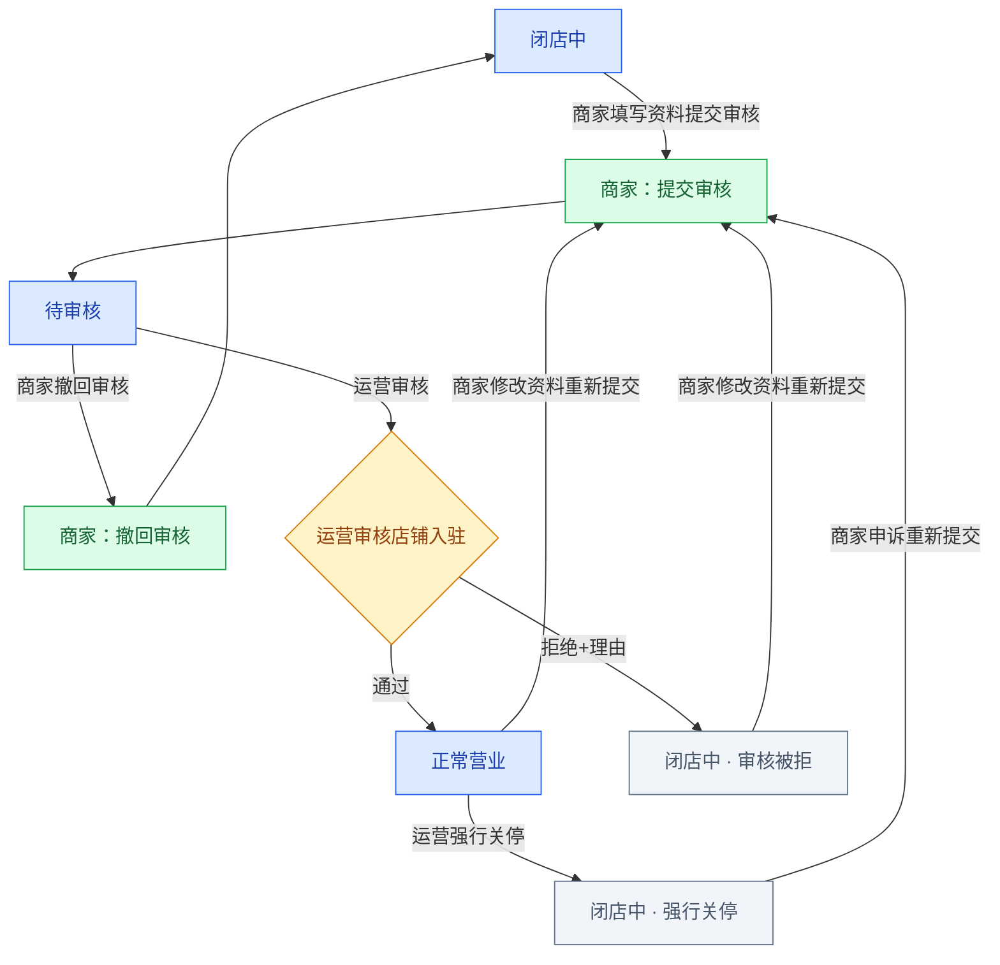
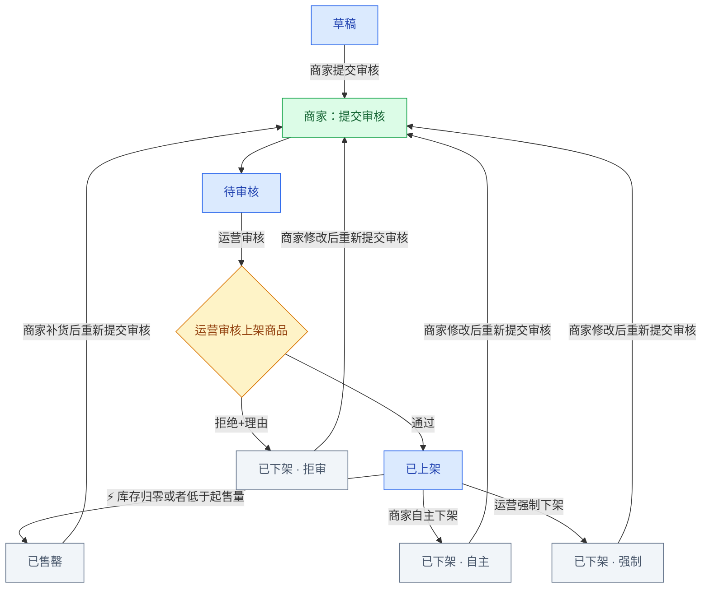
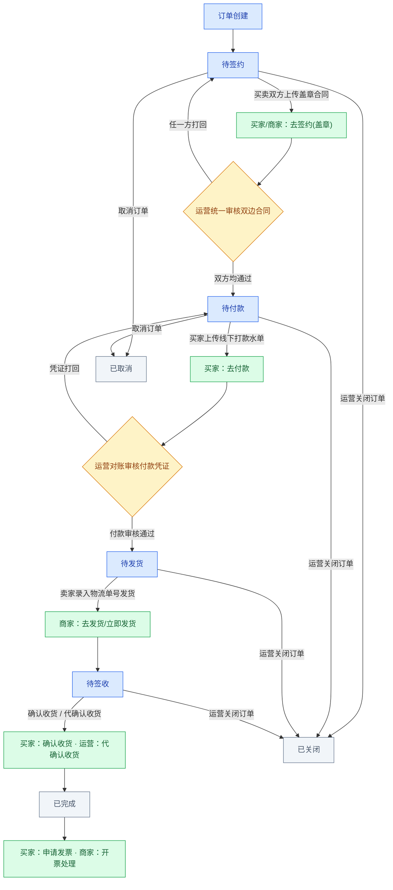
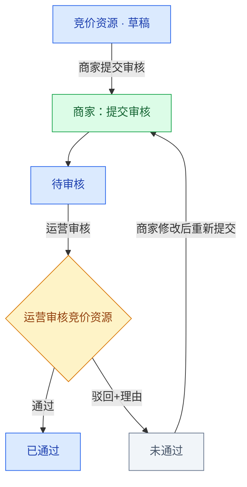
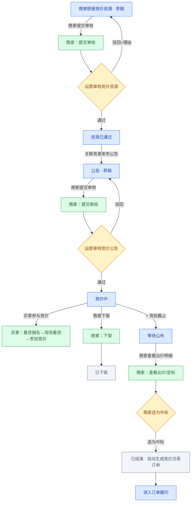
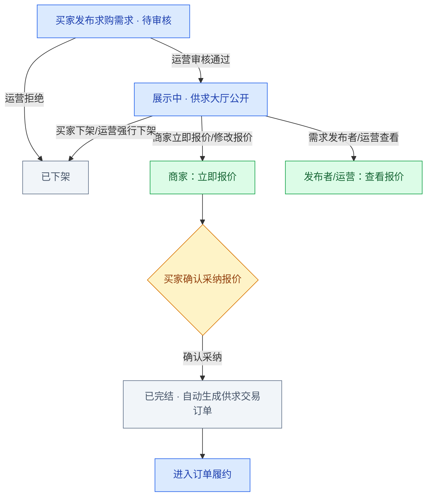
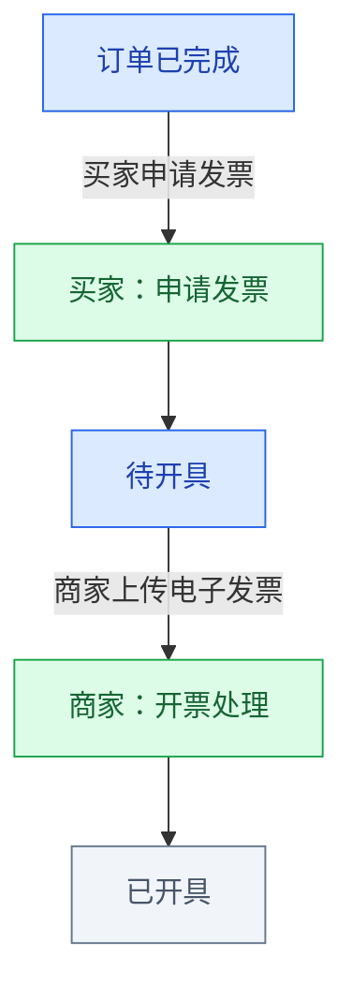
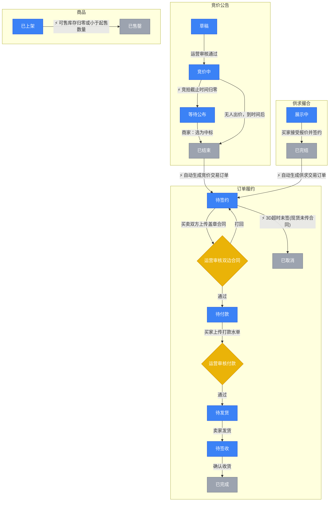

# 📊 产业园区商流供应链系统 - 全平台字段表、状态流转与弹窗详情全景文档

本文档为产业园区商流供应链系统（S2B2C 轻量版、去资金网关、线下履约对账）的产品需求说明，覆盖 **运营端 (Admin)**、**PC 商家端 (Merchant)**、**H5 移动商家端 (Merchant H5)**、**PC 买家商城端 (Mall)**、**H5 移动买家端 (H5)** 5 大端口。

文档以各端口界面实际渲染出的字段、文案与弹窗为依据，系统梳理：

1. 各列表/页面的**字段字典**（采用界面展示名称）；
2. 各**弹窗 / 详情页**的内部展示内容与表单字段；
3. 同一界面在**不同状态下的展示差异与操作按钮变化**；
4. 全平台**状态枚举**与**默认排序**汇总。

> 说明：界面中与通讯/IM 相关的模块（如 IM 沟通监控、聊天快照）不在本文档收录范围内。

### 🎨 流程图颜色图例（全文档统一）

> 本文档所有 Mermaid 流程图与多角色操作矩阵统一采用以下 4 色约定，用以区分「状态 / 按钮 / 判断 / 终止」：

| 图示 | 颜色 | 含义 | 在流程图中对应 |
|------|------|------|---------------|
| 🟦 | 蓝色底 | **流程状态** | 业务流转中的各个阶段状态（如 待签约、竞价中、展示中） |
| 🟩 | 绿色底 | **操作按钮** | 用户可点击的操作动作（如 去签约、选为中标、审核），**不同角色在不同状态下看到的按钮不同** |
| 🟨 | 黄色底 | **审核 / 判断节点** | 需要运营或系统判断的分支节点（如 运营审核合同、商家选为中标） |
| ⬜ | 灰色底 | **结束状态** | 流程终止状态（如 已完成、已取消、已下架、已结束） |

> 💡 同一界面在不同状态下、不同角色（买家 / 商家 / 运营）看到的按钮差异，除流程图中绿色节点外，另见各模块「多角色操作权限矩阵」。

---

## 🧭 Admin 侧边栏菜单 ↔ 本文档章节映射

| 侧边栏菜单       | 二级菜单     | 对应本文档章节          |
| ----------- | -------- | ---------------- |
| 数据中心 (BI)   | 业务报表     | 十、数据中心 (BI) 业务报表 |
| 客户管理        | -        | 十一、客户管理          |
| 商家管理        | 商家店铺管理   | 一、商家店铺管理         |
| 商家管理        | 分类数据字典   | 二、分类数据字典         |
| 商家管理        | 上架商品管理   | 三、上架商品管理         |
| 供求信息        | -        | 四、供求中心           |
| 订单透视        | -        | 五、订单透视与履约管理      |
| 竞价中心        | 资源监控     | 七、竞价资源监控         |
| 竞价中心        | 公告监控     | 八、竞价公告监控         |
| 配置中心        | 抽佣配置     | 九、平台抽佣配置         |
| 配置中心        | 商城装修     | 十二、商城装修配置        |
| ~~（无菜单入口）~~ | ~~协议管理~~ | ~~十三、协议管理~~      |

---

## 🏢 一、 运营管理端 (Admin)

### 1️⃣ 商家店铺管理

**列表字段**（共 11 列）：序号 → 商户号 → 店铺头像 → 店铺 Banner → 店铺名称 → 公司名称 → 店铺状态 → 货品数量 → 信用代码 → 更新时间 → 操作

| 字段名称 | 类型 | 展示与格式要求 | 触发动作 |
|---------|------|---------------|---------|
| **序号** | 流水号 | 1, 2, 3… 居中 | - |
| **商户号** | 文本 | 格式 `S0001`（四位流水号） | - |
| **店铺头像** | 图片 | 32×32 圆形缩略图 | 点击调起原图预览 |
| **店铺 Banner** | 图片 | 60×30 圆角矩形 | 点击调起原图预览 |
| **店铺名称** | 文本 | 粗体 | - |
| **公司名称** | 文本 | 灰色辅助文本，缺省 `--` | - |
| **店铺状态** | 枚举 | `待审核`(黄) / `正常营业`(绿) / `闭店中`(红:强制下架; 灰:暂未开通店铺) | 点击状态标签可演示切换 |
| **货品数量** | 整数 | 如 `1,250` | - |
| **信用代码** | 文本 | 18 位信用代码，缺省 `--` | 资质核验 |
| **更新时间** | 日期时间 | `yyyy-MM-dd HH:mm:ss` | 默认排序 |
| **操作** | 按钮 | `审核`(待审核) / `强行关停`(正常营业) / `--`(闭店) | 店铺审核弹窗 / 强行关停 |

**弹窗：店铺入驻审核**（待审核行 → 操作「审核」）
- 审核结果单选：`通过入驻`（绿）/ `拒绝入驻`（红），默认通过入驻；
- `拒绝理由 (最多50字) *` 多行文本框（选中拒绝时展开必填）；
- 底部：`取消`、`确定提交`。

**弹窗：强行关停**（正常营业行 → 操作「强行关停」）
- 点击按钮后，弹窗「关停理由」输入与「确认关停」按钮。

**状态流转与双场景**：
- **闭店中（灰色 · 暂未开通店铺）**：新商家未开店或初始入驻状态，提示 `闭店原因：暂未开通店铺`；
- **待审核（黄色）**：商家提交资料后等待运营审核；
- **正常营业（绿色）**：审核通过正常营业；
- **闭店中（红色 · 强制下架）**：运营审核拒绝或强行关停，提示 `强制下架原因：[具体下架/驳回理由]`。

#### 🔄 商家入驻生命周期

---

### 2️⃣ 分类数据字典

**列表字段**：序号 → 类别名称 → 类别编码 → 级别 → 状态 → 创建时间 → 更新时间 → 操作

| 字段名称 | 类型 | 展示与格式要求 | 触发动作 |
|---------|------|---------------|---------|
| **序号** | 流水号 | 1, 2, 3… | - |
| **类别名称** | 文本 | 带缩进 + 展开图标 | - |
| **类别编码** | 文本 | 如 `C001`、`C001-001` | - |
| **级别** | 枚举 | `一级` / `二级` / `三级` | - |
| **状态** | 标签 | `启用` / `禁用` | 点击就地切换 |
| **创建时间** | 日期时间 | `yyyy-MM-dd HH:mm:ss` | 默认排序（升序） |
| **操作** | 按钮 | `编辑` / `新增下级` / `禁用`(或`启用`) | 新增/编辑分类弹窗 |

**弹窗：新增/编辑货品类别**（标题三态：新增一级分类 / 新增下级分类 / 编辑货品类别）
- `上级分类`（下拉，新增一级时禁用）；`类别名称`；底部 `保存`。
- 三级分类行不显示「新增下级」；有关联商品的类别点禁用会提示无法禁用。

---

### 3️⃣ 上架商品管理

**列表字段**：序号 → 上架单号 → 主图 → 店铺名称 → 公司名称 → 商品名称 → 上架单类别 → 货品类别 → 单价 → 销量 → 创建时间 → 上架时间 → 更新时间 → 当前状态 → 管理操作

| 字段名称 | 类型 | 展示与格式要求 | 触发动作 |
|---------|------|---------------|---------|
| **上架单号** | 文本 | 格式 `LST2607010001` | - |
| **主图** | 图片 | 40×40 缩略图 | 点击调起原图预览 |
| **店铺名称 / 公司名称** | 文本 | 公司名称为灰色辅助文本 | - |
| **商品名称** | 文本 | 粗体 | - |
| **上架单类别** | 标签 | `现货` / `预售货` | - |
| **货品类别** | 三级分类 | 如 `粮油-谷物-大米` | - |
| **单价** | 金额 | `¥4,150.00 / 吨` | - |
| **销量** | 整数 | 如 `1,500` | - |
| **当前状态** | 枚举 | `待审核` / `已上架` / `已下架` / `已售罄` | - |
| **管理操作** | 按钮 | `编辑`+`审核`(待审核) / `强制下架`(已上架) / `--`(其余) | 商品审核弹窗 / 编辑弹窗 |

> 下架原因展示：`已下架(拒审原因: xxx)` / `已下架(强制下架原因: xxx)` / `已下架(自主下架)` / `已下架(店铺闭店)`。默认按更新时间降序。

**弹窗：上架商品审核**（待审核行 → 操作「审核」）
- 审核结果：`通过上架` / `拒绝上架`（默认通过）；`拒绝理由 (最多50字) *`（选中拒绝时必填）；底部 `取消`、`确定提交`。
- 弹窗内不展示商品图片/价格/库存等信息，仅审核结论。

**弹窗：编辑上架商品信息**（待审核行 → 操作「编辑」）
- 表单：顶部合并「商品图片缩略图 + 商品名称 *」、`售卖单价 *`、`计价单位 *`（吨/袋/箱/斤/立方/件）、`类别 (现货/预售) *`、`库存数量`（现货必填）、`货品分类`、`起售数量`。
- 选「现货」显示库存数量，选「预售」隐藏。底部：`仅保存 (仍待审核)`、`保存并审核通过`。

#### 🔄 上架商品审核与下架

---

### 4️⃣ 供求中心

**列表字段**：序号 → 求购单号 → 买家 → 买家手机号 → 意向货品 → 数量 → 交期时间 → 创建时间 → 更新时间 → 状态 → 操作

| 字段名称 | 类型 | 展示与格式要求 | 触发动作 |
|---------|------|---------------|---------|
| **求购单号** | 文本 | 格式 `REQ2607010001` | - |
| **买家 / 买家手机号** | 文本 | 手机号脱敏 `138****8818` | - |
| **意向货品** | 标签 | 蓝色 Tag | - |
| **数量 / 交期时间** | 文本 | `50 吨`；`yyyy-MM-dd ~ yyyy-MM-dd` | - |
| **状态** | 枚举 | `待审核` / `展示中` / `已完结` / `已下架`；状态标签仅作只读展示，不触发其他状态切换 | - |
| **操作** | 按钮 | `审核`(待审核) / `强行下架`+`查看报价 (n)`(展示中) / `查看报价 (n)`(已完结) / `--`(已下架) | 审核需求弹窗 / 查看报价弹窗 |

> 默认按创建时间降序。

**弹窗：供求信息审核**（待审核行 → 操作「审核」）
- 审核结果：`通过发布` / `拒绝发布`（默认通过）；`拒绝理由 (最多50字) *`（选中拒绝时必填）；底部 `取消`、`确定提交`。

**弹窗：求购报价列表**（展示中/已完结行 → 操作「查看报价 (n)」）
- 标题 `📋 求购报价列表`，副标题为意向货品名称；
- 每条报价卡片：`报价商家店铺名称`、`报价时间`、`报价金额`（红）、右侧状态 `已采纳成单`（绿）/ `未采纳`（灰）；
- 运营端为只读，不出现采纳按钮。无人报价时展示无数据。

---

### 5️⃣ 订单透视与履约管理

**列表字段**：序号 → 订单编号 → 订单类型 → 买家 → 买家手机号 → 关联卖家店铺 → 卖家公司 → 订单金额 → 平台佣金 → 履约状态 → 创建时间 → 操作

| 字段名称 | 类型 | 展示与格式要求 | 触发动作 |
|---------|------|---------------|---------|
| **订单编号** | 文本 | 格式 `ORD202607010001` | 点击调起订单履约详情页 |
| **订单类型** | 标签 | `现货交易订单` / `预售交易订单` / `供求交易订单` / `竞价交易订单` | - |
| **买家 / 买家手机号 / 关联卖家店铺 / 卖家公司** | 文本 | 手机号脱敏 | - |
| **订单金额 / 平台佣金** | 金额 | `¥100,000.00`；佣金如 `0.60% (¥600.00)` | - |
| **履约状态** | 枚举 | `待签约` / `待付款` / `待发货` / `待签收` / `已完成` / `已取消` / `已关闭` | - |
| **操作** | 按钮 | `审核合同`(待签约) / `审核付款`(待付款) / `代确认收货`(待签收) / `关闭订单` | 审核合同弹窗 / 审核付款弹窗 / 详情页 |

> 默认按创建时间降序。

#### 📄 订单履约详情页（点击订单编号/详情打开）

**页面区块**：
- 顶部信息条：订单编号、订单类型标签、下单时间、交易买方、供应商家、履约状态徽标 + 条件按钮（审核合同/审核付款）；
- 现货订单 3 天倒计时 Banner（仅现货交易订单显示）：待签约时显示「现货订单未传合同自动取消倒计时」，其余状态显示「3天履约保障倒计时」，格式精确至日时分秒（如 `02日 23时 59分 58秒`）；
- 状态提示横幅（随状态变化，见下表）；
- 交易履约节点进度（7 步）：`1. 提交买单` → `2. 合同签署及审核` → `3. 买家的付款` → `4. 付款后的审核` → `5. 卖家发货` → `6. 确认收货` → `7. 结算出账`；
- 左栏：订购货品与计价明细（表头 货品主图/货品名称/单价/数量/小计；费用 商品总额、订单实付金额）；
- 左栏：电子合同与法务存证（买家签署合同联 / 卖家签署合同联，各含状态徽标 待审核/已打回/已审核通过/已上传/未上传、文件预览）；
- 左栏：支付凭证与付款审核存证（随状态变化，见下表）；
- 右栏：物流发运信息（`快递单号`，仅待签收/已完成显示，其余 `--`）；
- 右栏：交易买家信息（买家名称、买家手机号，手机号脱敏，并显示平台认证采购方标识）；
- 右栏：平台综合抽佣计算（`成交金额`、`佣金抽佣率`、`平台预计提取佣金`）。

| 履约状态 | 进度条位置 | 状态横幅 | 支付凭证区 |
|---|---|---|---|
| 待签约 | 第 2 步 | 订单待签约 | 灰色虚线框：尚未进入付款阶段 |
| 待付款 | 第 3 步 | 订单待付款 | 凭证待审核时显示黄色卡片+审核付款按钮；未上传时灰色虚线框 |
| 待发货 | 第 5 步 | 订单待发货 | 已上传支付凭证附件清单（绿色） |
| 待签收 | 第 6 步 | 卖家已发货 | 凭证附件清单 |
| 已完成 | 第 7 步（全勾） | 交易履约已完成 | 凭证附件清单 |
| 已取消/已关闭 | 全灰 | 订单已关闭（显示关闭原因） | 对应状态 |

> 详情页本身无底部操作按钮；运营干预集中在列表操作列：待签约→审核合同/关闭(退款)/详情；待付款→审核付款/关闭/详情；待发货→关闭/详情；待签收→代确认收货/关闭/详情；已完成/已取消→详情。

**弹窗：运营端合同统一审核**（待签约且双方已上传 → 操作「审核合同」或详情页内「审核合同」）
- 基础信息条：`订单编号`；
- 买家合同卡片 + 卖家合同卡片：各含状态徽标、文件列表（点击预览）、打回原因输入 + 打回按钮；
- 底部：`双方全部通过`（绿）/ `关闭弹窗`。
- 任一方未上传不可审核；单方打回 → 订单退回待签约；双方均通过 → 推进待付款。

**弹窗：运营端审核买家付款凭证**（待付款且凭证待审核 → 操作「审核付款」或详情页内「审核付款」）
- 基础信息卡：`订单编号`、`买家名称`、`订单总价`（红）；
- 凭证区：`买家已提交打款凭证底单` + 文件名 + 点击预览；
- `若打回重审，请填写驳回原因` 多行文本框；
- 底部：`审核不通过 (打回)`（红）/ `审核通过入账`（主色）。
- 通过 → 推进待发货；打回 → 退回待付款并展示红条驳回原因。

#### 🔄 订单履约流转

#### 🛡️ 多角色操作权限矩阵

> 🔘 下表按钮对应流程图中的 🟩 绿色操作按钮；**同一状态下买家 / 商家 / 运营看到的按钮不同**。

| 履约状态 | 买家端 | 商家端 | 运营端 |
|---|---|---|---|
| 待签约 | 去签约(盖章) / 取消订单 | 去签约(盖章) / 取消订单 | 审核合同 / 关闭订单 |
| 待付款 | 去付款 / 取消订单 | 取消订单 | 审核付款 / 关闭订单 |
| 待发货 | 只读 | 去发货 / 立即发货 | 关闭订单 |
| 待签收 | 确认收货 | 只读 | 代确认收货 / 关闭订单 |
| 已完成 | 申请发票 | 开票处理 | 只读 |

---

### 6️⃣ 竞价资源监控

**列表字段**：序号 → 资源编号 → 图片 → 提报商家店铺名 → 公司名 → 资源货品名 → 货品规格描述 → 状态 → 创建时间 → 更新时间 → 操作

| 字段名称 | 类型 | 展示与格式要求 | 触发动作 |
|---------|------|---------------|---------|
| **资源编号** | 文本 | `RES2607010001` | - |
| **图片** | 图片 | 60×40 缩略图 | 点击调起原图预览 |
| **提报商家店铺名 / 公司名** | 文本 | 公司名灰色辅助 | - |
| **资源货品名 / 货品规格描述** | 文本 | 粗体 / 普通 | - |
| **状态** | 枚举 | `待审核` / `已通过` / `未通过`（未通过显示拒审原因） | - |
| **操作** | 按钮 | `审核`(待审核) | 竞价资源审核弹窗 |

**弹窗：竞价资源审核**（待审核行 → 操作「审核」）
- 资源信息摘要区（灰底）：`资源编号`、`提报店铺`、`公司名称`、`资源货品名`；
- 审核结果：`审核通过` / `审核驳回`（默认通过）；`驳回理由 (最多50字) *`（选中驳回时必填）；底部 `取消`、`确定提交`。

#### 🔄 竞价资源审核流转

---

### 7️⃣ 竞价公告监控

**列表字段**：序号 → 公告编号 → 公告标题 → 发布商家店铺 → 公司名称 → 关联资源编号 → 起拍底价 → 当前最高出价 → 状态 → 创建时间 → 操作

| 字段名称              | 类型  | 展示与格式要求                                                       | 触发动作            |
| ----------------- | --- | ------------------------------------------------------------- | --------------- |
| **公告编号 / 公告标题**   | 文本  | 公告编号等宽；标题粗体截断                                                 | -               |
| **发布商家店铺 / 公司名称** | 文本  | 公司名灰色                                                         | -               |
| **关联资源编号**        | 文本  | 绑定的已过审资源 ID                                                   | -               |
| **起拍底价 / 当前最高出价** | 金额  | `¥50,000.00`；最高出价红粗                                           | -               |
| **状态**            | 枚举  | `待审核` / `竞价中` / `等待公布` / `已下架`                                | -               |
| **操作**            | 按钮  | `审核`(待审核) / `强制下架`+`查看详情`(竞价中/等待公布) / `查看详情`(已结束) / `--`(已下架) | 公告审核弹窗 / 竞价详情弹窗 |

> 默认按创建时间降序。审核通过后状态变「竞价中」；竞拍截止后自动推进至「等待公布」。

**弹窗：竞价公告审核**（待审核行 → 操作「审核」）
- 审核结果：`通过发布` / `拒绝发布`（默认通过）；`拒绝理由 (最多50字) *`（选中拒绝时必填）；底部 `取消`、`确定提交`。弹窗内不展示起拍底价/截止时间等摘要。

**弹窗：竞价公告详情与出价明细**（竞价中/等待公布/已结束 → 操作「查看详情」，运营只读）
- 标题 `竞价公告详情与出价明细`，副标题 `公告标题 (公告编号)`；
- 出价明细表：序号 / 买家名称 / 联系手机号 / 出价时间 / 出价金额（按金额降序，手机号脱敏）；
- 全程只读，无定标权；无人出价显示「暂无买家出价」。

**弹窗：编辑竞价公告**（界面当前无触发入口，待确认是否放出）
- 表单：`公告标题 *`、`起拍底价 (元) *`、`竞拍截止时间 *`；底部 `取消`、`保存修改`。
- 保存后公告重置回「待审核」。

---

### 8️⃣ 平台抽佣配置

**列表字段**：序号 → 规则编号 → 规则名称 → 抽佣模式 → 针对目标 → 抽佣比例(%) → 创建时间 → 操作

| 字段名称 | 类型 | 展示与格式要求 | 触发动作 |
|---------|------|---------------|---------|
| **规则编号** | 文本 | 系统生成唯一号 | - |
| **规则名称** | 文本 | 粗体，不可重复 | - |
| **抽佣模式** | 枚举 | `全局模式` / `按特定商家` / `按特定商品类别` | - |
| **针对目标** | 文本 | 如 `全平台` 或 `远大钢铁` | - |
| **抽佣比例(%)** | 百分比 | 如 `0.60%` | - |
| **操作** | 按钮 | `修改`(全局) / `编辑`+`删除`(特定) | 配置抽佣规则弹窗 |

**弹窗：配置抽佣规则**（右上角「新增抽佣规则」）
- `抽佣模式选择 *`（按特定商家 / 按特定商品类别）；`规则名称 *`；
- 目标选择区：选商家时「针对商家店铺选择 *」（店铺下拉）；选品类时「针对商品类别选择 *」（三级级联面板）；
- `平台抽佣比例 (%) *`（默认 0.60）；底部 `取消`、`保存生效`。

---

### 9️⃣ 数据中心 (BI) 业务报表

侧边栏首项、默认落地页。全部只读展示，无表格、无筛选、无操作按钮。

| 区块 | 名称 |
|---|---|
| 统计卡 | 总交易金额 (GMV)、总订单数、现有商家数、活跃买家数 |
| 图表 | 实收总金额趋势（月度 GMV）、品类销售占比、订单量与活跃买家趋势、TOP 5 商家销售榜单 |

布局：4 个统计卡横排 → 2×2 图表区。

---

### 1️⃣0️⃣ 客户管理

**列表字段**：序号 → 客户账号 → 个人认证 → 企业认证 → 注册时间 → 个人认证时间 → 企业认证时间 → 操作

| 字段名称                       | 类型   | 展示与格式要求               | 触发动作   |
| -------------------------- | ---- | --------------------- | ------ |
| **客户账号**                   | 文本   | -                     | -      |
| **个人认证 / 企业认证**            | 枚举   | `已认证` / `待审核` / `未认证` | -      |
| **注册时间 / 个人认证时间 / 企业认证时间** | 日期时间 | 未认证缺省 `--`            | -      |
| **操作**                     | 按钮   | `详情`                  | 客户详情弹窗 |

筛选区：客户账号 + 注册时间范围 + 个人认证状态 + 企业认证状态 + 查询。

**弹窗：客户详情**（列表「详情」）
- 顶部：`客户账号` + 客户手机号；
- 竖向时间轴三条：`企业认证`（状态）、`个人认证`（状态）、`注册`（注册时间）；纯只读，无操作按钮。

**弹窗：企业入驻资质审核**（操作「审核商家」，企业认证为待审核时出现）
- 企业认证资料区：营业执照预览（支持查看原图与文件名）、企业名称、统一社会信用代码、法定代表人、经办人姓名、经办人手机号、法人身份证号码；资料缺失时显示 `未上传` / `--`。
- `审核意见 (驳回时必填)` 多行文本框；底部 `拒绝`、`通过`。

---

### 1️⃣1️⃣ 商城装修配置

页面由 3 个独立区块组成。

**(1) 首页分类金刚区配置**
- 货品大类勾选区（多选，最多外显 5 项核心大类）；
- 已选中大类预览与拖拽排序列表；未勾选时显示「尚无勾选的外显分类」；
- 保存分类配置按钮。

**(2) PC / H5 轮播图 (Banner) 配置**
- 左右双栏：PC 端轮播图、H5 端轮播图，两表结构一致；
- 字段：图片预览、状态（展示中/隐藏中）、操作（显示/隐藏、删除）；
- 新增 Banner 后默认状态为「隐藏中」，不会立即在对应端商城展示；运营人员点击列表中的「显示」后才切换为「展示中」，点击「隐藏」可再次停止展示；
- 各栏标题右侧「+ 新增PC轮播图」「+ 新增H5轮播图」。

---

### 1️⃣2️⃣ 协议管理

> ⚠️ 该页面 DOM 已完整实现，但侧边栏「配置中心」仅挂载了抽佣配置与商城装修，**无入口指向协议管理页**，当前无法通过 UI 访问，待补菜单项或确认废弃。

**列表字段**：协议编号 → 协议名称 → 版本号 → 发布时间 → 当前状态 → 操作

| 字段名称 | 类型 | 展示与格式要求 | 触发动作 |
|---------|------|---------------|---------|
| **协议编号 / 协议名称 / 版本号** | 文本 | 版本如 `v1.0` | - |
| **发布时间** | 日期时间 | `yyyy-MM-dd HH:mm:ss` | - |
| **当前状态** | 枚举 | `生效中` / `已失效` | - |
| **操作** | 按钮 | `编辑` / `查看` | 发布协议弹窗 |

**弹窗：发布新版协议**（协议页「新增协议」，当前无菜单入口）
- `协议类型`（商家入驻协议 / 隐私政策）；`版本号`（默认 V1.0）；`协议正文 (富文本)`；
- 提示：发布新版后系统自动注销该类型旧版协议；底部 `取消`、`立即发布`。

---

## 🏪 二、 PC 商家端后台 (Merchant)

### 0️⃣ 数据中心 (BI 看板)

**最近订单速览表**（7 列）：序号 → 订单编号 → 订单类型 → 买家 → 订单金额 → 履约状态 → 创建时间
- 无「买家手机号」列、无「操作」列，为订单中心的精简只读版本；点击订单编号调起订单详情页。

---

### 1️⃣ 店铺看板与装潢

表单字段（5 项）：商户号（只读）、店铺名称(商户名)、店铺头像(Logo)、店铺 Banner、店铺状态。
- **状态徽标与展示规则**：
  - `正常营业`（绿色 Badge）：各渠道货源及现货市场展现正常；
  - `待审核`（黄色 Badge）：资料提交后锁定只读，显示「撤回审核」；
  - `闭店中`（灰色 Badge · 暂未开通店铺）：初始未开店状态，表单可编辑，下方告警框提示 `闭店原因：暂未开通店铺`，提供「提交审核」按钮；
  - `闭店中`（红色 Badge · 强制下架/关停）：被平台关停或审核驳回状态，下方红框提示 `强制下架原因：[具体驳回理由]`，修改后可重新提交审核。
- 顶部状态看板仅保留标题与徽标，移除冗余灰色副标题，布局更简洁。

---

### 2️⃣ 基础商品库

**列表字段**：序号 → 商品代码 → 主图 → 商品名称 → 商品分类 → 创建时间 → 更新时间 → 操作

| 字段名称     | 类型   | 展示与格式要求         | 触发动作           |
| -------- | ---- | --------------- | -------------- |
| **商品代码** | 文本   | 格式 `GDxxxxx`    | -              |
| **主图**   | 图片   | 40×40 缩略图       | 点击调起大图预览       |
| **商品名称** | 文本   | 粗体              | -              |
| **商品分类** | 三级分类 | 如 `面粉-富强粉-特制一等` | -              |
| **操作**   | 按钮   | `编辑` / `删除`     | 编辑窗口 / 发布新商品弹窗 |

**弹窗：发布新商品**（「发布新商品」或「未上架」行「编辑」）
- `商品图片`（本地上传 1 张）、`商品名称 *`、`商品品类 *`（三级级联单选）；底部 `取消`、`确认发布`。确认后进入「未上架」。

---

### 3️⃣ 上架管理列表

**列表字段**：序号 → 上架单号 → 主图 → 商品名称 → 上架单类别 → 货品类别 → 单价 → 销量 → 上架时间 → 创建时间 → 更新时间 → 当前状态 → 操作

| 字段名称 | 类型 | 展示与格式要求 | 触发动作 |
|---------|------|---------------|---------|
| **上架单号 / 主图 / 商品名称** | 文本/图片 | 同前 | 点击主图预览 |
| **上架单类别** | 标签 | `现货` / `预售货` | - |
| **货品类别** | 三级分类 | 全路径 | - |
| **单价 / 销量** | 金额/整数 | - | - |
| **当前状态** | 枚举 | `草稿` / `待审核` / `已上架` / `已下架` / `已售罄` | - |
| **操作** | 按钮 | `提交审核`(草稿/已下架) / `编辑`+`提交审核`(草稿) / `下架`(已上架) / `编辑`(已下架) / `删除`(草稿) | 上架商品弹窗 |

**弹窗：新增/编辑上架**（「新增上架」或列表「编辑」）
- `选择关联货品 *`、`上架类型 *`（现货/预售）、`售卖单价 *`、`计价单位 *`、`起售数量 *`、`库存量`（现货必填，预售隐藏）；
- 底部 `取消`、`保存为草稿`、`提交上架审核`。编辑态标题仍显示「新增上架」，建议区分。

---

### 4️⃣ 商家订单中心

**列表字段**：序号 → 订单编号 → 订单类型 → 买家 → 买家手机号 → 订单金额 → 履约状态 → 创建时间 → 操作

| 字段名称 | 类型 | 展示与格式要求 | 触发动作 |
|---------|------|---------------|---------|
| **订单编号 / 订单类型 / 买家 / 买家手机号 / 订单金额** | 文本/金额 | 手机号脱敏 | 点击调起订单详情页 |
| **履约状态** | 枚举 | `待签约`/`待付款`/`待发货`/`待签收`/`已完成`/`已取消`/`已关闭` | - |
| **操作** | 按钮 | `去签约(盖章)` / `取消订单` / `去发货` / `开票处理` / `详情` | 合同签署弹窗 / 发货弹窗 / 开票处理弹窗 |

筛选含「申请开票」下拉（是/否，仅筛选条件非列表列）。

#### 📄 订单详情弹窗（订单「详情」打开；与买家端为同一通用弹窗 `showOrderDetail`）

- 居中卡片式弹窗（最大宽 860px），深色顶栏；**只读**，弹窗内不含操作按钮，所有操作（去签约(盖章) / 去发货 / 开票处理 / 取消订单 等）均在订单列表卡片上（见上方列表字段表的「操作」列）。对现货交易订单在 Modal Body 顶部嵌入 3 天倒计时 Banner（精确至日时分秒 `XX日 XX时 XX分 XX秒`）。

| 字段名称 | 类型 | 展示与格式要求 | 触发动作 |
|---------|------|---------------|---------|
| **标题 / 订单编号 / 交易模式** | 文本 | 顶栏「大宗履约订单详情」+ 订单编号（等宽）+ 交易模式（现货 / 预售 / 竞价 / 供求交易） | - |
| **7 步履约进度条** | 进度条 | 订单创建 → 合同签署 → 合同审核 → 买家的付款 → 付款后的审核 → 物流发货 → 签收结清；已完成步绿色✓、当前步紫色高亮、未达步灰色；每步附时间（未达显示「等待签约 / 等待审核 / 未发货 / 等待确认」等） | - |
| **供应商家** | 文本 | 商家店铺名 | - |
| **卖家主体公司** | 文本 | 卖家公司全称 | - |
| **交易买家信息** | 信息卡片 | 买家名称、买家手机号（手机号脱敏）、平台认证采购方标识 | - |
| **订单成交总额** | 金额 | 红色 | - |
| **平台抽佣费率** | 文本 | 蓝色，备注「按类目 / 商家特殊规则生效」 | - |
| **预计平台抽佣金额** | 金额 | 紫色（¥ 值） | - |
| **资金流转路径** | 文本 | 买卖双边线下公对公汇款（平台存证与核查） | - |
| **订购商品明细表** | 表格 | 列：序号 / 货品名称 / 单价（依据合同约定标价）/ 履约数量（大宗按批交割）/ 小计金额（红） | - |
| **买方合同签署状态** | 枚举 | 已审核通过（绿）/ 已打回（红）/ 已上传待审核（黄）/ 待上传合同（灰） | - |
| **卖方合同签署状态** | 枚举 | 同上 | - |
| **支付凭证与打款审核存证** | 卡片/方框 | 常态化展示（待签约/未付款时展示浅色虚线方框 `⏳ 买家尚未上传对公打款凭证。`；待审核时展示黄色提示与凭证预览；打回时展示红色驳回原因；审核通过展示凭证附件清单与预览） | 点击预览凭证 |
| **关闭窗口** | 按钮 | 弹窗底部唯一按钮 | 关闭弹窗 |

**弹窗：卖家合同签署**（待签约 → 去签约(盖章)）
- 签署方式页签：`上传纸质已签署合同`（默认）/ `在线盖章（待对接，不可点）`；
- 上传说明（最多 10 个文件，图/文不可混传）；已选文件卡片；底部 `关闭`、`确认签署`（未选文件时禁用）。
- 弹窗内无合同预览，预览在详情页合同区（审核通过后）。

**弹窗：发货**（待发货 → 去发货/立即发货）
- `第三方物流公司`（顺丰速运/安能物流/德邦物流/专线自建）；`纯文本物流单号`（必填）；底部 `取消`、`确认发货`。

**弹窗：开票处理**（已完成 → 待开票/已开发票）
- 买家开票申请详情卡（状态徽标、发票抬头、纳税人识别号、发票类型、受票邮箱、申请时间、开票金额）；
- 已上传发票图文/文档卡（预览按钮）；上传区（PDF/JPG/PNG，最大 15MB）；底部 `取消`、`确认上传并标记为已开具`。

---

### 5️⃣ 竞价资源提报

**列表字段**：序号 → 资源编号 → 货品名称 → 图片 → 规格描述 → 状态 → 创建时间 → 操作

| 字段名称 | 类型 | 展示与格式要求 | 触发动作 |
|---------|------|---------------|---------|
| **资源编号 / 货品名称 / 图片 / 规格描述** | 文本/图片 | 图片 40×40 | 点击图片预览 |
| **状态** | 枚举 | `草稿` / `待审核` / `已通过` / `未通过` | - |
| **操作** | 按钮 | `编辑` / `提交审核` / `删除`(仅草稿) | 资源新增/编辑弹窗 |

**弹窗：竞价资源新增/编辑**（「新增竞价资源」或列表「编辑」）
- `资源货品图片 *`（1 张）、`资源货品名称 *`、`规格描述 *`；底部 `取消`、`保存草稿`、`提交审核`。
- 编辑态标题仍显示「新增竞价物资资源」，建议区分；提交后进入「待审核」。

---

### 6️⃣ 竞价公告管理

**列表字段**（共 11 列）：序号 → 公告编号 → 公告标题 → 关联资源编号 → 起拍底价 → 当前最高出价 → 看货地址 → 联系电话 → 状态 → 创建时间 → 操作

| 字段名称 | 类型 | 展示与格式要求 | 触发动作 |
|---------|------|---------------|---------|
| **公告编号 / 公告标题 / 关联资源编号** | 文本 | 等宽编号 + 粗体标题 | - |
| **起拍底价 / 当前最高出价** | 金额 | 最高出价红 | - |
| **看货地址** | 文本 | 看货交割具体地址，支持省略号截断与悬浮 Title | - |
| **联系电话** | 文本 | 规范统一字段名，11 位联系手机号 | - |
| **状态** | 枚举 | `草稿` / `待审核` / `竞价中` / `等待公布` / `已结束` / `已下架` | - |
| **操作** | 按钮 | `编辑`+`提交审核`(草稿) / `查看出价`(竞价中/等待公布/已结束) / `下架`(竞价中/等待公布) / `--`(已下架) | 竞价实况与定标弹窗 / 公告新增编辑弹窗 |

**弹窗：竞价实况与定标**（竞价中/等待公布/已结束 → 查看出价）
- 标题栏固定「竞价实况与定标」；「当前公告：」一行随状态切换文案（可定标时「竞价定标处理 - 标题」/ 只读时「查看出价明细 - 标题」）；
- 报价排行榜：序号 / 买家名称 / 买家手机号（脱敏）/ 出价时间 / 出价金额 / 操作。

| 公告状态 | 当前公告行 | 操作列 | 说明 |
|---|---|---|---|
| 竞价中 | 查看出价明细 | 每行 `--` | 只读 |
| 等待公布 | 竞价定标处理 | 每行「选为中标」（绿） | 点击选为中标 → 确认后自动结束竞价并生成买家待签约订单 |
| 已结束 | 查看出价明细 | 中标者「已中标履约」（绿），其余 `--` | 只读展示结果 |

**弹窗：竞价公告新增/编辑**（「新增竞价公告」或列表「编辑」）
- `选择已审核通过的资源 *`、`竞价公告标题 *`、`起拍底价 (元) *`、`看货地址 *`、`联系电话 *`、`竞拍截止时间 *`；底部 `取消`、`保存草稿`、`提交审核`。
- 无已通过资源时提示先新增资源；截止时间默认带出 7 天后；看货地址与联系电话为必填项。

#### 🔄 竞价流程

#### 🛡️ 多角色操作权限矩阵

> 🔘 下表按钮对应流程图中的 🟩 绿色操作按钮；**同一竞价状态下商家 / 买家 / 运营看到的按钮不同**。

| 竞价状态   | 商家端         | 买家端                | 运营端       |
| ------ | ----------- | ------------------ | --------- |
| 草稿/待审核 | 编辑/提交审核/删除  | 不可见                | 审核        |
| 竞价中    | 查看出价(只读)/下架 | 看货报名→现场看货→提交报价     | 强制下架/查看详情 |
| 等待公布   | 查看出价(含选为中标) | 无操作                | 查看详情      |
| 已结束    | 查看出价(只读结果)  | 查看中标结果（中标人收到待签约订单） | 查看详情      |

---

## ~~📱 三、 H5 移动商家端 (Merchant H5)~~

### ~~1️⃣ 移动店铺看板与发货管理~~

- ~~**店铺移动看板**：店铺名称 / 头像 / 经营状态 Tag（正常营业/待审核/闭店中）；经营大盘（本月完结入账、待发货单、今日访客、中标转化率）；功能菜单（修改店铺名称/更换 Logo/Banner，菜单项待绑定弹窗）；「保存店铺装潢」按钮。~~
- ~~**移动订单列表**：订单编号 / 买家名 / 金额 / 履约状态卡片，点击调起移动订单详情。~~
- ~~**移动发货 Bottom Sheet**（待发货 → 立即发货）：`选择物流公司`（顺丰速运/德邦物流）、`纯文本运单号`（扫码或手动）；底部「确认提交并标记发货」。~~

#### ~~📄 移动订单详情页（点击订单卡片）~~

- ~~6 步进度条：订单创建 → 合同签署 → 合同审核 → 打款与核销 → 物流发货 → 签收结清；~~
- ~~双边主体信息（采购买家/买家电话/供应商家/卖家公司）；财务金额与平台抽佣（成交总额/抽佣费率/预计抽佣/资金流转路径）；~~
- ~~订购商品明细（序号/货品名称/单价/履约数量/小计）；~~
- ~~合同签署与平台审核状态（买方/卖方：已审核通过/已打回/已上传待审核/待上传）；~~
- ~~货款支付凭证核实（线下汇款回执 + 查看凭证 / 在线支付已结清 + 查看电子回单）；底部「关闭窗口」。~~
- ~~点击查看凭证弹出「资料文件在线实时预览」（建设银行记账凭证模板）。~~

### ~~2️⃣ 移动资源提报与公告定标~~

- ~~**移动新增资源 Sheet**（「新增竞价资源」）：`资源名称`、`规格描述`、`上传照片(拍照)`；底部「提交资源」→ 待平台审核。列表每条带「已通过/待审核」标签 + 编辑/删除（当前编辑/删除未绑定动作）。~~
- ~~**移动新增/编辑公告 Sheet**（「关联资源发布公告」或「编辑」）：`选择已审核的资源 *`、`公告标题 *`、`起拍底价 (元) *`、`竞拍截止时间 *`；底部「确认发布公告」。公告列表阶段标签：看货报名/现场看货/参加竞价/等待公布/已结束；审核标签：待审核/已通过/已拒绝/已撤回。~~
- ~~**移动店铺申诉 Sheet**（店铺被关停时「重新编辑并提交审核」）：`店铺名称`、`整改申诉说明`；底部「重新提交审核并上架」。~~
- ~~**移动上架公示公告 Sheet**（「新增上架公示/公告」）：`公告标题`、`选择上架商品`、`计划上架时间`；底部「发布上架公告」。列表显示「公示中/已结束」+ 推送首页/撤销。~~
- ~~**移动定标 Sheet**（公告「查看出价」）：标题「查看出价/定标」+ 公告标题；「起拍底价 | 当前最高」；出价记录（买家名称/时间/金额）；等待公布时每行「选为中标」（绿），已结束时显示「已中标/未中标」；底部「关闭」。~~

~~---~~

## 🛒 四、 PC 买家端商城 (Mall)

### 1️⃣ 商城首页

| 板块 | 字段/控件 | 触发动作 |
|---|---|---|
| 顶部 Header | 全部分类导航（树形悬浮）、全局搜索框（搜商品/搜商户）、快捷个人中心（个人中心/我的购物车） | 跳转大厅 / 搜索 / 调起子视图 |
| 港口 Banner | 宣发海报、Banner 搜索条（搜现货/搜求购） | 直接检索 |
| 首页三栏 | 全部品类导航（左侧 6 项）、精选推荐（2×2 商品网格）、最新大宗求购（右侧卡片）、热门物资竞价（右侧卡片） | 点击卡片调起详情弹窗 |

- 精选推荐仅展示「已上架」商品，按上架时间降序取前 4；其商品卡悬浮时同样显隐「数量步进器（默认该货品最低起售数量）+ 加入采购」，点击卡面进入商品详情弹窗；
- 最新大宗求购仅展示「展示中」需求，取前 4；
- 热门物资竞价仅展示「竞价中」公告，卡片显示 公告标题 / 当前最高出价（红粗）/ 店铺名称 / 竞价中 Tag，取前 4。

---

### 2️⃣ 现货与预售大厅

**卡片字段链**：现货/预售角标（左上浮层）→ 商品主图 → 商品名称 → 单价 + 库存/按需定制 → 店铺名称 + 商户编号 →（悬浮层）数量步进器 + 加入采购。

| 字段名称 | 类型 | 展示与格式要求 | 触发动作 |
|---------|------|---------------|---------|
| **现货 / 预售角标** | 标签 | 主图左上角浮层；`现货`(蓝底蓝字) / `预售`(紫底紫字) | - |
| **商品主图** | 图片 | 卡片顶部通栏图 | 点击卡面调起商品详情弹窗 |
| **商品名称** | 文本 | 粗体，单行截断 | 同上 |
| **单价** | 金额 | 红色粗体，`¥4,150.00 / 吨` | - |
| **可售库存** | 文本/枚举 | 现货显示 `库存: 500`（灰）；预售显示 `按需定制`（紫） | - |
| **店铺名称 / 商户编号** | 文本 | 店铺名悬浮变主色；右侧灰底 `No.10001` | 点击进入该商铺主页（不触发详情弹窗） |
| **数量步进器** | 步进器 | 悬浮层左侧 `−/数字/＋`；缺省为该货品的最低起售数量；减到下限不再递减 | 决定「加入采购」写入购物车的数量 |
| **加入采购** | 按钮 | 悬浮层右侧主色按钮 | 按步进器数量加入购物车（不打开详情） |

- 默认按上架时间降序，仅展示「已上架」商品。
- 该商品卡为**全站复用卡片**：首页精选推荐 / 全部分类 / 现货与预售大厅 / 商品搜索结果 / 商铺主页 共用同一套结构与悬浮层。
- 悬浮层与店铺名区域均独立响应点击，不会冒泡触发商品详情弹窗。

**弹窗：商品详情**（点击商品卡片主体，宽 500px 居中）

| 字段名称 | 类型 | 展示与格式要求 | 触发动作 |
|---------|------|---------------|---------|
| **弹窗标题** | 文本 | 取商品名称（缺省占位「商品详情」） | - |
| **商品主图** | 图片 | 摘要卡左侧 120×120 圆角图 | - |
| **销售单价** | 金额 | 摘要卡右上，红色特大号等宽字体 | - |
| **所属商户** | 文本 | `商户: 华东大宗物资贸易有限公司 (No.10001)` | - |
| **标签位** | 标签 | 摘要卡底部预留 2 个标签位，当前无文案 | - |
| **商品说明** | 文本 | 固定说明区块：「本货品符合园区大宗物资采购标准，提供双向 CA 电子签章保障。支持公对公线下汇款、账期结算，合同生成后将进入园区安全沙盒核销监管。」 | - |
| **意向采购数量** | 步进器 | `−/数字/＋`，缺省为该货品的最低起售数量 | 决定加入购物车的数量 |
| **加入购物车** | 按钮 | 底部左侧描边按钮 | 按数量入车并关闭弹窗，停留在当前页 |
| **立即购买** | 按钮 | 底部右侧主色按钮 | 按数量入车并关闭弹窗，直接跳转「个人中心 → 我的购物车」 |

- 弹窗不展示库存、现货/预售类型、计价单位、上架时间等列表页已有字段，也无商品详情图文、规格参数、店铺跳转入口。
- 「加入购物车」与「立即购买」写入逻辑完全相同，差异仅在于是否跳转购物车。

---

### 3️⃣ 竞价大厅

**卡片字段**：封面图 → 状态 Tag（右上角浮层）→ 公告主标题 → 副规格描述 → 发布企业 → 创建时间 → 起拍底价 + 当前最高出价（灰底价格区）→ 操作按钮。

| 字段名称 | 类型 | 展示与格式要求 | 触发动作 |
|---------|------|---------------|---------|
| **封面图** | 图片 | 100%×160px | 点击整卡调起详情 |
| **公告主标题** | 文本 | 粗体，截断 | - |
| **副规格描述** | 文本 | 灰色小字，无值不渲染 | - |
| **发布企业** | 文本 | `🏢 xxx` | - |
| **创建时间** | 日期 | `📅 创建时间: 2026-07-01`（仅到日） | - |
| **起拍底价 / 当前最高出价** | 金额 | 灰底左侧 / 红粗右侧（无人出价回落起拍底价） | - |
| **状态 Tag** | 标签 | `竞价中`(绿) / `等待公布`(粉) / `已结束`(灰) | - |
| **卡片操作** | 按钮 | `看货报名`(竞价中,主色) / `看货报名`(等待公布,紫) / `查看详情`(已结束,灰) | 竞价详情弹窗 |

**弹窗：竞价详情**（点击卡片 / 我参与的竞价操作按钮）
- **固定信息区**：封面图、公告标题、发布企业、起拍底价、当前最高出价、截止时间（精简顶部，移除多余地址电话）；
- **5 节点流程条与高亮流转判定**：
  - `① 看货报名`：未报名买家高亮第 1 步（显示数字 1，未完成打勾）；
  - `② 现场看货`：完成看货报名后，第 1 步打勾（`✓`），高亮第 2 步；
  - `③ 参加竞价`：完成现场看货拍照上传后，第 1、2 步打勾（`✓`），高亮第 3 步；
  - `④ 等待公布`：竞价截止定标阶段高亮第 4 步；
  - `⑤ 中标付款`：竞价结束且当前买家中标时高亮第 5 步。
- **流程卡片字段规范**：流程卡片（报名须知、现场看货拍照）中保留看货地址与统一的 **`联系电话`**（全端统一文案）；
- **「我的历史报价记录」区块**（已出价时出现：共 N 笔 / 出价记录 / 出价时间）；
- 动作卡随状态变化：

| 状态 | 动作卡文案 | 可操作项 |
|---|---|---|
| 等待公布 | 等待商户定标公布中 / 已登记出价 / 无法再加价 | 无 |
| 已结束且中标 | 恭喜您中标该项目 / 「去订单中心处理」 | 去订单中心 |
| 已结束且未中标 | 本次竞价未中标 / 中标买家 / 最终成交价 | 无 |
| 已结束且流标 | 竞价已结束(无人出价/未产生中标人) / 项目已流标 | 无 |
| 竞价中未报名 | 竞拍报名须知（含看货地址、联系电话、看货时间）/ 「立即看货报名」 | 看货报名 |
| 竞价中已报名未看货 | 现场看货拍照（含看货地址、联系电话）/ 上传看货凭证 / 「完成看货(激活报价)」 | 上传拍照 + 完成看货 |
| 竞价中已看货 | 首次报价/加价竞拍出价 / 金额输入框 / 「确认报价/提交加价」 | 报价竞拍 |

---

### 4️⃣ 寻源供求大厅

**列表/卡片字段**：`只看我发布` / `只看我参与` 复选（互斥）；货品名称、采购数量、期望交期、发布买家、报价状态（`未报价:立即报价` / `已报价:修改报价`）。

> 默认按发布时间降序，仅展示「展示中」需求。

**弹窗：发布采购意向需求**（「免费发布求购意向」）
- `求购货品名称 *`、`需求数量 *`、`计量单位 *`（吨/袋/箱/斤/立方/件）、`期望交期时间范围 *`；底部 `取消`、`确认发布采购需求`。提交后推送运营待审核。

**弹窗：立即报价**（求购项「立即报价/修改报价」）
- 标题 `提交货源报价`（修改时带「(修改现有报价)」）；只读「目标采购货品」；`我的报价金额 *`；底部 `取消`、`确认提交报价`。

**弹窗：求购报价列表**（求购项「查看报价 (n)」）
- 标题 `📋 求购报价列表` + 副标题货品名；每条：店铺名、报价时间、报价金额（红）；
- 未采纳显示「确认采纳」（点击生成现货订单），已采纳显示「已采纳成单」（绿）。

> 注：当前需求发布者本人在求购卡片上可见并点击「查看报价 (n)」按钮（只读查看），与「报价仅运营后台可见」的规则存在出入，待产品确认走「回归原规则」还是「承认现状」。

#### 🔄 供需求购撮合流转

---

### 5️⃣ 个人中心与订单履约

#### (1) 我的购物车
- 按店铺分组；空态「购物车空空如也，快去挑点好货吧」+「去逛逛」；
- 店铺区块（店铺名/进店逛逛）+ 商品行（勾选/名称/单价/数量加减/小计/删除）；
- 失效商品标「失效」不计入总计；底部「全选」「已选 N 件，总计 ¥X」「生成订单」（未勾选时禁用）。

#### (2) 我的订单中心

| 字段名称 | 类型 | 展示与格式要求 | 触发动作 |
|---------|------|---------------|---------|
| **订单编号 / 商品 / 卖家 / 金额** | 文本/金额 | 卖家蓝色 | 点击调起订单详情页 |
| **状态** | 枚举 | `待签约`/`待付款`/`待发货`/`待签收`/`已完成`/`已取消` | - |
| **操作** | 按钮 | `去签约`/`去付款`/`确认收货`/`申请发票`/`查看凭证` | 合同签署弹窗/付款弹窗/申请发票弹窗 |

**订单详情弹窗**（点击订单「详情」调起；买家端与商家端为同一通用弹窗 `showOrderDetail`）

- 居中卡片式弹窗（最大宽 860px），深色顶栏；**只读**，弹窗内不含操作按钮，所有操作（去签约 / 去付款 / 确认收货 / 申请发票 等）均在订单列表卡片上（见上方列表字段表的「操作」列）。对现货交易订单在 Modal Body 顶部渲染 3 天倒计时 Banner（精确至日时分秒 `XX日 XX时 XX分 XX秒`）。

| 字段名称 | 类型 | 展示与格式要求 | 触发动作 |
|---------|------|---------------|---------|
| **标题 / 订单编号 / 交易模式** | 文本 | 顶栏「大宗履约订单详情」+ 订单编号（等宽）+ 交易模式（现货 / 预售 / 竞价 / 供求交易） | - |
| **7 步履约进度条** | 进度条 | 订单创建 → 合同签署 → 合同审核 → 买家的付款 → 付款后的审核 → 物流发货 → 签收结清；已完成步绿色✓、当前步紫色高亮、未达步灰色；每步附时间（未达显示「等待签约 / 等待审核 / 未发货 / 等待确认」等） | - |
| **供应商家** | 文本 | 商家店铺名 | - |
| **卖家主体公司** | 文本 | 卖家公司全称 | - |
| **交易买家信息** | 信息卡片 | 买家名称、买家手机号（手机号脱敏）、平台认证采购方标识 | - |
| **订单成交总额** | 金额 | 红色 | - |
| **平台抽佣费率** | 文本 | 蓝色，备注「按类目 / 商家特殊规则生效」 | - |
| **预计平台抽佣金额** | 金额 | 紫色（¥ 值） | - |
| **资金流转路径** | 文本 | 买卖双边线下公对公汇款（平台存证与核查） | - |
| **订购商品明细表** | 表格 | 列：序号 / 货品名称 / 单价（依据合同约定标价）/ 履约数量（大宗按批交割）/ 小计金额（红） | - |
| **买方合同签署状态** | 枚举 | 已审核通过（绿）/ 已打回（红）/ 已上传待审核（黄）/ 待上传合同（灰） | - |
| **卖方合同签署状态** | 枚举 | 同上 | - |
| **关闭窗口** | 按钮 | 弹窗底部唯一按钮 | 关闭弹窗 |

**弹窗：买家合同签署**（订单「去签约(盖章)」）
- 签署方式页签：`上传纸质已签署合同`（默认）/ `在线盖章（待对接）`；上传说明（最多 10 个，不可混传）；已选文件卡片；底部 `关闭`、`确认签署`（未选禁用）。

**弹窗：买家付款**（订单「去付款」/「重新上传打款凭证」）
- 金额卡（订单金额/编号/卖家）；支付方式页签：`上传对公转账凭证/底单`（默认）/ `在线支付（待对接）`；
- 提示（最多 5 个，不可混传）；上传区；底部 `取消`、`确认付款`（未选禁用）。

**弹窗：申请发票**（已完成订单「申请发票」）
- 金额卡（发票金额/订单编号）；`抬头类型 *`（企业/个人·非企业，默认企业）；`发票抬头名称 *`（企业时只读预填买家名）；`纳税人识别号 *`（仅企业显示，只读预填）；底部 `取消`、`提交申请`。

#### (3) 我参与的竞价

**列表字段**（10 列）：项目编号 → 竞价公告标题 → 货品名称 → 规格描述 → 发布企业 → 起拍底价 → 当前最高价 → 我的最高出价 → 当前状态 → 操作

| 字段名称 | 类型 | 展示与格式要求 |
|---------|------|---------------|
| **项目编号** | 文本 | `BID2607010001` 等宽粗体 |
| **竞价公告标题** | 文本 | 粗体 |
| **货品名称 / 规格描述** | 文本 | 规格描述灰色小字 |
| **发布企业** | 文本 | 灰字 |
| **起拍底价 / 当前最高价** | 金额 | 次要灰 / 红粗（无人出价回落起拍底价） |
| **我的最高出价** | 金额 | 紫粗，无记录显示「暂无报价」 |
| **当前状态** | 标签 | `竞价中`(绿) / `等待公布`(粉) / `已结束`(灰) |
| **操作** | 按钮 | 按参与进度四段式（见下） |

**操作按钮四段式**（点击均调起竞价详情弹窗）：

| 条件 | 按钮文案 | 配色 |
|---|---|---|
| 已结束 / 等待公布 | 查看详情 | 灰 |
| 尚未看货报名 | 看货报名 | 绿 |
| 已报名未看货 | 查看详情 | 蓝 |
| 已看货未出价 | 报价竞拍 | 橙 |
| 已出价 | 加价竞拍 | 紫 |

- 进入列表条件：已看货报名 / 已完成看货 / 已提交报价 / 报价记录中包含当前买家，任一即进入；
- 空态：「您尚未参与任何竞拍项目，快去竞价大厅参与吧」。

#### (4) 资质与认证

页面由两张认证卡片纵向排列，卡片结构一致、状态独立。

| 字段名称 | 类型 | 展示与格式要求 | 触发动作 |
|---------|------|---------------|---------|
| **认证项名称** | 文本 | `个人实名认证` / `企业商家认证` | - |
| **认证用途说明** | 文本 | 灰色副标题：个人「认证后可发布求购信息」；企业「认证后可发布商品并参与报价/竞价」 | - |
| **认证状态徽标** | 枚举 | `未认证`(灰) / `审核中`(黄) / `已认证`(绿) / `认证失败`(红) | - |
| **状态说明文案** | 文本 | 随状态变化的整段说明，如已认证「您的个人身份信息已通过系统审核，相关数据受隐私协议保护。」；失败时显示 `失败原因：营业执照不清晰，请重新上传。` | - |
| **卡片操作** | 按钮 | 已认证显示 `认证已完成，不可更改`（禁用态）；认证失败显示 `重新认证`；未认证显示发起认证入口 | 重新进入对应认证流程 |

- 两项认证状态互相独立：可出现「个人已认证 + 企业认证失败」的组合。
- 页面下半部另挂一张「我的订单台账」只读表（订单编号 / 商品 / 卖家 / 金额 / 状态 / 操作），为订单中心的精简镜像。

#### (5) 申请成为平台入驻商家

| 字段名称 | 类型 | 展示与格式要求 | 触发动作 |
|---------|------|---------------|---------|
| **页面标题 / 引导语** | 文本 | `申请成为平台入驻商家` +「提交企业资质，通过审核后即可在平台上架商品销售。」 | - |
| **企业名称主体** | 输入框 | 占位「请输入营业执照上的完整名称」 | - |
| **统一社会信用代码** | 输入框 | 占位「18位信用代码」 | - |
| **提交企业认证资料** | 按钮 | 主色按钮，表单底部 | 提交后进入企业认证审核 |

- 表单仅收集企业名称与信用代码两项，页面内无营业执照/资质附件上传控件。
- 买家由此升级为商家，与运营端「企业入驻资质审核」为同一条链路的上下游。

---

### 6️⃣ 发票中心

**列表字段**：序号 → 发票号 → 关联订单号 → 关联申请金额 → 申请时间 → 开具时间 → 状态 → 操作

| 字段名称               | 类型    | 展示与格式要求                  | 触发动作                    |
| ------------------ | ----- | ------------------------ | ----------------------- |
| **发票号**            | 文本    | `INV202607010001`        | -                       |
| **关联订单号 / 关联申请金额** | 文本/金额 | -                        | -                       |
| **申请时间 / 开具时间**    | 日期时间  | `yyyy-MM-dd HH:mm:ss`    | -                       |
| **状态**             | 枚举    | `待开具` / `已开具`            | -                       |
| **操作**             | 按钮    | 已开具状态显示 `查看发票` 与 `下载` 按钮 | 调起电子发票预览弹窗 / 触发电子发票文件下载 |

> 默认按申请时间降序。

#### 🔄 发票开具流转

---

### 7️⃣ 商铺主页与店铺搜索

#### (1) 商铺主页

入口：商品卡片上的店铺名称、购物车店铺分组的「进店逛逛 >」、店铺搜索结果卡片。

| 字段名称 | 类型 | 展示与格式要求 | 触发动作 |
|---------|------|---------------|---------|
| **店铺 Banner** | 图片 | 页面顶部通栏背景图，随店铺切换 | - |
| **店铺头像** | 图片/文字 | Banner 下方圆形头像 | - |
| **商户名称** | 文本 | 大号粗体 | - |
| **企业认证徽标** | 标签 | 商户名右侧 `企业认证` | - |
| **商户编号** | 文本 | `No.10001` | - |
| **入驻时间** | 文本 | `入驻时间：2026-01-01` | - |
| **关注店铺** | 按钮 | 未关注 `关注店铺`（主色）/ 已关注 `已关注`（灰） | 点击切换关注态并提示 |
| **店内分类** | 标签组 | `全部商品` / `钢材专区` / `木材专区`，当前为静态展示 | 无跳转 |
| **店内搜索** | 输入框 + 按钮 | 占位「在店内搜索商品...」+「搜本店」 | 当前仅提示"执行店内搜索"，未真正过滤列表 |
| **店内商品网格** | 卡片列表 | 复用全站通用商品卡（含悬浮步进器 + 加入采购） | 点击卡面调起商品详情弹窗 |

#### (2) 店铺搜索结果

入口：顶部 Header 搜索类型切为「搜商户」后检索。

| 字段名称 | 类型 | 展示与格式要求 | 触发动作 |
|---------|------|---------------|---------|
| **店铺搜索框** | 输入框 + 按钮 | 与 Header 关键词双向同步 +「搜索店铺」 | 按店铺名或公司名模糊匹配 |
| **结果计数** | 文本 | `共找到 N 个相关店铺` | - |
| **店铺头像** | 图片/文字 | 60×60 圆形；无图时取店名首字生成主色底图 | - |
| **店铺名称** | 文本 | 粗体 | 点击整卡进入商铺主页 |
| **所属公司** | 文本 | 灰色小字，缺省「官方直营正品商户」 | - |
| **营业状态** | 标签 | `正在营业`(绿) / `闭店中`(灰) / `审核未通过`(红) | - |

- 空态：「未找到匹配的店铺」。
- 闭店中与审核未通过的店铺仍出现在结果里且可点击进入，未做拦截。

---

## 📱 五、 H5 移动买家端 (H5)

### 0️⃣ 整体导航与页面总览

底部 Tab 栏（4 个主入口）：首页 / 竞价 / 找货源 / 我的，当前页高亮。

| 字段名称 | 类型 | 展示与格式要求 | 触发动作 |
|---------|------|---------------|---------|
| **底部 Tab** | 导航 | 4 项：首页 / 竞价 / 找货源 / 我的 | 切换对应主页面 |
| **顶部标题栏** | 文本 | 紫色渐变「咖喱粑粑商城」，右侧胶囊菜单 / 关闭图标 | - |
| **返回** | 按钮 | 子页面左上角返回箭头 | 退回上一级 |

页面清单：首页、全部分类、找货源（采购意向）、竞价大厅、购物车、个人中心、商铺主页、搜索商户店铺列表、我的订单、订单详情、我的竞价记录、发票中心、个人实名认证、企业商家认证。

---

### 1️⃣ 首页

**列表字段**（商品网格）：现货·预售角标 → 商品主图 → 商品名称 → 单价 + 库存 → 店铺名称 → 数量步进器 → 快捷加购按钮

| 字段名称            | 类型    | 展示与格式要求                             | 触发动作                                   |
| --------------- | ----- | ----------------------------------- | -------------------------------------- |
| **顶部搜索**        | 控件    | 搜索类型切换（商品 / 商户）+ 关键词输入框 + 搜索按钮      | 跳转搜索结果                                 |
| **促销 Banner**   | 图片    | 「夏季现货特惠大促」+ 副标题「源头直发 · 大宗保障 · 安全交付」 | -                                      |
| **快捷分类**        | 标签    | 横向滚动分类标签（动态渲染）                      | 切换分类筛选                                 |
| **现货/预售切换 Tab** | 切换    | 全部类型 / 现货专区 / 预售交期                  | 过滤商品网格                                 |
| **现货·预售角标**     | 标签    | 主图左上角浮层；`现货`(蓝底蓝字) / `预售`(紫底紫字)     | -                                      |
| **商品主图**        | 图片    | 卡片左侧缩略图                             | 点击卡面调起商品详情 Sheet                       |
| **商品名称**        | 文本    | 粗体，截断显示                             | 同上                                     |
| **单价**          | 金额    | 红色粗体，仅取价格数值段（不带计价单位后缀）              | -                                      |
| **可售库存**        | 文本/枚举 | 现货显示 `库存: 500`（灰）；预售显示 `按需定制`（紫）    | -                                      |
| **店铺名称**        | 文本    | 灰色小字，单行截断                           | 点击进入该商铺主页（不触发详情 Sheet）                 |
| **数量步进器**       | 步进器   | 卡片右下角 `− 数量 ＋`（缩放展示）；缺省为该货品的最低起售数量  | 决定快捷加购的数量                              |
| **快捷加购按钮**      | 按钮    | 步进器右侧 30×30 圆形主色按钮，内嵌购物车图标          | 按步进器数量直接入车并提示「已成功加入N件到购物车」，不打开详情 Sheet |

- 默认排序：推荐商品按上架时间降序取前 N 展示（与 PC 现货大厅一致）。
- 分类筛选条：选中分类后显示「当前分类：XXX」+ 清除筛选。
- 步进器、加购按钮、店铺名三处均独立响应点击，不冒泡触发详情 Sheet。

**Sheet：商品详情**（点击商品卡片主体，居中卡片式弹层，最大宽度 350px）

| 字段名称 | 类型 | 展示与格式要求 | 触发动作 |
|---------|------|---------------|---------|
| **弹层标题** | 文本 | 取商品名称（缺省占位「商品详情」） | - |
| **商品主图** | 图片 | 摘要卡左侧 76×76 圆角图 | - |
| **销售单价** | 金额 | 摘要卡右上，红色大号等宽字体 | - |
| **所属商户** | 文本 | `商户: 华东大宗物资贸易有限公司 (No.10001)` | - |
| **标签位** | 标签 | 摘要卡底部预留标签位，当前无文案 | - |
| **交易说明** | 文本 | 固定文案：「支持公对公线下汇款、账期结算，合同生成后将进入园区安全沙盒。」 | - |
| **采购数量** | 步进器 | `− 数字 ＋`，缺省为该货品的最低起售数量 | 决定加入购物车的数量 |
| **加入购物车** | 按钮 | 底部左侧描边按钮 | 按数量入车并关闭弹层，停留当前页 |
| **立即采购** | 按钮 | 底部右侧主色按钮 | 按数量入车并关闭弹层，直接切换到购物车页 |

- 该 Sheet 与卡片旁步进器是两套独立控件：卡片步进器服务于快捷加购，Sheet 内步进器每次打开都会重置为该货品的最低起售数量。
- Sheet 不展示库存、现货/预售类型、计价单位、商品详情图文与店铺跳转入口，字段集比 PC 商品详情弹窗更精简（无「本货品符合园区大宗物资采购标准…」整段说明）。
- 「加入购物车」与「立即采购」入车逻辑完全相同，差异仅在于是否跳转购物车页。

---

### 2️⃣ 全部分类页

左右分栏：左侧一级分类列表，右侧对应子分类列表（JS 动态渲染），用于从分类维度浏览商品。

| 字段名称 | 类型 | 展示与格式要求 | 触发动作 |
|---------|------|---------------|---------|
| **一级分类** | 列表 | 左侧竖排 | 点击切换右侧子分类 |
| **子分类** | 列表 | 右侧联动展示 | 点击进入商品列表 |

> ⚠️ 界面已布局，但底部 Tab 与已知入口未直接挂接该页，入口待确认。

---

### 3️⃣ 找货源（采购意向）

**列表字段**（求购意向卡片）：货品名称 → 采购数量 → 期望交期 → 发布买家 → 报价状态

| 字段名称 | 类型 | 展示与格式要求 | 触发动作 |
|---------|------|---------------|---------|
| **发布采购意向** | 按钮 | 顶部「发布采购意向 (寻源)」主按钮（整行） | 打开发布采购意向 Modal |
| **需求搜索框** | 控件 | 搜索标题或买家 + 搜索按钮 | 过滤列表 |
| **只看我发布 / 只看我参与** | 复选 | 互斥勾选 | 过滤列表 |
| **货品名称** | 文本 | 卡片标题 | 点击调起求购报价列表 |
| **采购数量** | 文本 | 如 `100 吨` | - |
| **期望交期** | 文本 | 时间范围 | - |
| **发布买家** | 文本 | 买家昵称 | - |
| **报价状态** | 按钮 | `未报价：立即报价` / `已报价：修改报价` | 打开立即报价 Modal |

- 默认排序：按发布时间降序，仅展示「展示中」需求（与 PC 寻源供求大厅一致）。

**弹窗：发布采购意向 Modal**（「发布采购意向 (寻源)」）
- `求购货品名称 *`、`需求数量 *`、`计量单位 *`（吨/袋/箱/斤/立方/件）、`期望交期时间范围 *`；底部 `取消`、`确认发布采购需求`。提交后推送运营待审核。

**弹窗：立即报价 Modal**（「立即报价 / 修改报价」）
- 标题 `提交货源报价`（修改时带「(修改现有报价)」）；只读「目标采购货品」；`我的报价金额 *`；底部 `取消`、`确认提交报价`。

**弹窗：求购报价列表**（「查看报价 (n)」）
- 标题 `📋 求购报价列表` + 副标题货品名；每条：店铺名、报价时间、报价金额（红）；未采纳显示「确认采纳」（点击生成现货订单），已采纳显示「已采纳成单」（绿）。

---

### 4️⃣ 竞价大厅

**列表字段**（竞价公告卡片）：封面图 → 公告主标题 → 起拍底价 → 当前最高出价 → 状态标签

| 字段名称 | 类型 | 展示与格式要求 | 触发动作 |
|---------|------|---------------|---------|
| **公告搜索框** | 控件 | 搜索公告标题 + 搜索按钮 | 过滤列表 |
| **状态过滤标签** | 切换 | 全部 / 🙋‍♂️ 我参与的 / 竞价中 / 等待公布 | 过滤列表 |
| **封面图** | 图片 | 卡片头图 | 点击调起竞价详情 Sheet |
| **公告主标题** | 文本 | 粗体截断 | 点击调起竞价详情 Sheet |
| **起拍底价** | 金额 | 灰底 | - |
| **当前最高出价** | 金额 | 红粗（无人出价回落起拍底价） | - |
| **状态标签** | 标签 | `竞价中`(绿) / `等待公布`(粉) / `已结束`(灰) | - |

- 默认排序：按创建时间降序（与 PC 竞价大厅一致）。
- 状态过滤「我参与的」：仅展示当前买家已报名 / 已看货 / 已出价的公告。

**弹窗：竞价详情 Sheet**（点击卡片 / 我参与的竞价操作按钮）
- 固定区块：封面图、公告标题、发布企业、起拍底价、当前最高出价、截止时间；
- 5 节点流程条：`看货报名 → 现场看货 → 参加竞价 → 等待公布 → 中标付款`；
- 「我的历史报价记录」区块（已出价时出现：共 N 笔 / 出价记录 / 出价时间）；
- 动作卡随状态变化（见下表）。

**竞价详情 Sheet 状态分支**：

| 状态 | 引导卡 | 底部操作 |
|---|---|---|
| 未报名 | 看货报名说明 | 立即看货报名 |
| 已报名未看货 | 现场看货拍照 + 上传凭证 | 完成看货(解锁报价) |
| 竞价中已看货 | 首次/加价竞拍 + 金额输入框 | 提交报价/提交加价 |
| 等待公布 | 等待公布结果，无法加价 | 无 |
| 已结束 | 中标买家/最终成交价（或流标） | 无 |

> 流程状态枚举：竞价中 / 等待公布 / 已结束（与 PC 端一致）。

---

### 5️⃣ 购物车

按店铺分组展示。

| 字段名称 | 类型 | 展示与格式要求 | 触发动作 |
|---------|------|---------------|---------|
| **店铺行** | 分组 | `🏪 店铺名` + 「进店 >」 | 进店 |
| **勾选框** | 控件 | 店铺级 + 商品级 | 选择结算 |
| **商品主图** | 图片 | 缩略图 | - |
| **商品名称** | 文本 | - | - |
| **单价** | 金额 | `¥xx` | - |
| **数量步进器** | 控件 | － / 数字 / ＋（最小 1） | 改数量 |
| **删除** | 按钮 | 商品行删除 | 移除商品 |
| **失效商品** | 标签 | 标「失效」，仅可删除 | - |
| **底部结算栏** | 区域 | 全选 / 合计金额 / 失效件数提示 / 生成订单按钮（未勾选时禁用） | 生成订单 |
| **空态** | 提示 | 「购物车空空如也」+「去逛逛」 | 去首页 |

- 排序：用户手动维护，按店铺分组（无系统排序）。

---

### 6️⃣ 个人中心

| 字段名称 | 类型 | 展示与格式要求 | 触发动作 |
|---------|------|---------------|---------|
| **用户头部** | 区域 | 头像、用户名（可点 ✏️ 修改昵称）、「企业买家」标签 | 改昵称 |
| **我的订单面板** | 快捷入口 | 待签约 / 待发货 / 待收货 三个状态入口 + 「全部订单 >」 | 进我的订单（按状态过滤） |
| **功能菜单** | 列表 | 我的购物车 / 我的竞价记录 / 发票中心 / 个人实名认证（已认证）/ 企业商家认证（去认证） | 进对应页 |

---

### 7️⃣ 商铺主页 & 搜索商户

| 字段名称 | 类型 | 展示与格式要求 | 触发动作 |
|---------|------|---------------|---------|
| **店铺 Banner** | 图片 | 商铺主页头图 | - |
| **店铺头像** | 图片 | 圆形 | - |
| **店铺名称** | 文本 | 粗体 | - |
| **店铺编号** | 文本 | `No.10001` | - |
| **店内搜索框** | 控件 | 店内商品搜索 | 过滤店内商品 |
| **店内商品网格** | 网格 | 同首页商品卡 | 商品详情 Sheet |
| **商户搜索框** | 控件 | 搜索店铺名称或公司全称 | 搜商户 |
| **店铺计数** | 文本 | 「共找到 N 个相关店铺」 | - |
| **店铺卡片** | 卡片 | 商户列表项 | 进店（商铺主页） |

---

### 8️⃣ 我的订单（列表 + 详情）

**订单列表页**

| 字段名称 | 类型 | 展示与格式要求 | 触发动作 |
|---------|------|---------------|---------|
| **状态过滤标签** | 切换 | 全部 / 待付款 / 待签约 / 待发货 / 已完结 | 过滤列表 |
| **订单编号** | 文本 | 列表卡片 | 点击进订单详情 |
| **订单类型标签** | 标签 | 现货 / 预售 / 供求 / 竞价交易订单 | - |
| **状态标签** | 标签 | 待签约 / 待付款 / 待发货 / 待签收 / 已完成 / 已取消 | - |
| **商品名 / 店铺** | 文本 | 卡片展示 | - |
| **金额** | 金额 | 订单金额 | - |
| **状态化按钮** | 按钮 | 见下方矩阵 | 对应操作 |

- 默认排序：按订单创建 / 更新时间倒序（最近在前）。

**订单详情全屏页**：状态横幅（状态文案 + 说明）→ 现货订单 3 天倒计时 Banner（仅现货交易订单显示，精确到日时分秒 `03日 00时 00分 00秒`）→ 货品卡（订单编号、订单类型、商品图、商品名、单价、×1 批次（单位）、货品总价、平台佣金(1.5%)、订单实付金额）→ 物流发运信息（快递单号）→ 电子合同与付款凭证。详情页底部无按钮栏，操作入口在列表卡片。

**订单列表卡片状态化按钮（H5 端操作入口在列表而非详情页）**：

| 订单状态 | 列表卡片按钮 | 说明 |
|---|---|---|
| 待签约 | 去签约 + 取消（合同已提交时显示「⏳ 合同已提交，平台审核中…」；被打回时 重新上传签约合同） | 签约 |
| 待付款 | 去付款 + 取消（对公凭证已提交时显示「⏳ 对公凭证已提交，平台审核中…」；被打回时 重新上传打款凭证） | 付款 |
| 待发货 | 无 | - |
| 待签收 | 确认收货 | 收货 |
| 已完成 | 申请发票（未申请时） | 开票 |

> 流程状态枚举：待签约 → 待付款 → 待发货 → 待签收 → 已完成；可经取消 / 关闭转入 已取消。

---

### 9️⃣ 我的竞价记录

**列表字段**（竞价记录卡片）：项目编号 → 公告标题 → 货品名称 → 规格 → 发布企业 → 起拍底价 → 当前最高价 → 我的最高出价 → 当前状态 → 操作

| 字段名称 | 类型 | 展示与格式要求 | 触发动作 |
|---------|------|---------------|---------|
| **状态快捷 Tab** | 切换 | 全部出价 / 竞价中 / 等待公布 / 已结束（带数量统计） | 过滤列表 |
| **项目编号** | 文本 | 卡片 | 点击调起竞价详情 Sheet |
| **公告标题** | 文本 | 粗体 | 点击调起竞价详情 Sheet |
| **货品名称** | 文本 | - | - |
| **规格** | 文本 | - | - |
| **发布企业** | 文本 | - | - |
| **起拍底价** | 金额 | - | - |
| **当前最高价** | 金额 | 红粗 | - |
| **我的最高出价** | 金额 | 我的出价高亮 | - |
| **当前状态** | 标签 | 竞价中 / 等待公布 / 已结束 | - |
| **操作** | 按钮 | 看货报名 / 报价竞拍 / 查看详情（随状态） | 竞价详情 Sheet |

- 默认排序：按出价 / 创建时间倒序。
- 进入列表条件：买家已看货报名 / 已看货 / 已出价 / 有报价记录（逻辑或）。

> 流程状态枚举：竞价中 / 等待公布 / 已结束。

---

### 🔟 发票中心

| 字段名称 | 类型 | 展示与格式要求 | 触发动作 |
|---------|------|---------------|---------|
| **发票记录列表** | 列表 | 关联订单、开票金额、发票状态（待开具 / 已开具）、操作按钮（已开具时显示`查看发票`与`下载`） | 调起电子发票预览弹窗 / 触发电子发票文件下载 |

- 默认排序：按开票申请时间倒序。
- 发票状态枚举：待开具 / 已开具。

**弹窗：申请发票 Modal**（订单已完成「申请发票」）
- 申请开具增值税发票：关联交易订单、可开票金额、`抬头类型`（企业 / 个人非企业）、`抬头名称`（只读预填）、`纳税人识别号`（企业显示，只读）；底部 `取消` / `提交开票申请`。
- 选「个人」时隐藏税号、抬头变「个人」。

---

### 1️⃣1️⃣ 实名 / 企业认证

| 字段名称 | 类型 | 展示与格式要求 | 触发动作 |
|---------|------|---------------|---------|
| **个人实名认证** | 状态 | 已通过认证（展示认证成功态） | - |
| **企业商家认证** | 入口 | 企业入驻申请页（说明文案 + 提交申请按钮） | 提交申请后提示已提交 |

> 认证状态枚举：未认证 / 审核中 / 已认证。

---

### 1️⃣2️⃣ 弹窗与详情 Sheet 汇总（点击触发）

| 弹窗/详情 | 触发入口 | 内部展示内容 | 状态差异 |
|---|---|---|---|
| **商品详情/购买 Sheet** | 商品卡片点击 | 见 1️⃣ 首页「Sheet：商品详情」字段表 | 加入购物车仅入车；立即采购入车并跳购物车 |
| **竞价详情 Sheet** | 竞价大厅/我参与的竞价 点击 | 标题「竞价大厅 & 实时出价」+ 货品全景卡 + 5 步流程条（看货报名→现场看货→参加竞价→等待公布→中标付款）+ 我的历史报价 + 底部操作 | 见 4️⃣ 状态分支表 |
| **发布采购意向 Modal** | 找货源「发布采购意向」 | 求购货品 * / 需求数量 * + 计量单位 * / 交期时间范围 *；取消 / 确认发布 | 无状态分支 |
| **立即报价 Modal** | 找货源「立即报价/修改报价」 | 采购需求项目（名称）+ 我的报价金额 *；取消 / 确认提交报价 | 首次与修改仅预填不同 |
| **合同签署 Sheet** | 订单待签约「去签约」 | 大宗商品买卖合同签署：签署方式页签「上传纸质已签署合同」(默认) /「在线盖章」(待对接，点击仅提示不可切换) + 上传区（最多 10 个文件，图片或文档不可混传）+ 已选文件卡（可删除）；关闭 / 确认签署 | 未选文件时「确认签署」置灰禁用；提交后合同置待审核 |
| **付款弹窗** | 订单待付款「去付款」 | 确认支付货款：橙色金额卡（等待买家付款 / 订单金额 / 订单编号 + 卖家）+ 支付方式页签「上传对公转账凭证/底单」(默认) /「在线支付」(待对接) + 上传区（最多 5 个文件，图片或 PDF 不可混传）+ 已选凭证卡（可删除）；取消 / 确认付款 | 未选凭证时「确认付款」置灰禁用 |
| **申请发票 Modal** | 订单已完成「申请发票」 | 申请开具增值税发票：关联交易订单、可开票金额、抬头类型（企业/个人非企业）、抬头名称（只读预填）、纳税人识别号（企业显示，只读）；取消 / 提交开票申请 | 选个人时隐藏税号、抬头变「个人」 |
| **求购报价列表** | 找货源 查看报价 | 店铺名/时间/金额 + 确认采纳/已采纳成单 | 买家视角可确认采纳生成现货订单 |

---

## 📊 六、 全平台通用枚举、状态流转与排序汇总

### 🎯 状态枚举全景

| 端口 | 模块 | 字段 | 全量枚举值 |
|------|------|------|-----------|
| 运营端 | 商家店铺管理 | 店铺状态 | 未开店 / 待审核 / 正常营业 / 闭店中 |
| 运营端 | 上架商品管理 | 当前状态 | 待审核 / 已上架 / 已下架 / 已售罄 |
| 运营端 | 供求中心 | 需求状态 | 待审核 / 展示中 / 已下架 / 已完结 |
| 全端口 | 订单中心 | 订单类型 | 现货交易订单 / 预售交易订单 / 供求交易订单 / 竞价交易订单 |
| 全端口 | 订单中心 | 履约状态 | 待签约 / 待付款 / 待发货 / 待签收 / 已完成 / 已取消 / 已关闭 |
| 商家端 | 竞价公告 | 公告状态 | 草稿 / 待审核 / 竞价中 / 等待公布 / 已结束 / 已下架 |
| 买家端 | 竞价大厅/我参与的竞价 | 状态 Tag | 竞价中 / 等待公布 / 已结束（仅 3 值） |
| 买家端 | 发票中心 | 发票状态 | 待开具 / 已开具 |

### 📈 默认排序规则

| 端口 | 模块 | 排序字段 | 方向 |
|------|------|---------|------|
| 运营端 | 商家店铺管理 | 更新时间 | 降序 |
| 运营端 | 分类数据字典 | 创建时间 | 升序（树形） |
| 运营端 | 上架商品管理 | 更新时间 | 降序 |
| 运营端 | 供求中心 | 创建时间 | 降序 |
| 运营端 | 订单透视 | 创建时间 | 降序 |
| 运营端 | 资源监控 | 创建时间 | 降序 |
| 运营端 | 公告监控 | 创建时间 | 降序 |
| 商家端 | 商品/上架/订单/竞价 | 创建时间 | 降序 |
| 买家端 | 发票中心 | 申请时间 | 降序 |
| 买家端 | 求购大厅 | 发布时间 | 降序 |
| 买家端 | 我参与的竞价 | 无显式排序 | 依数据原始顺序（接真实接口需补排序） |

---

## ⚡ 七、 全系统状态流转与触发机制汇总

下图将全系统状态机整合为一张自动化流转图。其中 **⚡ 标记的边为系统自动触发**（定时器扫描截止时间 / 库存归零或低于起售数量 / 发布事件），其余边为用户操作或运营审核触发。

### 自动化流转文字说明

图中以 ⚡ 标记的边均为**系统自动触发**——触发条件到达后由系统自动完成状态推进，不依赖人工点击或运营审核。逐条说明如下：

**1. 竞价公告：竞拍截止 → 竞价中 → 等待公布**
触发条件：竞价公告的"竞拍截止时间"到达。系统自动将状态从"竞价中"推进至"等待公布"，同时封闭该公告的报价入口、终止买家继续出价，并开启商家侧的"选为中标"定标操作。

**2. 订单履约：超时未签 → 待签约 → 已取消**
触发条件：仅针对现货订单（非预售订单），订单处于"待签约"状态，且任意一方在 3天（3D）内未上传合同。系统自动将订单置为"已取消"，流转终止，并释放库存。

**3. 商品：库存归零或低于起售数量 → 已上架 → 已售罄**
触发条件：商品"可售库存"降为 0 或低于起售数量。系统自动将商品状态置为"已售罄"，前端购买入口置灰、不可再下单。

**4. 竞价 / 供求结束 → 自动生成交易订单**
触发条件：① 商家在竞价公告"等待公布"阶段"选为中标"；② 供求撮合中买家"接受报价并签约"。满足任一，系统自动生成一条对应的交易订单（竞价交易订单 / 供求交易订单），新订单以"待签约"状态进入订单履约流程。
**5. 竞价中  → 自动生成交易订单**
触发条件：竞拍时间结束，如果无人出价，则状态自动流转为自动结束。

| 业务域     | 触发条件           | 源状态 → 目标状态       | 发生后系统动作       |
| ------- | -------------- | ---------------- | ------------- |
| 竞价公告    | 竞拍截止时间到达       | 竞价中 → 等待公布       | 封闭报价入口；开启商家定标 |
| 订单履约    | 现货订单任意一方未传合同超过3D | 待签约 → 已取消        | 流转终止，释放库存     |
| 商品      | 可售库存归零或低于起售数量 | 已上架 → 已售罄        | 购买入口置灰，标示为已售罄 |
| 竞价 / 供求 | 选为中标 / 接受报价并签约 | 已结束 / 已完结 → 待签约  | 自动生成交易订单，进入履约 |

其余联动机制（非状态流转）：购物车红点随增删改同步、平台佣金按抽佣规则实时计算、运营拒绝原因 50 字实时计数。
