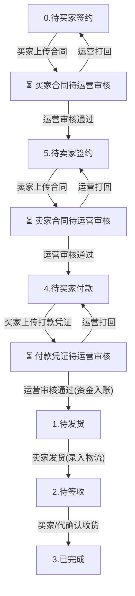

####  1. 履约主流程与审核子流程节点图

---

#### 2. 三端（买家 / 卖家 / 运营端）节点操作与按钮对照表

| 主履约节点 | 子审核状态 | 买家端 (Mall PC / H5) | 卖家端 (Merchant PC / H5) | 运营端 (Admin) | 核心流动与规则说明 |
| :--- | :--- | :--- | :--- | :--- | :--- |
| **0. 待买家签约** | **未上传合同** | `【去签约(盖章)】` `【取消】` | `【取消订单】` | *(无审核按钮)* | 买家在线签署/上传买家联合同；卖家与运营端静候买家提交。 |
| | **待运营审核** | `⏳ 合同已提交，平台审核中...` | *(无按钮，显示买家待签署)* | `【审核合同】` | 买家已上传合同，买家端隐去去签约按钮；运营端可【买家通过】或【打回买家】。 |
| | **打回重审** | `【重新上传签约合同】` *(红按钮)* `❌ 驳回原因: ...` | *(无按钮)* | *(无审核按钮)* | 运营打回后订单保留在待买家签约；买家可看驳回原因并二次上传，运营端无审核按钮。 |
| **5. 待卖家签约** | **未上传合同** | *(无按钮，待卖家签署)* | `【去签约(盖章)】` `【取消】` | *(无审核按钮)* | 买家合同已过审；卖家在线签署/上传卖家联合同；运营端静候卖家提交。 |
| | **待运营审核** | *(无按钮)* | `⏳ 您的签署合同已提交，等待审核...` | `【审核合同】` | 卖家已上传合同，卖家端隐去去签约按钮；运营端可预览买卖双方合同，执行【卖家通过】或【打回卖家】。 |
| | **打回重审** | *(无按钮)* | `【重新上传签约合同】` *(红按钮)* `❌ 驳回原因: ...` | *(无审核按钮)* | 运营打回后订单保留在待卖家签约；卖家可看驳回原因并二次上传，运营端无审核按钮。 |
| **4. 待买家付款** | **未上传凭证** | `【去付款】` `【取消】` | `【取消订单】` | *(无审核按钮)* | 双方合同均已过审；买家线下对公转账并上传打款底单；运营端静候买家提交凭证。 |
| | **待运营审核** | `⏳ 对公打款凭证已提交，平台审核中...` | `⏳ 买家对公凭证已提交，待平台审核入账...` | `【审核付款】` | 买家已上传凭证，买家端隐去去付款按钮；四端详情页均显示已传文件与【点击预览凭证】；运营端审核资金入账。 |
| | **打回重审** | `【重新上传打款凭证】` *(红按钮)* `❌ 驳回原因: ...` | *(无按钮)* | *(无审核按钮)* | 运营打回后订单保留在待付款；买家可看驳回原因并重新上传凭证，运营端无审核按钮。 |
| **1. 待发货** | **资金已托管入账** | *(静候卖家发货)* | `【立即发货】` | `【关闭(退款)】` | 平台确认资金入账；卖家填报大宗物流承运商与单号发货。 |
| **2. 待签收** | **货物在途配送** | `【确认收货】` | *(静候买家签收)* | `【代确认收货】` `【关闭(退款)】` | 卖家已发货，买家核验货物无误后点击确认收货（或运营端代确认）。 |
| **3. 已完成** | **履约完结** | `【申请发票】` *(可选)* | `【上传/管理发票】` | *(无履约按钮)* | 资金划拨至卖家商户余额；支持买家申请发票与卖家上传开票凭证。 |

---

#### 3. 核心设计原则摘要

1. **主状态稳定**：主履约状态永远保持标准的 6 个大节点（`0待买家签约` → `5待卖家签约` → `4待付款` → `1待发货` → `2待签收` → `3已完成`），绝不新增临时主状态标签。
2. **审核按钮精准触发**：运营端仅在存在 `pending`（待审核）状态的合同或打款凭证时才呈现 `【审核合同】` / `【审核付款】` 按钮；未上传或已被打回未重传时**严禁显示审核按钮**。
3. **买卖双联独立控制**：【审核合同】弹窗及四端订单详情均将【🛒 买家签署合同联】与【🏬 卖家签署合同联】拆分为独立单元，分别控制上传、预览、审核与打回重传。
4. **审核中信息透出**：文件一旦上传且处于 `pending` 状态，四端订单详情板块中均可实时查看已提交的文件名、状态标识及 `【点击预览】` 按钮。

