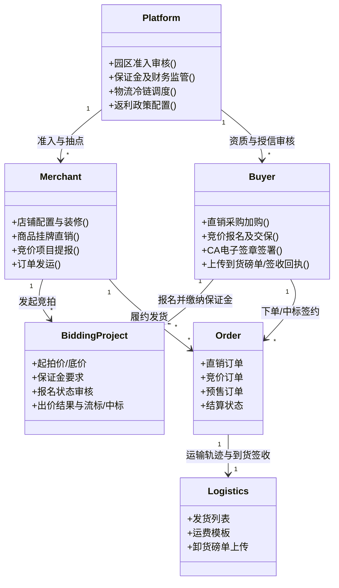
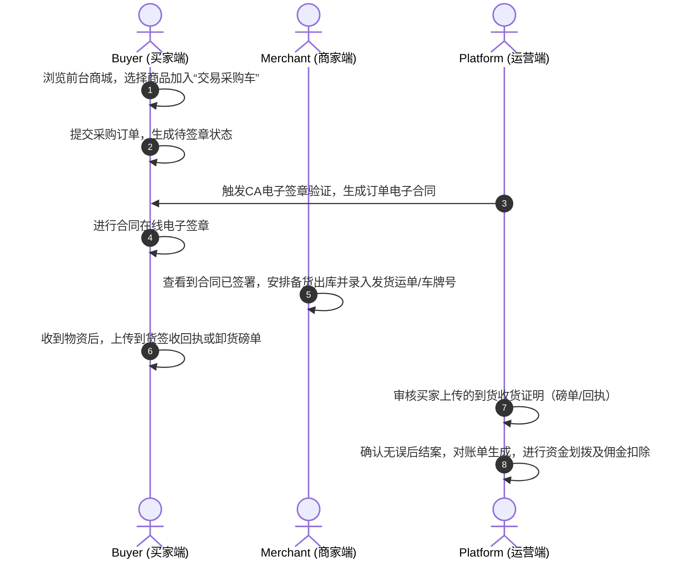
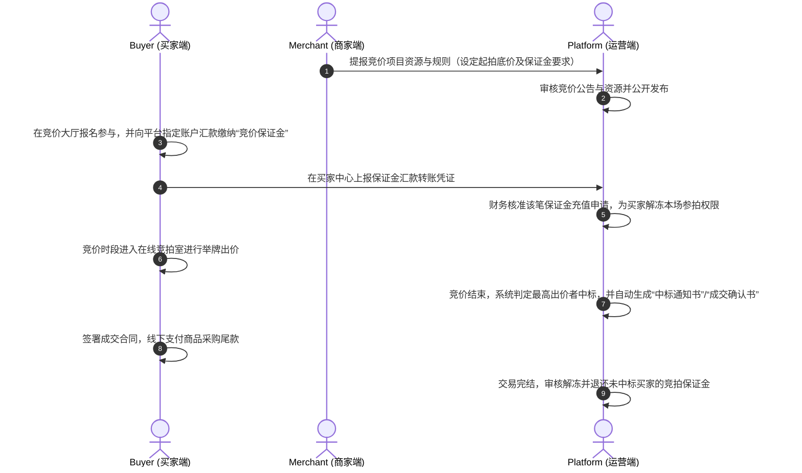

# 农谷链 S2B2C 供应链系统综合调研报告

本报告主要针对浏览器标签页所呈现的 S2B2C 农产品交易与供应链系统（农谷链）进行深度调研，梳理其知识架构、业务操作流程以及各端核心功能。

---

## 一、 系统知识架构 (Knowledge Architecture)

本系统采用典型的 **S2B2C (Supplier to Business to Customer/Buyer)** 架构：
- **S (Supplier/Merchant)**：上游供应商/商家，负责农副产品发布、订单履约、仓储出库。
- **B (Platform/园区运营端)**：园区平台运营方，负责交易撮合、合规审核、冷链调度、仓储监管、资金账期以及电子签约的准入审核。
- **C/Buyer (Purchasing Enterprise)**：下游采购企业/买家（大宗采购单位），负责在商城下单、参与竞价、签署CA电子合同、确认收货上报及账期结算。

### 1. 核心实体与概念关系

### 2. 核心账期与结算模型
- **预存款与福点**：买家和商家在平台设立的充值账户，支持预存款明细、福点交易、充值审核。
- **授信账期（释放与明细）**：针对资质良好的大型买家企业，平台可给予授信额度（信用采购），订单完成后进行授信额度回滚与账期核销结算。
- **竞价保证金监管**：为规避竞价违约，买家参拍前必须向平台缴存保证金，由平台财务审核通过后解冻竞价举牌资格。未中标或交易完结后，由平台审核进行保证金退还或解冻。
- **返利与佣金**：买家和商家根据平台销售策略，可享受平台返利政策；交易完成后，平台对商家抽取一定的佣金。

---

## 二、 核心业务操作流程 (Operational Workflows)

### 1. 现货 / 挂牌直销交易流程

### 2. 竞价 / 招标采购交易流程

---

## 三、 三端操作功能内容详情

### 1. 运营端（园区端）
运营端是整个系统的核心管控大脑，负责审核、清结算与物流监控：
- **数据中心**：汇总业务报表、月度经营报表、数据总表，以及平台全局订单的实时台账，掌握整体供应链健康度。
- **用户中心**：负责买家/卖家/商家的入驻资质审核、会员等级定义、会员标签与权益配置、黑名单管理。
- **财务中心**：
  - **预存款与充值审核**：充值流水审核、预存款余额监测。
  - **授信账期管理**：设置采购企业授信规则，审核授信额度额申请、处理额度手动释放、监控授信还款明细。
  - **费用核销**：费用核销列表、核销审批。
  - **返利中心**：维护返利政策，审核用户返利结算。
- **竞价中心（监管）**：
  - 审核商家提报的竞价项目（预告审核、公告审核、报名审核）。
  - 资金监管：对买家缴纳的竞拍保证金进行充值审核、解冻审核、退还审核或因违约导致的罚没审核。
- **配置中心**：系统协议（入驻协议、隐私政策）配置、CA电子印章设置、物流公司维护、运费模板全局管理。

### 2. 商家端（供应商端）
商家端主要用于日常的商品挂牌、竞拍提报及订单发运履约：
- **商品中心**：发布商品（支持单品发布、批量导入）、批量管理商品分类和属性、配置商家销售策略（如组合商品、特有价格规则等）。
- **内容中心**：店铺基础信息管理、装修店铺主页、提报店铺申请。
- **竞价管理**：发布竞价资源、起草并发布竞拍公告、设定竞拍项目的起拍价及对应保证金比例，并查看竞买室的出价结果及中标明细。
- **订单与发货**：订单发运履约、管理退单和退货地址、录入车辆排班与司机信息、下载已签CA章的电子购销合同。
- **报表与账单**：查看采购结算对账单、供应商结算报表，与园区财务进行周期性清算。

### 3. 买家端（PC商城前台与会员中心）
买家端是下游采购商选购商品和协同履约的入口：
- **前台商城**：
  - 挂牌直销区浏览和分类搜索（支持按品类筛选大宗物资）。
  - 竞价中心大厅：查看进行中/预告中的竞拍专场。
  - 供应链服务板块入口：金融服务（账期申请）、物流仓储查询、农残检测报告公示。
- **买家会员中心**：
  - **订单与合同**：查看直销/竞拍等全部订单状态，在线进行CA合同电子签章，下载留底合同。
  - **履约反馈（上报凭证）**：对于已发货运单，卸货后拍照并填写“到货收货证明”（磅单、签收扫描件），上传给运营端审核，作为付款结案的依据。
  - **询报价管理**：发布求购询价单，查看供应商提供的报价单并进行转单处理。
  - **发票中心**：录入企业增票资质，在线提交订单开票申请，查看我的发票列表。
  - **资金与分销**：监控预存款及积分余额、管理我的邀请码及分销业绩统计。
