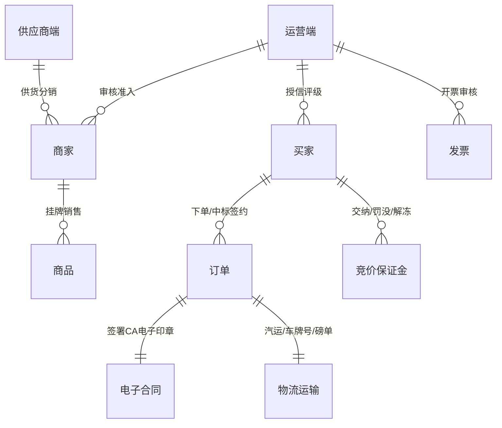
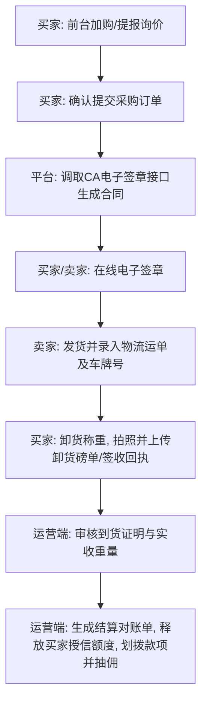
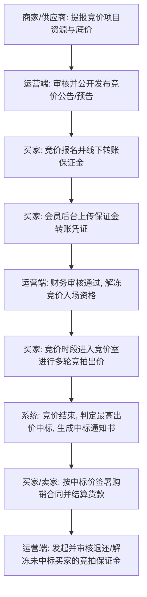
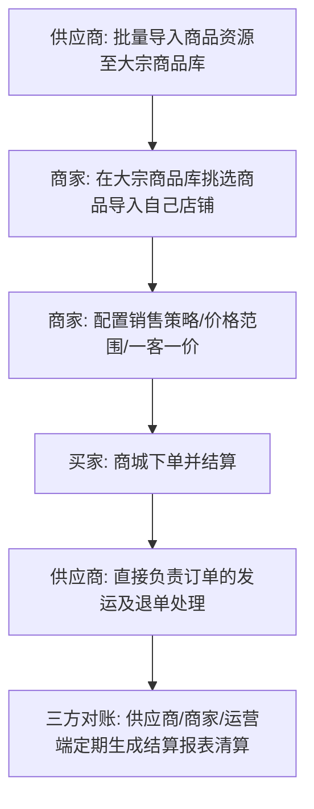

# 采销云 S2B2C 大宗商品供应链系统深度调研与知识架构报告

本报告由产品经理对“采销云”系统进行全端（运营端、商家端、供应商端、买家商城端）点击交互与逻辑梳理后撰写。报告深入解构了该大宗供应链交易系统的业务链路、各端定位、核心知识架构及详细操作流程。

---

## 一、 系统四端角色定位与协作矩阵

本系统是围绕**大宗农产品/工业原料（以“农谷链”为典型业务场景）**构建的 S2B2C 供应链商城系统。其协作矩阵如下：

| 端别 | 角色名称 | 核心职责定位 | 核心交互菜单 |
| :--- | :--- | :--- | :--- |
| **运营端** | 平台/园区运营方 | **全局监管者与清算中心**。负责客商资质准入审核、财务账期授信授权、竞价资金监管（保证金/佣金审核）、CA合同签章配置、全局订单监控与纠纷调处。 | 数据中心、用户中心、财务中心、结算中心、竞价中心、配置中心 |
| **商家端** | 挂牌零售/批发商 | **销售运营与竞价发起方**。负责日常店铺装修、商品销售策略制定（一客一价/销售范围）、发布竞拍专场、管理直销/竞价订单并进行履约发货。 | 店铺管理、商品发布、订单管理、竞价中心、对账报表 |
| **供应商端** | 上游生产/集采商 | **货源供应与大宗批发方**。负责生产端物资的批量录入与挂牌、礼包订单处理、处理采购方的询报价（转单）以及大宗退单管理。 | 商品中心（批量导入/上传）、交易中心（询报价/礼包订单）、报表中心 |
| **买家端** | 下游采购企业 | **终端消费与物资采买方**。在前台选购挂牌商品或参与竞价，在会员后台签署CA电子合同、上报到货磅单（收货证明）、申请开具发票并管理账期还款。 | 前台导航（挂牌直销/竞价中心/产销对接）、发票中心、订单中心、我的供求 |

---

## 二、 核心实体与知识架构 (Knowledge Architecture)

系统的核心业务逻辑围绕**交易、资金、实物履约和身份信用**四个维度展开：

### 1. 交易与商品模型
- **挂牌直销（Spot Goods）**：标准现货交易模式。商品具备前台分类、商品品牌、参数与规格（如高卡低硫、水份、粒度等大宗指标指标）。
- **竞价招标（Bidding/Auction）**：非标及大宗现货的核心交易模式。系统设定“看货阶段”与“出价阶段”，通过设定底价、延时时长、保证金门槛，在公开竞价室以“加价”或“减价”形式撮合。
- **一客一价与销售策略**：支持渠道价格范围、渠道库存范围以及特定采购商用户的专属定价（一客一价），实现精准的大宗交易渠道隔离。

### 2. 资金与授信模型
- **预存款与福点**：买卖双方在平台的虚拟账户，支持充值申请审核及提现，满足平台内部结算。
- **授信账期（Credit Financing）**：对于高信用的买家企业，平台财务审批后授予其账期额度。买家下单时可优先扣除授信额度（货款纯线下结算），并在规定账期内完成还款后进行授信额度释放。
- **竞价保证金（Bidding Margin）**：为防范弃标风险，买家参拍前必须通过线下汇款并上传凭证，运营端财务审核通过后赋予本场竞买室资格。中标后保证金转化为履约保障，未中标者在竞价结案后由平台发起保证金退还/解冻审核。
- **佣金抽取（Commission Setting）**：平台可按商家等级、商品品类设置不同的抽佣比例（或固定金额），在对账单结案时自动计算平台分成。

### 3. 物流与履约证明模型
- **CA 电子合同签约**：交易建立时，系统调用集成的 CA 电子签章接口，生成附带防伪数字证书的 PDF 合同，买卖双方在线完成签章。
- **到货签收证明（磅单/回单）**：大宗农产品及大宗商品采用汽运/船运直发，买家签收后必须将“卸货磅单”或“到货签收单”拍照上传。运营端人工核对实收重量无误后才予以结清对账，从而控制物流虚假发运风险。

---

## 三、 核心业务操作流程 (Operational Workflows)

### 流程一：现货/挂牌直销交易协同流程（带 CA 签章与磅单核准）

### 流程二：大宗竞价/招标采购交易流程（保证金全闭环）

### 流程三：S2B 供货分销协同流程

---

## 四、 核心功能模块明细清单

### 1. 运营端（园区管理后台）
- **数据中心（业务报表）**：汇总下单/回购用户数、订单总金额、实收总金额，导出明细表。
- **用户中心（客商准入与资质审核）**：
  - `采购商入驻审核` / `商家审核` / `供应商注册`：审核企业营业执照、机构代码、大宗交易资质。
  - `黑名单管理`：对违约弃标、不付尾款的客商进行拉黑与解除。
- **商品中心（商品合规审核）**：
  - `货品列表审核` / `商家商品审核`：审核大宗商品的规格、检测报告及参数是否合规。
- **财务中心（账期授信与资金池管理）**：
  - `授信释放` / `授信明细` / `授信管理`：配置大宗采购企业授信评级与规则，人工释放被锁定的额度。
  - `预存款管理` / `充值审核列表`：审核买卖双方的线下大宗充值单。
- **竞价中心（监管）**：
  - `竞价公告审核` / `竞价预告审核`：审核拍品底价、看货时间及加价幅度。
  - `竞价资金/规则/审核管理`：监管场次保证金，判定弃标扣除并罚没保证金的逻辑。
- **配置中心（系统基础配置）**：协议配置（采购合同模板、隐私协议、CA章印）、日志管理（审计操作IP与动作）。

### 2. 商家端（卖家后台）
- **商品发布与策略**：
  - `批量导入商品`/`批量上传详情`：大批量录入大宗产品。
  - `销售策略`：配置不同渠道的价格与库存可见范围。
- **内容中心（店铺装修）**：
  - `店铺申请`/`店铺列表`：定制商家的品牌主页和联系方式。
- **订单履约**：
  - `订单列表` / `发货列表`：查看订单状态，录入承运方车牌号，跟进CA电子合同的签章状态。

### 3. 供应商端（供应商后台）
- **商品管理**：
  - `大宗商品导入`：直接将原产地大宗资源批量导入平台大宗库。
- **交易协同**：
  - `询报价管理`：接收买家的询价意向，进行大宗报价并提交转单。
  - `退单管理`：处理退货及损耗纠纷。

### 4. 买家端（PC商城及买家中心）
- **商城大厅**：
  - `优选商城` / `采购大厅` / `供应大厅`：自主挑选挂牌产品或发布求购信息。
  - `竞价中心`：进入在线竞价室出价。
- **买家会员中心**：
  - `我的全部采购订单`：下载CA电子签章合同。
  - `我的竞拍与保证金`：上传并查看保证金转账凭证审批状态。
  - `上传到货收货证明`：上传签收单/称重磅单图片，用于触发结案。
  - `发票中心`：上传增值税开票信息，在线开票。
