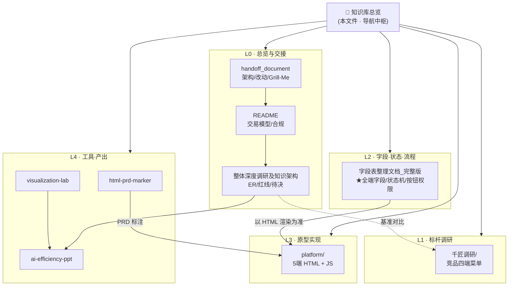
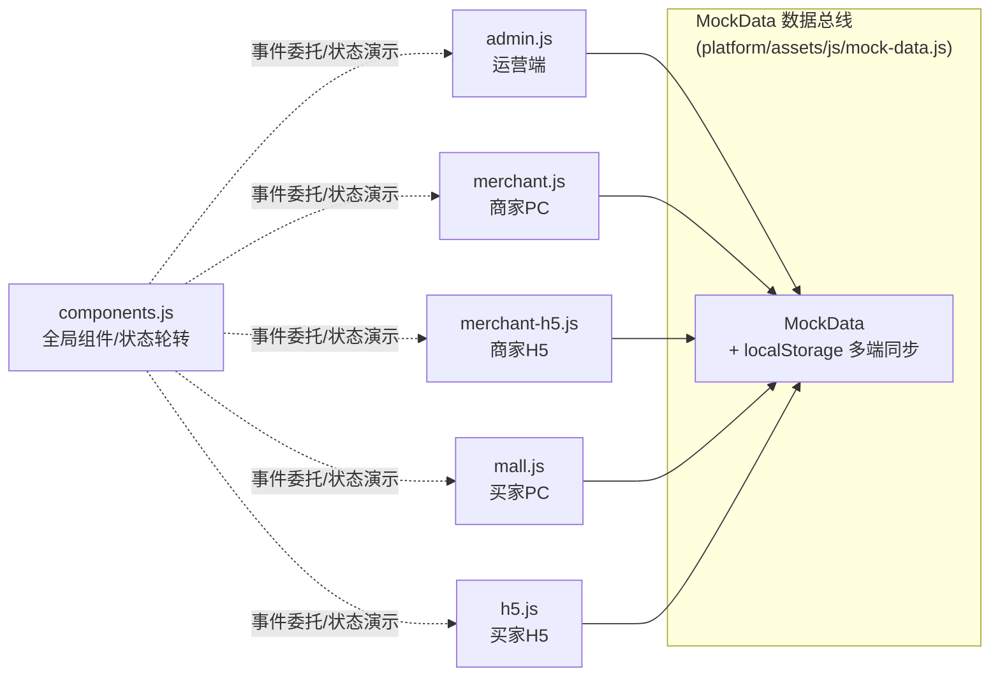
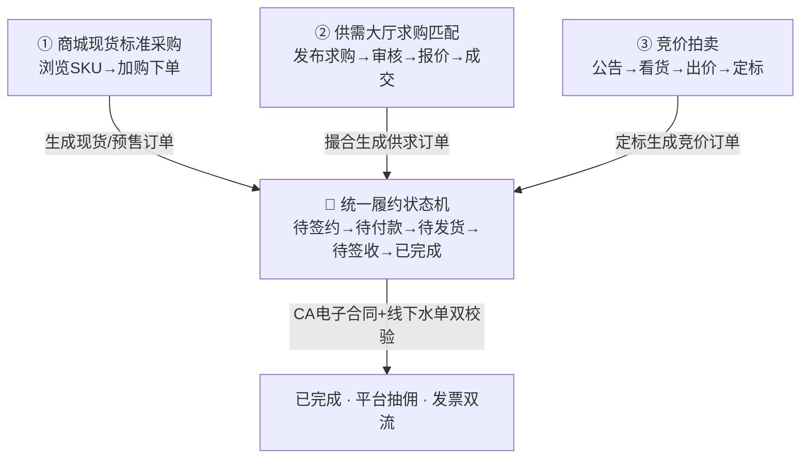
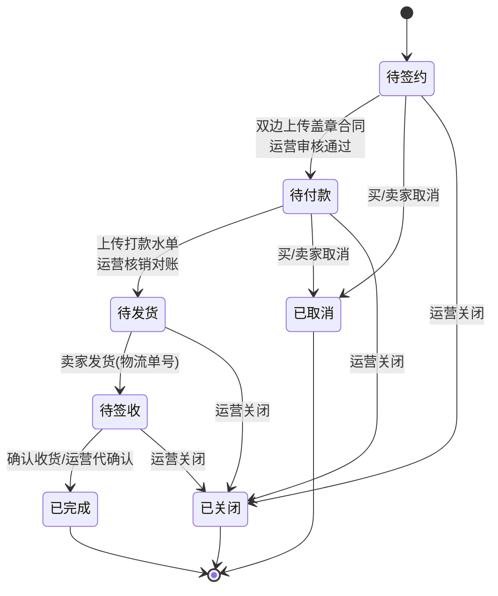

# 🗂️ 商流供应链系统 · 知识库总览 (Knowledge Base Index)

> 本文件是「产业园区商流供应链系统（S2B2C 轻量版）」项目的**总入口与导航中枢**，用双链把全部调研、设计、实现、工具类文档关联成一张知识网。
> 在 Obsidian 中点击任意 `[[双链]]` 即可跳转；配合「关系图谱」可直观看到文档之间的依赖。

---

## 0. 一句话定位与命名说明

| 维度 | 说明 |
| --- | --- |
| **项目别名** | 「采销云」/「咖喱粑粑」/「产业园区商流供应链系统（S2B2C 轻量版）」，三者在文档中混用，指向同一套系统 |
| **本质** | 轻量化、**去资金网关**、以「**法务电子合同**」为约束纽带、以「**线下履约对账 + 平台抽佣**」为核心的**大宗商品供应链商流平台高保真原型** |
| **典型场景** | 以「农谷链」（大宗农产品/工业原料）为典型业务样板 |
| **技术栈** | 纯前端原生 **HTML5 + CSS3 + Vanilla JS，零依赖**，浏览器直接打开即可运行 |
| **主色调** | 雅致紫罗兰 `#ae86e7` |
| **五端矩阵** | ① 运营端(Admin) ② 商家PC(Merchant) ③ 商家H5(Merchant-H5) ④ 买家PC(Mall) ⑤ 买家H5(H5) |
| **数据总线** | 所有状态流经 `platform/assets/js/mock-data.js` 的 `MockData` 内存库（多端经 localStorage 同步） |

---

## 1. 📚 文档地图（知识分层与双链接）

### L0 · 总览与交接（先看这两份）
- [[handoff_document]] — 项目交接文档：架构、数据联动机理、核心重构模块规格、历次改动文件一览、二次开发部署、Grill-Me 强制规则
- [[README]] — 采销云 S2B2C 系统说明：四端角色定位、三大交易模型、统一状态机、合规落地指南（CA 电子合同 + 数电票双流）
- [[整体深度调研及知识架构]] — PM 对系统点击梳理后的深度调研：四端协作矩阵、核心实体 ER、三大业务流、模块清单、红线约束、合规方案、待决 issue

### L1 · 业务调研与标杆（战略层）
- 📁 **千匠调研/**（竞品标杆：千匠云 SaaS 全功能四端扫描，用于裁剪参考）
  - [[千匠调研/全端功能与菜单目录大纲]] — 78+ 功能页元素级扫描总纲（最详尽）
  - [[千匠调研/运营端（园区管理后台）菜单目录]] — 运营端完整菜单树（数据中心/财务/竞价/结算/分销/营销…）
  - [[千匠调研/商家后台菜单]] — 商家端菜单树（商品/订单/竞价/结算/报表）
  - [[千匠调研/供应商端菜单]] — 供应商端菜单树（上游供货、询报价、退单）
  - [[千匠调研/PC商城菜单]] — 买家 PC 商城菜单树（前台导航 + 会员中心）

### L2 · 字段 / 状态机 / 流程设计（设计层 · 已统一收敛）
- [[Summary/字段表整理文档_完整版]] — ★**唯一收敛源**：五端全量字段字典 + 各端状态流转 Mermaid + 多角色按钮权限矩阵 + 四类触发机制汇总。原独立的「可视化流程文档」「订单全流程与三端按钮对照表」内容已并入本文件（见 §六状态枚举全集 / §七四类触发机制 / 各端状态图与权限矩阵），无需再单独查阅
- [[Summary/字段表整理文档]] — 上述文档的简版
- [[Summary/分类及物流]] — 11 大类商品分类字典 + 物流承运商清单
- [[Summary/202608031351PRD复制]] — 大规模 PRD 复制稿（0.6MB，需求条目源）

### L3 · 原型实现（代码层）
- 📁 **platform/** — 高保真原型核心目录
  - 入口：`mall.html`(买家PC) / `h5.html`(买家H5) / `merchant.html`(商家PC) / `merchant-h5.html`(商家H5) / `admin.html`(运营端)
  - 逻辑：`assets/js/` → `mock-data.js`(数据总线) / `components.js`(全局组件) / `mall.js` `h5.js` `merchant.js` `merchant-h5.js` `admin.js` / PRD 注入 `prd-data-*.js` `prd-pin-tool.js`
  - 样式：`assets/css/` → `global.css` `mall.css` `h5.css` `admin.css`
- 📁 **草稿/** — 早期原型草稿：`买家pc.html` `买家小程序.html` `商家PC.html` `商家小程序.html` `运营.html`

### L4 · 工具与生产力（Skill / 产出）
- 📁 **html-prd-marker/** — [[html-prd-marker/SKILL]]：将 PRD 需求以交互标注（popover）形式打到 HTML 原型上
- 📁 **visualization-lab/** — 可视化工具集（架构图 / 流程图 / DrawIO / Excalidraw / 烟花科技图等 skill）
- 📁 **ai-efficiency-ppt/** — AI 提效汇报 PPT（含 slides、svg 素材、生成/修复脚本）
- 📁 **.agents/** — 项目级 Agent 规则与 skill（含 `rules/grill-me.md` 强制追问规范、`skills/jo-html-product`）

### 🔗 文件衔接关系图（知识网与代码联动一眼看懂）

**① 文档知识网**——本文件为中枢，向下连接各层文档；横向看，深度调研以千匠为标杆、字段表以 `platform/` 实际渲染为准、PRD 标注与可视化产出各归其位：

**② 原型代码文件联动**——五端 `.js` 全部挂在 `MockData` 内存数据总线（经 localStorage 多端同步）上，`components.js` 负责全局组件与状态轮转：

### 📊 数据资产（二进制）
- `商流.xlsx` — 商流字段/样例数据（15K）
- `S2B2C功能清单20260715.xlsx` — S2B2C 功能清单（18K）
- `千匠调研/` 另含 `*.xmind`(2) `*.pdf`(1) `*.xlsx`(1) 等原始调研素材

---

## 2. 🧩 核心概念模型（概念索引）

### 2.1 三大交易模型（最终汇入统一履约）
1. **商城现货标准采购**（主流干道）：浏览现货 SKU → 加购下单
2. **供需大厅求购匹配**（定制寻源）：发布求购 → 运营审核 → 商家 IM 报价 → 接受转单
3. **竞价拍卖**（大宗博弈）：发布竞价公告 → 看货报名 → 多轮出价 → 价高者得（无保证金模式）

> 详细流转见 [[整体深度调研及知识架构]] §三、[[README]] §3；各端状态图与按钮权限见 [[Summary/字段表整理文档_完整版]] 对应端章节

### 2.2 角色权限矩阵（RBAC，单用户表升维）
| 角色 | 账号属性 | 核心边界 |
| --- | --- | --- |
| **买家** | 手机号注册（基础身份） | 只能买：下单/竞价出价/发求购/签合同/打款/确认收货/申请开票 |
| **商家** | 提交营业执照→运营审核升维 | 买家权限 + 卖家后台：上架/发布竞价/接单发货/开票 |
| **平台运营** | 超级管理员分配 | 全局审核/规则配置/财务结算/监管放款 |

> 来源：[[整体深度调研及知识架构]] §二「用户角色与权限升维架构」

### 2.3 统一履约状态机（订单主链）

- 合同/付款采用「**双联独立审核**」子态：未上传 / 已上传待审核 / 被打回
- 详见 [[Summary/字段表整理文档_完整版]] §五（买家/H5 履约表单）与 §六（履约状态枚举与触发逻辑）

### 2.4 全平台状态枚举全集
| 模块 | 枚举（详见 [[Summary/字段表整理文档_完整版]] §六） |
| --- | --- |
| 店铺状态 | 未开店 / 待审核 / 正常营业 / 闭店中 |
| 货品状态 | 草稿 / 待审核 / 已上架 / 已下架 / 已售罄 |
| 需求状态 | 待审核 / 展示中 / 已下架 / 已完结 |
| 订单类型 | 现货 / 预售 / 供求 / 竞价 交易订单 |
| 履约状态 | 待签约 / 待付款 / 待发货 / 待签收 / 已完成 / 已取消 / 已关闭 |
| 竞价状态 | 草稿 / 待审核 / 竞价中 / 等待公布 / 已结束 / 已下架 |
| 发票状态 | 待开具 / 已开具 |

### 2.5 四类触发机制
- **时间驱动**：到达 `bidEndTime` → 竞价中自动转「等待公布」
- **数据/库存驱动**：库存归零 → 已售罄；购物车红点实时算；佣金按优先级实时算
- **交易事件驱动**：定标选为中标 / 求购撮合 → 自动生成对应类型订单
- **线下履约 + 运营双校验**：双边盖章→激活合同审核；打款水单→激活对账审核；确认收货→自动结清

> 汇总见 [[Summary/字段表整理文档_完整版]] §七

---

## 3. 🧭 五端功能模块导航（入口双链）

| 端 | 核心模块 | 字段/流程文档锚点 |
| --- | --- | --- |
| **运营端 Admin** | 店铺/分类/上架商品/供求/订单透视/IM/竞价资源/竞价公告/抽佣 | [[Summary/字段表整理文档_完整版]] §一 |
| **商家PC** | 店铺装潢/基础商品库/上架管理/订单中心/竞价资源/竞价公告 | [[Summary/字段表整理文档_完整版]] §二 |
| **商家H5** | 移动看板/发货/资源提报/公告定标 | [[Summary/字段表整理文档_完整版]] §三 |
| **买家PC Mall** | 首页/现货大厅/竞价大厅/寻源供求/个人中心(购物车·订单·发票) | [[Summary/字段表整理文档_完整版]] §四 |
| **买家H5** | 首页/商品规格/需求发布/出价/合同签署/发票申请 | [[Summary/字段表整理文档_完整版]] §五 |

---

## 4. 🛡️ 关键设计决策与红线（来自深度调研）

> 详见 [[整体深度调研及知识架构]] §五

**三道核心防线**
1. **求购拦截防线**：前端提交求购初始 `Status=0(待审核)`，供需大厅严禁渲染未过审数据
2. **法务签约物理阻塞**：`Contract_Signed=False` 时强制置灰商家端「发货」按钮（法务优先于物流）
3. **财务解耦计算**：佣金仅在「已完成」时按快照总额 × 当前费率计算，写入独立流水表，历史账单不受后期改费率影响

**合规落地方案（重要）**
- 电子合同须用第三方 **CA 机构**（e签宝 / 法大大），自生成印章图片无效
- 发票须「双发票流」：货款发票(卖家→买家) + 佣金发票(平台→卖家)，避免虚开增值税发票；对接数电票（诺诺 / 百旺）
- 价值：业务流/合同流/发票流「三流合一」→ 未来可延展供应链金融（仓单质押、订单融资）

---

## 5. 🔍 千匠调研（标杆）vs 本项目（裁剪后）对照

| 维度 | 千匠云（标杆，全功能 SaaS） | 本项目（轻量化原型） |
| --- | --- | --- |
| 端口 | 运营 / 商家 / **供应商** / 买家 四端 | 运营 / 商家PC / 商家H5 / 买家PC / 买家H5（**移除独立供应商端**） |
| 资金 | 预存款/福点、授信账期、竞价保证金 | **去资金网关**，纯线下公对公打款 + 上传水单 |
| 营销 | 积分/秒杀/满减/分销/直播 | 全部移除 |
| 退单 | 完整退单管理 | **移除复杂退货**，仅保留运营「关闭(退款)」 |
| 竞价 | 保证金全闭环 + 预告 + 资金管理 | 自由竞价（仅高低价），无保证金 |
| 合同 | CA 签章 + 磅单 | 电子合同上传 + 运营双校验（原型的演示版） |

> 标杆全菜单见 [[千匠调研/全端功能与菜单目录大纲]]、[[千匠调研/运营端（园区管理后台）菜单目录]]

---

## 6. 🤖 Agent 工作流与强制规则（Grill-Me）

> 详见 [[handoff_document]] §六、项目规则 `.agents/rules/grill-me.md`

- 任何 Agent 处理本项目**代码/需求/问题/文件操作前**，必须先触发 `Grill-Me` 逐题追问对齐
- 推荐 Skill 链：`grilling` → `html-prd-annotator` → `jo-html-product` → `code-review`
- 全局配置参考 `.gemini/config/GEMINI.md`、`.agents/GEMINI.md`

---

## 7. 🚀 二次开发与联调指南

> 详见 [[handoff_document]] §5

1. **零构建**：用 Live Server / Nginx 托管 `platform/` 即可演示
2. **演示秒切**：点击带状态类名的元素可循环轮转状态（接真实接口时在 `components.js` 事件委托中屏蔽）
3. **数据扩充**：改 `mock-data.js` 的 `MockData` 初始化数组；PRD 标注数据在 `prd-data-*.js`
4. **历史补丁已合并**：早期迭代用的 `patch_*.js` 补丁脚本（注入审核弹窗、分类映射、起售/库存字段、发布商品等）已全部并入 `platform/` 源文件，脚本本身已移入 `.patch-archive/` 归档（仅作追溯，不参与运行）。二次开发直接改源文件即可，无需再跑 patch。

---

## 8. ✅ 待决 issue（来自深度调研，待产品拍板）

- IM 敏感内容：仅保留询价/报价/砍价三类卡片消息 ✅已确认
- 飞单/退款：运营端加高权限「终止交易并退回资金」按钮 ✅已确认
- 付款凭证与物流：对接 B2B/三方支付与三方快递接口 ✅已确认
- 挂牌新增「预售货」及预售成交期 ✅已确认
- 竞价做到自由竞价（仅高低价）✅已确认
- 卖家需移动端 ✅已确认（已落地商家 H5）

---

## 9. 🔗 推荐阅读顺序（ newcomers）

1. [[handoff_document]]（先建立全貌与边界）
2. [[README]] → [[整体深度调研及知识架构]]（理解业务模型与合规）
3. [[千匠调研/全端功能与菜单目录大纲]]（看标杆，理解裁剪原因）
4. [[Summary/字段表整理文档_完整版]]（落地的字段与权限细节）
5. [[Summary/字段表整理文档_完整版]]（§六状态枚举全集 + §七四类触发机制 + 各端状态流转 Mermaid 与按钮权限矩阵，已统一收敛流程/按钮/字段，原"可视化流程文档""订单全流程对照表"不必再单独读）
6. `platform/` 代码（对照实现）
